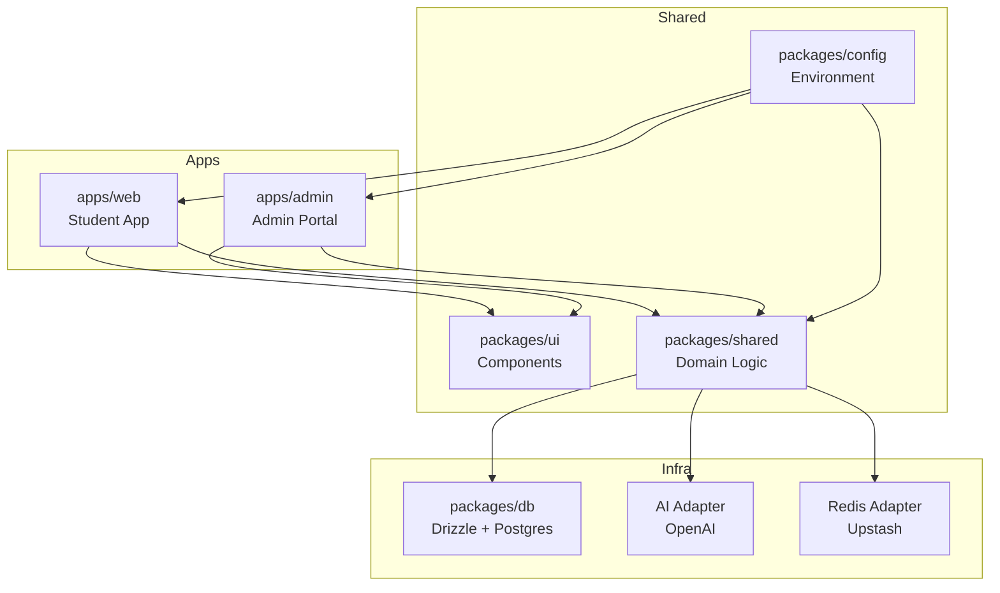
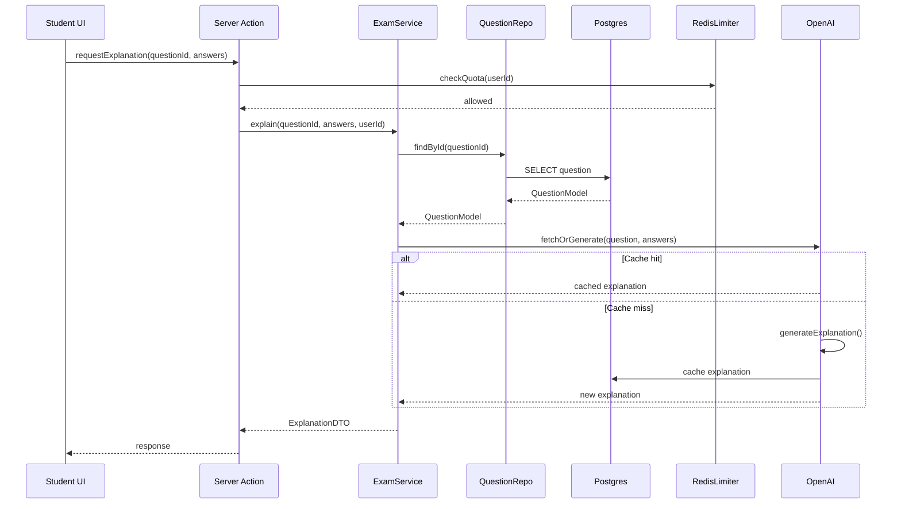

# Brainliest Platform - Complete Architecture Blueprint

**Version:** 2.0.0
**Last Updated:** 2025-10-02
**Status:** 🔒 LOCKED — Foundational Charter - Complete Rebuild

> **Guardrail Notice**  
> This blueprint is subordinate to `.ai-guardrails`, `PROJECT_MANIFEST.md`, and `COMPLETE_BUILD_SPECIFICATION.md`.
> Review those documents first, then [docs/architecture/guardrails.md](docs/architecture/guardrails.md) before making any change.
> AI assistants must follow these guardrails exactly.
>
> **Companion Documents**
> - [.ai-guardrails](.ai-guardrails) — AI session onboarding checklist
> - [PROJECT_MANIFEST.md](PROJECT_MANIFEST.md) — Highest authority guardrails
> - [COMPLETE_BUILD_SPECIFICATION.md](COMPLETE_BUILD_SPECIFICATION.md) — Implementation contract
> - [docs/architecture/guardrails.md](docs/architecture/guardrails.md) — Governance & enforcement rules
> - [docs/architecture/overview.md](docs/architecture/overview.md) — System summary

---

## Table of Contents

1. [Executive Summary](#executive-summary)
2. [Foundational Principles](#foundational-principles)
3. [Technology Stack](#technology-stack)
4. [Monorepo Structure](#monorepo-structure)
5. [Naming Conventions & Style Guide](#naming-conventions--style-guide)
6. [Shared Registries (SSOT)](#shared-registries-ssot)
7. [Layered Architecture](#layered-architecture)
8. [Database Schema](#database-schema)
9. [Redis Keyspace Strategy](#redis-keyspace-strategy)
10. [Type System & Interfaces](#type-system--interfaces)
11. [Web Application (Student-Facing)](#web-application-student-facing)
12. [Admin Portal](#admin-portal)
13. [Authentication & Authorization](#authentication--authorization)
14. [API Design & Server Actions](#api-design--server-actions)
15. [AI Integration](#ai-integration)
16. [Search & Discovery](#search--discovery)
17. [Analytics & Tracking](#analytics--tracking)
18. [Performance & Caching](#performance--caching)
19. [Security & Compliance](#security--compliance)
20. [Testing Strategy](#testing-strategy)
21. [Developer Experience](#developer-experience)
22. [Deployment & DevOps](#deployment--devops)
23. [Diagrams](#diagrams)
24. [Type Export Maps](#type-export-maps)
25. [Dependency Graph Tooling](#dependency-graph-tooling)
26. [Implementation Phases](#implementation-phases)
27. [Quality Gates](#quality-gates)
28. [Documentation Requirements](#documentation-requirements)

---

## Executive Summary

### Purpose & Vision

Build **Brainliest.com** as a Next.js 14 App Router platform delivering curated past exam questions for professional certifications and academic subjects. Students browse categories, sit practice sessions, reveal answers, and trigger AI-assisted explanations. Admins manage taxonomy, questions, users, and integration keys via a hardened **admin.brainliest.com** control panel.

### Primary Objectives

- **Zero TypeScript errors**: Forbid `any`, favor strict typing and schema-first validation
- **Full SSR + ISR/SSG hybrid** where sensible for fast global performance
- **Modular, SSOT architecture**: Shared registries for domain constants, validation schemas, API routes, and UI components across web/app/server
- **Best-in-class DX**: Linting, testing, story previews, and clear separation of concerns (domain, infra, presentation, orchestration)

### Non-Negotiables

1. Strict TypeScript with ESLint + Prettier enforcement
2. SSOT via shared packages for all domain logic, schemas, and constants
3. Layered architecture: Presentation → Application → Domain → Infrastructure
4. Role-separated authentication (students via NextAuth, admins via custom auth with WebAuthn/2FA)
5. Zero duplication of logic/structures across web and admin
6. Observability, security, and accessibility baked in from day one
7. Production-grade tooling: CI/CD, automated testing, monitoring, audit logging

---

## Foundational Principles

### Architecture Philosophy

- **Domain-Driven Design (DDD)**: Clear separation between presentation, application services, domain models, and infrastructure adapters
- **Single Source of Truth (SSOT)**: Shared registries consumed by all apps, preventing drift and duplication
- **Scalability**: Horizontal scaling via stateless Next.js deployment, caching strategy (Redis + ISR), queue-ready architecture for AI tasks
- **Maintainability**: Monorepo with pnpm + Turborepo, layered lint rules, ADR documentation for major decisions, automated script generators
- **Observability**: Built-in logging, tracing, metrics with instrumentation hooks for Sentry/Grafana
- **Security**: Principle of least privilege, secure secret storage, encrypted integration keys, comprehensive audit logs

### Core Tenets

1. **Schema-First Development**: All data structures defined via Zod schemas in shared packages before implementation
2. **Type Safety Everywhere**: No runtime type assertions; leverage TypeScript's type system fully
3. **Immutable Domain Models**: Business logic operates on read-only data structures
4. **Explicit Dependencies**: Dependency injection for infrastructure concerns
5. **Fail Fast**: Validate at system boundaries; errors propagate with context
6. **Test at Every Layer**: Unit, integration, E2E, contract, and visual regression testing

---

## Technology Stack

### Core Technologies

- **Framework**: Next.js 14 with App Router, React Server Components, Route Handlers
- **Language**: TypeScript 5.x (strict mode)
- **UI Framework**: React 18 with Server Components
- **Styling**: Tailwind CSS + custom design tokens
- **Component Library**: Radix UI primitives + custom `@ui` package
- **Database**: PostgreSQL 15+ via Drizzle ORM
- **Caching/State**: Redis (Upstash) for caching, rate limits, sessions, job coordination
- **Authentication**:
  - NextAuth v5 (OAuth + email magic links) for students
  - Custom implementation with Clerk/JWT for admin (separate cookie namespace + CSRF)
- **AI**: OpenAI Functions API (GPT-4 or o3-family) for answer explanations
- **Deployment**: Vercel (brainliest.com + admin.brainliest.com subdomain)
- **Monitoring**: Sentry (errors), Logtail/Logflare (structured logs), Vercel Analytics

### Development Tools

- **Package Manager**: pnpm with workspaces
- **Build Tool**: Turborepo for monorepo caching
- **Linting**: ESLint + TypeScript ESLint
- **Formatting**: Prettier
- **Testing**: Vitest (unit), Playwright (E2E), Testing Library (component)
- **Component Preview**: Storybook
- **Code Generation**: Plop generators for scaffolding
- **Dependency Management**: Dependency Cruiser for import validation

---

## Monorepo Structure

```
brainliest/
├── apps/
│   ├── web/                 # Student-facing Next.js app (brainliest.com)
│   │   ├── src/
│   │   │   ├── app/         # App Router routes
│   │   │   ├── components/  # App-specific components
│   │   │   ├── hooks/       # Custom React hooks
│   │   │   ├── lib/         # Utilities & helpers
│   │   │   └── styles/      # Global styles
│   │   ├── public/
│   │   └── package.json
│   ├── admin/               # Admin portal (admin.brainliest.com)
│   │   ├── src/
│   │   │   ├── app/
│   │   │   ├── components/
│   │   │   ├── hooks/
│   │   │   └── lib/
│   │   ├── public/
│   │   └── package.json
│   └── workers/             # Background jobs, cron handlers (optional)
│       └── src/
├── packages/
│   ├── ui/                  # Shared component library
│   │   ├── src/
│   │   │   ├── primitives/  # Base components (Button, Input, Card)
│   │   │   ├── composites/  # Complex components (DataGrid, SearchSelect)
│   │   │   ├── hooks/       # Shared hooks
│   │   │   └── theme/       # Design tokens, Tailwind config
│   │   └── package.json
│   ├── shared/              # Domain logic, schemas, services
│   │   ├── src/
│   │   │   ├── domain/      # Models, enums, value objects
│   │   │   ├── schemas/     # Zod validation schemas
│   │   │   ├── services/    # Business logic (pure functions)
│   │   │   ├── adapters/    # Infrastructure interfaces
│   │   │   ├── analytics/   # Event definitions
│   │   │   └── utils/       # Shared utilities
│   │   └── package.json
│   ├── db/                  # Database layer
│   │   ├── src/
│   │   │   ├── schema/      # Drizzle schema definitions
│   │   │   ├── repositories/ # Repository implementations
│   │   │   ├── migrations/  # SQL migrations
│   │   │   ├── seeds/       # Seed data
│   │   │   └── fixtures/    # Test data generators
│   │   └── package.json
│   ├── config/              # Environment & configuration
│   │   ├── src/
│   │   │   ├── env/         # Zod env schemas
│   │   │   ├── constants/   # App-wide constants
│   │   │   └── feature-flags/
│   │   └── package.json
│   ├── testing/             # Testing utilities
│   │   ├── src/
│   │   │   ├── vitest/      # Vitest setup & helpers
│   │   │   ├── playwright/  # Playwright fixtures
│   │   │   └── mocks/       # Mock data
│   │   └── package.json
│   └── tooling/             # Development tools
│       ├── src/
│       │   ├── generators/  # Plop templates
│       │   ├── scripts/     # CLI utilities
│       │   └── lint/        # Custom lint rules
│       └── package.json
├── docs/                    # Documentation
│   ├── architecture/
│   ├── adr/                 # Architecture Decision Records
│   ├── api/                 # API documentation
│   └── guides/
├── .github/
│   └── workflows/           # CI/CD pipelines
├── turbo.json
├── pnpm-workspace.yaml
├── .dependency-cruiser.js
├── .editorconfig
└── package.json
```

---

## Naming Conventions & Style Guide

### File & Directory Naming

- **Files**: `kebab-case` (e.g., `question-service.ts`, `question-card.tsx`)
- **Directories**: `kebab-case` (e.g., `exam-sessions/`, `user-profiles/`)
- **Test files**: `*.test.ts` or `*.spec.ts`
- **Storybook**: `*.stories.tsx`

### Code Naming

- **Components**: `PascalCase` (e.g., `QuestionCard`, `ExamSessionPanel`)
- **Functions & Variables**: `camelCase` (e.g., `startExamSession`, `questionRepository`)
- **Types & Interfaces**: `PascalCase` (e.g., `QuestionModel`, `ExamRepository`)
- **Constants**: `UPPER_SNAKE_CASE` (e.g., `MAX_QUESTIONS_PER_SESSION`, `AI_EXPLANATION_TTL`)
- **Enums**: `PascalCase` for name, `UPPER_SNAKE_CASE` for values

```typescript
export enum ExamDifficulty {
  BEGINNER = 'BEGINNER',
  INTERMEDIATE = 'INTERMEDIATE',
  ADVANCED = 'ADVANCED',
  EXPERT = 'EXPERT',
}
```

### Database Naming

- **Tables**: `snake_case` (e.g., `exam_sessions`, `question_ai_explanations`)
- **Columns**: `snake_case` (e.g., `created_at`, `user_id`, `exam_slug`)
- **Indexes**: `idx_{table}_{column(s)}` (e.g., `idx_questions_exam_slug`)
- **Foreign Keys**: `fk_{table}_{ref_table}` (e.g., `fk_questions_exams`)

**Note**: Drizzle schema exports use `camelCase`; mapper functions handle conversion.

### Route Naming

- **Public routes**: `kebab-case` (e.g., `/exam-sessions`, `/practice/aws-certified-developer`)
- **API routes**: `/api/v1/` prefix, versioned (e.g., `/api/v1/exam-sessions`)

### Schema Type Suffixes

- **Zod schemas**: `XxxSchema` (e.g., `createQuestionSchema`, `updateExamSchema`)
- **DTOs**: `XxxDto` (e.g., `QuestionDto`, `ExamResultDto`)
- **Domain models**: `XxxModel` (e.g., `QuestionModel`, `ExamSessionModel`)
- **Drizzle entities**: `XxxEntity` (internal to `packages/db`)

### Export Strategy

- **No default exports** except for Next.js page/layout/route components
- **Named exports** for all other modules to improve refactoring and IDE support

---

## Shared Registries (SSOT)

All domain constants, enums, schemas, and feature flags live in shared packages and are consumed by both web and admin apps.

### CategoryRegistry

Centralized definition of all categories with metadata.

```typescript
// packages/shared/src/domain/registries/category-registry.ts
export const CATEGORY_REGISTRY = {
  PROFESSIONAL_CERTIFICATIONS: {
    slug: 'professional-certifications',
    name: 'Professional Certifications',
    description: 'Industry-recognized certifications',
    icon: 'certificate',
    type: CategoryType.PROFESSIONAL,
    sortOrder: 1,
  },
  UNIVERSITY_COLLEGE: {
    slug: 'university-college',
    name: 'University & College',
    description: 'Academic courses and degrees',
    icon: 'graduation-cap',
    type: CategoryType.ACADEMIC,
    sortOrder: 2,
  },
  STANDARDIZED_TESTS: {
    slug: 'standardized-tests',
    name: 'Standardized Test Prep',
    description: 'SAT, GRE, GMAT, and more',
    icon: 'clipboard-check',
    type: CategoryType.STANDARDIZED,
    sortOrder: 3,
  },
} as const;

export type CategorySlug = keyof typeof CATEGORY_REGISTRY;
```

### FeatureFlagRegistry

```typescript
// packages/shared/src/domain/registries/feature-flag-registry.ts
export const FEATURE_FLAG_REGISTRY = {
  AI_EXPLANATIONS_ENABLED: {
    key: 'ai_explanations_enabled',
    description: 'Enable AI-powered answer explanations',
    defaultValue: true,
    rolloutType: 'boolean',
  },
  BULK_QUESTION_IMPORT: {
    key: 'bulk_question_import',
    description: 'Allow CSV/JSON question imports',
    defaultValue: false,
    rolloutType: 'boolean',
  },
  FREEMIUM_DAILY_LIMIT: {
    key: 'freemium_daily_limit',
    description: 'Max questions per day for free users',
    defaultValue: 20,
    rolloutType: 'number',
  },
} as const;
```

### IntegrationKeyTypes

```typescript
// packages/shared/src/domain/registries/integration-key-types.ts
export enum IntegrationKeyType {
  OPENAI_API_KEY = 'OPENAI_API_KEY',
  STRIPE_SECRET_KEY = 'STRIPE_SECRET_KEY',
  RESEND_API_KEY = 'RESEND_API_KEY',
  CAPTCHA_SECRET = 'CAPTCHA_SECRET',
}
```

### PermissionMatrix

```typescript
// packages/shared/src/domain/registries/permission-matrix.ts
export const PERMISSION_MATRIX = {
  [UserRole.STUDENT]: {
    canViewQuestions: true,
    canRequestExplanations: true,
    canManageProfile: true,
  },
  [AdminRole.VIEWER]: {
    canViewDashboard: true,
    canViewQuestions: true,
    canViewUsers: true,
  },
  [AdminRole.EDITOR]: {
    canViewDashboard: true,
    canManageQuestions: true,
    canManageExams: true,
    canManageTaxonomy: true,
  },
  [AdminRole.SUPERADMIN]: {
    canViewDashboard: true,
    canManageQuestions: true,
    canManageExams: true,
    canManageTaxonomy: true,
    canManageUsers: true,
    canManageIntegrations: true,
    canViewAuditLogs: true,
  },
} as const;
```

### AnalyticsEventRegistry

```typescript
// packages/shared/src/analytics/event-registry.ts
export const ANALYTICS_EVENTS = {
  EXAM_STARTED: 'exam_started',
  QUESTION_ANSWERED: 'question_answered',
  EXPLANATION_REQUESTED: 'explanation_requested',
  EXAM_COMPLETED: 'exam_completed',
  USER_REGISTERED: 'user_registered',
} as const;

export interface ExamStartedEvent {
  eventName: typeof ANALYTICS_EVENTS.EXAM_STARTED;
  userId: string;
  examSlug: string;
  sessionId: string;
  timestamp: number;
}
```

---

## Layered Architecture

### Overview

```
┌─────────────────────────────────────┐
│   Presentation Layer                │  ← apps/web, apps/admin
│   (UI Components, Pages, Layouts)   │
└──────────────┬──────────────────────┘
               │
┌──────────────▼──────────────────────┐
│   Application Layer                 │  ← Server Actions, Route Handlers
│   (Orchestration, Use Cases)        │
└──────────────┬──────────────────────┘
               │
┌──────────────▼──────────────────────┐
│   Domain Layer                      │  ← packages/shared
│   (Business Logic, Models, Schemas) │
└──────────────┬──────────────────────┘
               │
┌──────────────▼──────────────────────┐
│   Infrastructure Layer              │  ← packages/db, adapters
│   (DB, Cache, External APIs)        │
└─────────────────────────────────────┘
```

### Module Responsibilities

#### Presentation Layer (`apps/web`, `apps/admin`)

- Render UI using shared components from `packages/ui`
- Handle user interactions, form submissions
- Call server actions or API routes
- **Cannot**: Access database directly, call infrastructure adapters
- **Imports from**: `packages/ui`, `packages/shared/domain`, local hooks

#### Application Layer (Server Actions, Route Handlers)

- Orchestrate business operations
- Validate input using shared Zod schemas
- Call domain services
- Handle authentication/authorization
- Serialize responses
- **Cannot**: Contain business logic, access infrastructure directly
- **Imports from**: `packages/shared/services`, `packages/shared/schemas`, `packages/db` (via interfaces)

#### Domain Layer (`packages/shared`)

- Define business entities, value objects, aggregates
- Expose pure business logic functions
- Validation schemas (Zod)
- Domain events
- **Cannot**: Access infrastructure, know about HTTP/UI concerns
- **Imports from**: Nothing (self-contained except utility libraries)

#### Infrastructure Layer (`packages/db`, adapters)

- Implement repository interfaces
- Database access via Drizzle
- Redis operations
- External API clients (OpenAI, payment gateways)
- **Cannot**: Contain business logic
- **Imports from**: `packages/shared/domain` (for types), Drizzle, Redis client

### Dependency Rules

1. **UI components** may import only from `packages/ui`, `packages/shared/domain`, and local hooks
2. **Server actions** may depend on domain services and repository interfaces, never raw Drizzle tables
3. **Repository implementations** reside in infra and depend on Drizzle/Redis, but accept DTOs defined in domain
4. **AI adapters** wrap OpenAI client; only domain services call them via interface to preserve testability
5. **Admin and web apps** share no state directly; communication only through shared packages and database

---

## Database Schema

All tables use `snake_case` naming. Drizzle schema definitions export as `camelCase`.

### Core Tables

#### categories

```sql
CREATE TABLE categories (
  slug VARCHAR(255) PRIMARY KEY,
  name VARCHAR(255) NOT NULL,
  description TEXT,
  icon VARCHAR(100),
  sort_order INTEGER NOT NULL DEFAULT 0,
  type VARCHAR(50) NOT NULL,
  active BOOLEAN NOT NULL DEFAULT TRUE,
  created_at TIMESTAMP NOT NULL DEFAULT CURRENT_TIMESTAMP,
  updated_at TIMESTAMP NOT NULL DEFAULT CURRENT_TIMESTAMP
);
```

#### subcategories

```sql
CREATE TABLE subcategories (
  slug VARCHAR(255) PRIMARY KEY,
  category_slug VARCHAR(255) NOT NULL REFERENCES categories(slug) ON DELETE CASCADE,
  name VARCHAR(255) NOT NULL,
  description TEXT,
  icon VARCHAR(100),
  sort_order INTEGER NOT NULL DEFAULT 0,
  active BOOLEAN NOT NULL DEFAULT TRUE,
  created_at TIMESTAMP NOT NULL DEFAULT CURRENT_TIMESTAMP,
  updated_at TIMESTAMP NOT NULL DEFAULT CURRENT_TIMESTAMP
);
```

#### subjects

```sql
CREATE TABLE subjects (
  slug VARCHAR(255) PRIMARY KEY,
  category_slug VARCHAR(255) NOT NULL REFERENCES categories(slug) ON DELETE CASCADE,
  subcategory_slug VARCHAR(255) REFERENCES subcategories(slug) ON DELETE SET NULL,
  name VARCHAR(255) NOT NULL,
  description TEXT,
  icon VARCHAR(100),
  difficulty VARCHAR(50),
  tags TEXT[], -- Array of tags
  active BOOLEAN NOT NULL DEFAULT TRUE,
  metadata JSONB DEFAULT '{}',
  created_at TIMESTAMP NOT NULL DEFAULT CURRENT_TIMESTAMP,
  updated_at TIMESTAMP NOT NULL DEFAULT CURRENT_TIMESTAMP
);
```

#### exams

```sql
CREATE TABLE exams (
  slug VARCHAR(255) PRIMARY KEY,
  subject_slug VARCHAR(255) NOT NULL REFERENCES subjects(slug) ON DELETE CASCADE,
  title VARCHAR(500) NOT NULL,
  description TEXT,
  duration_minutes INTEGER,
  difficulty VARCHAR(50),
  question_target INTEGER,
  status VARCHAR(50) NOT NULL DEFAULT 'draft',
  metadata JSONB DEFAULT '{}',
  created_at TIMESTAMP NOT NULL DEFAULT CURRENT_TIMESTAMP,
  updated_at TIMESTAMP NOT NULL DEFAULT CURRENT_TIMESTAMP
);
```

#### questions

```sql
CREATE TABLE questions (
  id UUID PRIMARY KEY DEFAULT gen_random_uuid(),
  exam_slug VARCHAR(255) REFERENCES exams(slug) ON DELETE SET NULL,
  subject_slug VARCHAR(255) NOT NULL REFERENCES subjects(slug) ON DELETE CASCADE,
  text TEXT NOT NULL,
  options JSONB NOT NULL, -- Array of {id, label, isCorrect?}
  correct_answer INTEGER, -- For single-choice
  correct_answers INTEGER[], -- For multi-choice
  allow_multiple BOOLEAN NOT NULL DEFAULT FALSE,
  explanation TEXT,
  domain VARCHAR(255),
  source VARCHAR(255),
  year INTEGER,
  visibility VARCHAR(50) NOT NULL DEFAULT 'draft',
  metadata JSONB DEFAULT '{}',
  created_at TIMESTAMP NOT NULL DEFAULT CURRENT_TIMESTAMP,
  updated_at TIMESTAMP NOT NULL DEFAULT CURRENT_TIMESTAMP
);
```

#### question_assets

```sql
CREATE TABLE question_assets (
  id UUID PRIMARY KEY DEFAULT gen_random_uuid(),
  question_id UUID NOT NULL REFERENCES questions(id) ON DELETE CASCADE,
  type VARCHAR(50) NOT NULL, -- 'image', 'audio', 'video'
  url TEXT NOT NULL,
  metadata JSONB DEFAULT '{}',
  created_at TIMESTAMP NOT NULL DEFAULT CURRENT_TIMESTAMP
);
```

#### question_ai_explanations

```sql
CREATE TABLE question_ai_explanations (
  id UUID PRIMARY KEY DEFAULT gen_random_uuid(),
  question_id UUID NOT NULL REFERENCES questions(id) ON DELETE CASCADE,
  answer_pattern TEXT NOT NULL, -- Hash of selected answers
  content TEXT NOT NULL,
  model VARCHAR(100) NOT NULL,
  tokens_total INTEGER NOT NULL,
  cost_cents INTEGER NOT NULL,
  created_at TIMESTAMP NOT NULL DEFAULT CURRENT_TIMESTAMP,
  UNIQUE(question_id, answer_pattern)
);
```

### User Tables

#### users

```sql
CREATE TABLE users (
  id UUID PRIMARY KEY DEFAULT gen_random_uuid(),
  email VARCHAR(255) UNIQUE NOT NULL,
  email_verified_at TIMESTAMP,
  hashed_password TEXT,
  role VARCHAR(50) NOT NULL DEFAULT 'student',
  status VARCHAR(50) NOT NULL DEFAULT 'active',
  profile JSONB DEFAULT '{}',
  created_at TIMESTAMP NOT NULL DEFAULT CURRENT_TIMESTAMP,
  updated_at TIMESTAMP NOT NULL DEFAULT CURRENT_TIMESTAMP
);
```

#### user_profiles

```sql
CREATE TABLE user_profiles (
  user_id UUID PRIMARY KEY REFERENCES users(id) ON DELETE CASCADE,
  first_name VARCHAR(255),
  last_name VARCHAR(255),
  avatar_url TEXT,
  preferences JSONB DEFAULT '{}',
  created_at TIMESTAMP NOT NULL DEFAULT CURRENT_TIMESTAMP,
  updated_at TIMESTAMP NOT NULL DEFAULT CURRENT_TIMESTAMP
);
```

#### admin_users

```sql
CREATE TABLE admin_users (
  id UUID PRIMARY KEY DEFAULT gen_random_uuid(),
  email VARCHAR(255) UNIQUE NOT NULL,
  password_hash TEXT NOT NULL,
  role VARCHAR(50) NOT NULL DEFAULT 'viewer',
  totp_secret TEXT,
  last_login_at TIMESTAMP,
  status VARCHAR(50) NOT NULL DEFAULT 'active',
  created_at TIMESTAMP NOT NULL DEFAULT CURRENT_TIMESTAMP,
  updated_at TIMESTAMP NOT NULL DEFAULT CURRENT_TIMESTAMP
);
```

### Session & Activity Tables

#### exam_sessions

```sql
CREATE TABLE exam_sessions (
  id UUID PRIMARY KEY DEFAULT gen_random_uuid(),
  user_id UUID NOT NULL REFERENCES users(id) ON DELETE CASCADE,
  exam_slug VARCHAR(255) NOT NULL REFERENCES exams(slug) ON DELETE CASCADE,
  status VARCHAR(50) NOT NULL DEFAULT 'in_progress',
  score_percent DECIMAL(5,2),
  time_spent_seconds INTEGER,
  started_at TIMESTAMP NOT NULL DEFAULT CURRENT_TIMESTAMP,
  completed_at TIMESTAMP,
  metadata JSONB DEFAULT '{}'
);
```

#### exam_session_questions

```sql
CREATE TABLE exam_session_questions (
  id UUID PRIMARY KEY DEFAULT gen_random_uuid(),
  session_id UUID NOT NULL REFERENCES exam_sessions(id) ON DELETE CASCADE,
  question_id UUID NOT NULL REFERENCES questions(id) ON DELETE CASCADE,
  order_index INTEGER NOT NULL,
  selected_answers INTEGER[],
  is_correct BOOLEAN,
  time_spent_seconds INTEGER,
  ai_explanation_id UUID REFERENCES question_ai_explanations(id),
  created_at TIMESTAMP NOT NULL DEFAULT CURRENT_TIMESTAMP,
  UNIQUE(session_id, question_id)
);
```

#### bookmarks

```sql
CREATE TABLE bookmarks (
  id UUID PRIMARY KEY DEFAULT gen_random_uuid(),
  user_id UUID NOT NULL REFERENCES users(id) ON DELETE CASCADE,
  question_id UUID NOT NULL REFERENCES questions(id) ON DELETE CASCADE,
  notes TEXT,
  created_at TIMESTAMP NOT NULL DEFAULT CURRENT_TIMESTAMP,
  UNIQUE(user_id, question_id)
);
```

### Admin & Security Tables

#### integration_keys

```sql
CREATE TABLE integration_keys (
  id UUID PRIMARY KEY DEFAULT gen_random_uuid(),
  name VARCHAR(255) NOT NULL,
  type VARCHAR(100) NOT NULL,
  value_encrypted TEXT NOT NULL,
  description TEXT,
  environment VARCHAR(50) NOT NULL DEFAULT 'production',
  last_rotated_at TIMESTAMP,
  created_by_admin UUID REFERENCES admin_users(id),
  created_at TIMESTAMP NOT NULL DEFAULT CURRENT_TIMESTAMP,
  updated_at TIMESTAMP NOT NULL DEFAULT CURRENT_TIMESTAMP
);
```

#### feature_flags

```sql
CREATE TABLE feature_flags (
  key VARCHAR(255) PRIMARY KEY,
  description TEXT,
  enabled BOOLEAN NOT NULL DEFAULT FALSE,
  rollout_percentage INTEGER DEFAULT 100,
  metadata JSONB DEFAULT '{}',
  created_at TIMESTAMP NOT NULL DEFAULT CURRENT_TIMESTAMP,
  updated_at TIMESTAMP NOT NULL DEFAULT CURRENT_TIMESTAMP
);
```

#### audit_logs

```sql
CREATE TABLE audit_logs (
  id UUID PRIMARY KEY DEFAULT gen_random_uuid(),
  actor_type VARCHAR(50) NOT NULL, -- 'admin', 'user', 'system'
  actor_id UUID,
  action VARCHAR(255) NOT NULL,
  entity_type VARCHAR(100),
  entity_id UUID,
  diff JSONB,
  ip_address VARCHAR(45),
  user_agent TEXT,
  created_at TIMESTAMP NOT NULL DEFAULT CURRENT_TIMESTAMP
);
```

#### bans

```sql
CREATE TABLE bans (
  id UUID PRIMARY KEY DEFAULT gen_random_uuid(),
  user_id UUID NOT NULL REFERENCES users(id) ON DELETE CASCADE,
  admin_id UUID NOT NULL REFERENCES admin_users(id),
  reason TEXT NOT NULL,
  expires_at TIMESTAMP,
  created_at TIMESTAMP NOT NULL DEFAULT CURRENT_TIMESTAMP
);
```

#### announcements

```sql
CREATE TABLE announcements (
  id UUID PRIMARY KEY DEFAULT gen_random_uuid(),
  title VARCHAR(500) NOT NULL,
  body TEXT NOT NULL,
  starts_at TIMESTAMP NOT NULL,
  ends_at TIMESTAMP,
  audience VARCHAR(50) NOT NULL DEFAULT 'all',
  active BOOLEAN NOT NULL DEFAULT TRUE,
  created_at TIMESTAMP NOT NULL DEFAULT CURRENT_TIMESTAMP,
  updated_at TIMESTAMP NOT NULL DEFAULT CURRENT_TIMESTAMP
);
```

---

## Redis Keyspace Strategy

Use typed wrappers in `packages/shared/redis` for all Redis operations.

### Key Prefixes

- `cache:*` - General caching
- `ratelimit:*` - Rate limiting buckets
- `ai:explanation:*` - AI explanation caching
- `session:admin:*` - Admin session storage
- `queue:*` - Background job queues

### Cache Keys

```typescript
// packages/shared/src/adapters/redis/keys.ts
export const RedisKeys = {
  // Caches
  subjectPopular: () => 'cache:subject-popular',
  examStats: (examSlug: string) => `cache:exam:${examSlug}:stats`,
  aiExplanation: (questionId: string, answerHash: string) =>
    `ai:explanation:${questionId}:${answerHash}`,

  // Rate limits
  aiRateLimit: (userId: string) => `ratelimit:ai:${userId}`,
  authAttempts: (identifier: string) => `ratelimit:auth:${identifier}`,

  // Sessions
  adminSession: (sessionId: string) => `session:admin:${sessionId}`,
} as const;
```

### TTL Constants

```typescript
// packages/shared/src/adapters/redis/ttl.ts
export const RedisTTL = {
  AI_EXPLANATION: 60 * 60 * 24 * 7, // 7 days
  EXAM_STATS: 60 * 60, // 1 hour
  POPULAR_SUBJECTS: 60 * 60 * 24, // 1 day
  ADMIN_SESSION: 60 * 60 * 8, // 8 hours
  RATE_LIMIT_WINDOW: 60 * 60, // 1 hour
} as const;
```

---

## Type System & Interfaces

### Domain Models

```typescript
// packages/shared/src/domain/models/question.ts
import { Brand } from '../utils/brand';

export type QuestionId = Brand<string, 'QuestionId'>;
export type ExamSlug = Brand<string, 'ExamSlug'>;
export type SubjectSlug = Brand<string, 'SubjectSlug'>;

export interface QuestionOption {
  readonly id: number;
  readonly label: string;
  readonly isCorrect?: boolean;
}

export enum QuestionDomain {
  NETWORKING = 'NETWORKING',
  SECURITY = 'SECURITY',
  DATABASES = 'DATABASES',
  ALGORITHMS = 'ALGORITHMS',
}

export interface QuestionModel {
  readonly id: QuestionId;
  readonly text: string;
  readonly options: ReadonlyArray<QuestionOption>;
  readonly correctAnswer: number;
  readonly correctAnswers: ReadonlyArray<number>;
  readonly allowMultiple: boolean;
  readonly domain: QuestionDomain;
  readonly explanation?: string;
  readonly subjectSlug: SubjectSlug;
  readonly examSlug: ExamSlug;
  readonly sourceYear?: number;
  readonly createdAt: Date;
  readonly updatedAt: Date;
}
```

### Repository Interfaces

```typescript
// packages/db/src/repositories/question-repository.ts
import type { QuestionModel, QuestionId, ExamSlug } from '@brainliest/shared/domain';

export interface QuestionFilter {
  subjectSlug?: string;
  domain?: string;
  difficulty?: string;
  year?: number;
  status?: string;
}

export interface PaginatedResult<T> {
  data: T[];
  pagination: {
    page: number;
    pageSize: number;
    totalCount: number;
    totalPages: number;
  };
}

export interface CreateQuestionInput {
  text: string;
  options: Array<{ id: number; label: string }>;
  correctAnswer?: number;
  correctAnswers?: number[];
  allowMultiple: boolean;
  explanation?: string;
  domain: string;
  subjectSlug: string;
  examSlug?: string;
  sourceYear?: number;
}

export interface UpdateQuestionInput extends Partial<CreateQuestionInput> {
  id: QuestionId;
}

export interface QuestionRepository {
  findById(id: QuestionId): Promise<QuestionModel | null>;
  findByExam(
    examSlug: ExamSlug,
    filters: QuestionFilter,
    page: number,
    pageSize: number
  ): Promise<PaginatedResult<QuestionModel>>;
  create(payload: CreateQuestionInput, actorId: string): Promise<QuestionId>;
  update(payload: UpdateQuestionInput, actorId: string): Promise<void>;
  delete(id: QuestionId, actorId: string): Promise<void>;
  bulkCreate(payloads: CreateQuestionInput[], actorId: string): Promise<QuestionId[]>;
}
```

### Service Interfaces

```typescript
// packages/shared/src/services/exam-service.ts
import type { UserId, ExamSlug, ExamSessionId } from '../domain';

export interface StartExamSessionDTO {
  userId: UserId;
  examSlug: ExamSlug;
  mode: 'practice' | 'timed';
}

export interface RecordAnswerDTO {
  sessionId: ExamSessionId;
  questionId: QuestionId;
  selectedAnswers: number[];
}

export interface ExamSessionModel {
  id: ExamSessionId;
  userId: UserId;
  examSlug: ExamSlug;
  status: 'in_progress' | 'completed';
  startedAt: Date;
  completedAt?: Date;
}

export interface QuestionOutcomeModel {
  questionId: QuestionId;
  selectedAnswers: number[];
  isCorrect: boolean;
  correctAnswers: number[];
}

export interface ExamResultModel {
  sessionId: ExamSessionId;
  scorePercent: number;
  timeSpentSeconds: number;
  totalQuestions: number;
  correctCount: number;
  domainBreakdown: Record<string, { correct: number; total: number }>;
}

export interface ExamService {
  startSession(input: StartExamSessionDTO): Promise<ExamSessionModel>;
  recordAnswer(input: RecordAnswerDTO): Promise<QuestionOutcomeModel>;
  finalizeSession(sessionId: ExamSessionId): Promise<ExamResultModel>;
}
```

### Server Action Pattern

```typescript
// apps/web/app/practice/[examSlug]/actions.ts
'use server';

import { z } from 'zod';
import { authAction } from '@/lib/auth-action';
import { requestExplanationSchema } from '@brainliest/shared/schemas';
import { aiExplanationService } from '@/lib/services';

export const requestExplanation = authAction(
  requestExplanationSchema,
  async ({ questionId, selectedAnswers }, ctx) => {
    const explanation = await aiExplanationService.getOrCreate({
      questionId,
      selectedAnswers,
      userId: ctx.user.id,
    });

    return { success: true, data: explanation };
  }
);
```

---

## Web Application (Student-Facing)

### Routing Structure

```
apps/web/src/app/
├── (auth)/
│   ├── sign-in/
│   ├── sign-up/
│   └── reset-password/
├── (marketing)/
│   ├── page.tsx                    # Homepage
│   ├── about/
│   ├── contact/
│   ├── privacy/
│   └── terms/
├── categories/
│   ├── page.tsx                    # Category index
│   └── [categorySlug]/
│       ├── page.tsx                # Category detail
│       └── [subCategorySlug]/
│           └── page.tsx            # Subcategory detail
├── subjects/
│   ├── page.tsx                    # Subject list
│   └── [subjectSlug]/
│       └── page.tsx                # Subject detail with exam list
├── exams/
│   └── [examSlug]/
│       └── page.tsx                # Exam overview
├── practice/
│   └── [examSlug]/
│       ├── page.tsx                # Practice session
│       └── actions.ts              # Server actions
├── results/
│   └── [sessionId]/
│       └── page.tsx                # Results summary
├── search/
│   └── page.tsx                    # Search results
├── account/
│   ├── page.tsx                    # Profile overview
│   ├── settings/
│   ├── history/
│   └── bookmarks/
└── api/
    └── v1/
        ├── exam-sessions/
        ├── questions/
        └── explanations/
```

### Key Features

#### Homepage

- Hero section with CTA
- Live statistics (total subjects, exams, questions)
- Category navigation grid
- Trending certifications carousel
- Testimonials (optional)
- SEO-optimized with Next.js metadata API

#### Category Explorer

- SSR page listing main categories
- Each category card shows:
  - Icon, name, description
  - Subject count
  - Difficulty breakdown
  - CTA to explore
- Breadcrumb navigation

#### Subject Detail

- Subject metadata (description, difficulty, tags)
- Associated exams list with filters
- Question count graph by domain
- Recommended resources
- Start practice CTA

#### Exam Overview

- Exam metadata (title, description, duration)
- Sample question preview
- Difficulty indicator
- Instructions modal
- Start button initiating server action

#### Practice Experience

**Flow:**
1. Server action `startExamSession` creates `exam_sessions` record
2. Session token stored in cookie/localStorage
3. Question navigation: prev/next, jump menu, mark for review
4. Timer persists across refresh using session data
5. "Reveal Answer" button marks question as viewed
6. "Explain with AI" button:
   - Triggers `requestExplanation(questionId, selectedAnswers)` server action
   - Checks Redis cache (key: `ai:explanation:{questionId}:{answerHash}`)
   - If miss, calls OpenAI and caches result (TTL 7 days)
   - Rate limited: 5 explanations per question per hour per user
7. Pause/resume via server action updates
8. Submit exam finalizes session, calculates score

**Accessibility:**
- Keyboard navigation (arrow keys, Enter, Space)
- Focus management
- ARIA labels for all interactive elements
- Screen reader announcements for state changes

#### Results Page

- Score summary card with gauge
- Per-domain accuracy breakdown
- Time distribution chart
- List of questions with ability to:
  - View question + user's answer
  - Request AI explanation (if not already done)
- Retry exam CTA
- Share results (optional)

#### Profile & Settings

- Exam history table with filters
- Favorite subjects management
- Notification preferences (email/push)
- Connected OAuth providers
- Exam recommendations based on history

#### Search

- Global command palette (⌘K)
- Full search page with facets:
  - Category, difficulty, domain
  - Exam length, source year
- Fuzzy search across subjects/exams/questions
- Postgres full-text search initially; Algolia adapter ready

#### Responsive Design

- Mobile-first Tailwind breakpoints
- Stacked layouts on mobile
- Sticky header with search
- Bottom navigation for mobile
- Touch-optimized question navigation

---

## Admin Portal

### Routing Structure

```
apps/admin/src/app/
├── (auth)/
│   └── login/
├── dashboard/
│   └── page.tsx
├── taxonomy/
│   ├── categories/
│   ├── subcategories/
│   └── subjects/
├── exams/
│   ├── page.tsx
│   ├── new/
│   └── [examSlug]/
│       └── edit/
├── questions/
│   ├── page.tsx
│   ├── new/
│   ├── import/
│   └── [questionId]/
│       └── edit/
├── media/
│   └── page.tsx
├── users/
│   ├── students/
│   └── admins/
├── integrations/
│   └── page.tsx
├── settings/
│   ├── feature-flags/
│   └── announcements/
├── analytics/
│   └── page.tsx
└── audit-logs/
    └── page.tsx
```

### Key Features

#### Authentication

- Email + password + TOTP (Google Authenticator)
- Optional WebAuthn (hardware keys)
- IP allowlist toggle via feature flag
- Separate cookie namespace: `__Host-admin_session`
- Session stored in Redis with revocation support

#### Dashboard

- KPI cards:
  - Daily active users
  - Total exams/questions
  - AI usage (requests, cost)
  - New user registrations
- Quick actions: Add question, Review AI logs
- Recent activity feed
- Usage graphs (7-day, 30-day trends)

#### Taxonomy Management

**Categories/Subcategories/Subjects:**
- Searchable data tables with filters
- Inline status toggles (active/inactive)
- Sort order via drag handles
- Icon picker integration
- CRUD forms with Zod validation
- Slug auto-generation with collision detection
- Bulk CSV import/export

#### Exam Management

- List view with filters (subject, category, status)
- Editor with wizard steps:
  1. Metadata (title, description, duration)
  2. Assign subject
  3. Target question count
  4. Difficulty
  5. Attachments
- Clone exam functionality
- Preview question list
- Reorder questions via drag & drop
- Publish/unpublish toggle

#### Question Management

- Table view with filters:
  - Subject, exam, domain, difficulty
  - Year, status (draft/published)
- Inline preview of question content
- Create/edit form:
  - Rich text editor for question text
  - Options builder (min 2, max 10)
  - Mark correct answer(s)
  - Attach explanation
  - Domain tags, source year
  - Asset upload (images, audio)
  - JSON preview
- Bulk import wizard:
  - Upload CSV/JSON
  - Map fields to schema
  - Conflict detection (duplicate slugs)
  - Dry-run preview
- Bulk actions:
  - Assign to exam
  - Publish/unpublish
  - Delete with confirmation
- AI explanation management:
  - View cached responses
  - Regenerate explanation
  - Mark as featured
  - Track cost per question

#### Media Manager

- Upload images/audio
- Tag by question/exam
- Enforce size/type restrictions
- Grid view with preview
- Batch delete
- Storage: Vercel Blob or S3-compatible

#### User Management

**Students:**
- List with search, filters (status, role, registration date)
- Status toggles (active/suspended/banned)
- Ban/unban with reason + expiry
- Password reset trigger
- Impersonate (with audit log)
- Export to CSV

**Admins:**
- List with role assignment
- Enforce 2FA for elevated roles
- Login history
- Last activity timestamp
- Invite new admin (send setup email)

#### Integration Keys

- CRUD for sensitive keys (OpenAI, Stripe, Resend, Captcha)
- Encrypted storage using `crypto.subtle` or KMS
- Environment scoping (preview vs production)
- Rotation reminders (auto-alert after 90 days)
- View last 4 characters only
- Audit log for all access

#### Settings

**Feature Flags:**
- Toggle new UI features
- AI model selection
- Enable/disable modules
- Rollout percentage slider

**Freemium Limits:**
- Questions per day
- AI explanations per session
- Exam attempts per week

**Announcement Editor:**
- Rich text editor
- Audience targeting (all, students, admins)
- Schedule start/end dates
- Preview banner

#### Audit Log

- Filterable timeline of all admin actions
- Columns: timestamp, actor, action, entity type, entity ID, diff
- JSON diff viewer for updates
- Export to CSV
- Include IP address, user agent

#### Analytics

- Usage trends graphs (D3/Recharts)
- Question coverage heatmap
- AI cost tracker (by date, by question)
- Top subjects/exams
- User retention cohorts

---

## Authentication & Authorization

### Student Authentication (NextAuth v5)

**Providers:**
- Credentials (email + password)
- OAuth (Google, GitHub)
- Email magic links (passwordless)

**Session Strategy:**
- JWT-based with refresh tokens
- Token stored in httpOnly cookie
- Expiry: 7 days (configurable)

**Implementation:**
```typescript
// apps/web/lib/auth.ts
import NextAuth from 'next-auth';
import { authConfig } from '@/lib/auth-config';

export const { handlers, auth, signIn, signOut } = NextAuth(authConfig);
```

**Middleware:**
```typescript
// apps/web/middleware.ts
export { auth as middleware } from '@/lib/auth';

export const config = {
  matcher: ['/account/:path*', '/practice/:path*'],
};
```

### Admin Authentication

**Custom Implementation:**
- Email + password (bcrypt hashed)
- TOTP via `@noble/hashes`
- Optional WebAuthn via `@simplewebauthn/server`

**Session Storage:**
- Redis-backed for revocation support
- Cookie: `__Host-admin_session` (secure, httpOnly, sameSite: strict)
- Expiry: 8 hours

**Middleware:**
```typescript
// apps/admin/middleware.ts
import { verifyAdminSession } from '@/lib/admin-auth';

export async function middleware(request: NextRequest) {
  const session = await verifyAdminSession(request);

  if (!session) {
    return NextResponse.redirect(new URL('/login', request.url));
  }

  // Check IP allowlist if feature flag enabled
  // ...

  return NextResponse.next();
}
```

### Authorization (RBAC)

**Permission Matrix:**
```typescript
// packages/shared/src/domain/permissions.ts
export enum AdminRole {
  VIEWER = 'VIEWER',
  EDITOR = 'EDITOR',
  SUPERADMIN = 'SUPERADMIN',
}

export const PERMISSIONS = {
  [AdminRole.VIEWER]: {
    canViewDashboard: true,
    canViewQuestions: true,
    canViewUsers: true,
  },
  [AdminRole.EDITOR]: {
    canViewDashboard: true,
    canManageQuestions: true,
    canManageExams: true,
    canManageTaxonomy: true,
  },
  [AdminRole.SUPERADMIN]: {
    canViewDashboard: true,
    canManageQuestions: true,
    canManageExams: true,
    canManageTaxonomy: true,
    canManageUsers: true,
    canManageIntegrations: true,
    canViewAuditLogs: true,
  },
} as const;
```

**Guard Utility:**
```typescript
// packages/shared/src/utils/can.ts
export function can(role: AdminRole, permission: keyof Permissions): boolean {
  return PERMISSIONS[role]?.[permission] ?? false;
}
```

**Server Action Guard:**
```typescript
// apps/admin/lib/admin-action.ts
import { can } from '@brainliest/shared/utils';

export function adminAction<T>(
  permission: keyof Permissions,
  handler: (ctx: AdminContext) => Promise<T>
) {
  return async (...args: unknown[]) => {
    const session = await getAdminSession();

    if (!session) {
      throw new UnauthorizedError();
    }

    if (!can(session.role, permission)) {
      throw new ForbiddenError();
    }

    return handler({ admin: session, ...args });
  };
}
```

---

## API Design & Server Actions

### API Route Structure

```
/api/v1/
├── auth/
│   ├── login
│   ├── logout
│   └── refresh
├── exam-sessions/
│   ├── POST /          # Start session
│   ├── GET /:id        # Get session
│   └── PATCH /:id      # Update session
├── questions/
│   ├── GET /           # List questions
│   ├── POST /          # Create question (admin)
│   ├── GET /:id        # Get question
│   └── PATCH /:id      # Update question (admin)
├── explanations/
│   └── POST /          # Request AI explanation
├── admin/
│   ├── categories/
│   ├── exams/
│   ├── questions/
│   ├── users/
│   └── integrations/
└── webhooks/
    └── stripe/
```

### Response Envelope

```typescript
// packages/shared/src/api/response.ts
export interface ApiResponse<T> {
  success: boolean;
  data?: T;
  error?: {
    code: string;
    message: string;
    details?: unknown;
  };
  meta?: {
    page?: number;
    pageSize?: number;
    totalCount?: number;
  };
}

export function successResponse<T>(data: T, meta?: object): ApiResponse<T> {
  return { success: true, data, meta };
}

export function errorResponse(code: string, message: string, details?: unknown): ApiResponse<never> {
  return { success: false, error: { code, message, details } };
}
```

### Error Handling

```typescript
// packages/shared/src/errors/app-error.ts
export class AppError extends Error {
  constructor(
    public readonly code: string,
    public readonly statusCode: number,
    message: string,
    public readonly details?: unknown
  ) {
    super(message);
    this.name = 'AppError';
  }
}

export class ValidationError extends AppError {
  constructor(message: string, details?: unknown) {
    super('VALIDATION_ERROR', 400, message, details);
  }
}

export class UnauthorizedError extends AppError {
  constructor(message = 'Unauthorized') {
    super('UNAUTHORIZED', 401, message);
  }
}

export class ForbiddenError extends AppError {
  constructor(message = 'Forbidden') {
    super('FORBIDDEN', 403, message);
  }
}

export class NotFoundError extends AppError {
  constructor(resource: string) {
    super('NOT_FOUND', 404, `${resource} not found`);
  }
}
```

### Input Validation

```typescript
// apps/web/app/api/v1/exam-sessions/route.ts
import { z } from 'zod';
import { NextRequest, NextResponse } from 'next/server';
import { startExamSessionSchema } from '@brainliest/shared/schemas';
import { successResponse, errorResponse } from '@brainliest/shared/api';

export async function POST(request: NextRequest) {
  try {
    const body = await request.json();
    const payload = startExamSessionSchema.parse(body);

    const session = await examService.startSession(payload);

    return NextResponse.json(successResponse(session));
  } catch (error) {
    if (error instanceof z.ZodError) {
      return NextResponse.json(
        errorResponse('VALIDATION_ERROR', 'Invalid input', error.errors),
        { status: 400 }
      );
    }

    // Log error, return generic message
    logger.error('Failed to start exam session', { error });
    return NextResponse.json(
      errorResponse('INTERNAL_ERROR', 'Something went wrong'),
      { status: 500 }
    );
  }
}
```

### Server Actions

```typescript
// apps/web/app/practice/[examSlug]/actions.ts
'use server';

import { z } from 'zod';
import { revalidatePath } from 'next/cache';
import { authAction } from '@/lib/auth-action';

const recordAnswerSchema = z.object({
  sessionId: z.string().uuid(),
  questionId: z.string().uuid(),
  selectedAnswers: z.array(z.number()),
});

export const recordAnswer = authAction(
  recordAnswerSchema,
  async ({ sessionId, questionId, selectedAnswers }, ctx) => {
    const outcome = await examService.recordAnswer({
      sessionId,
      questionId,
      selectedAnswers,
      userId: ctx.user.id,
    });

    revalidatePath(`/practice/${sessionId}`);

    return outcome;
  }
);
```

---

## AI Integration

### Service Architecture

```typescript
// packages/shared/src/adapters/ai/explain-question.ts
import { OpenAI } from 'openai';
import type { QuestionModel } from '../../domain';

export interface ExplanationRequest {
  question: QuestionModel;
  selectedAnswers: number[];
  userId: string;
}

export interface ExplanationResponse {
  summary: string;
  keyPoints: string[];
  stepByStep: string[];
  relatedConcepts: string[];
  confidence: 'high' | 'medium' | 'low';
}

const openai = new OpenAI({ apiKey: env.OPENAI_API_KEY });

export async function generateExplanation(
  request: ExplanationRequest
): Promise<ExplanationResponse> {
  const prompt = buildPrompt(request.question, request.selectedAnswers);

  const response = await openai.chat.completions.create({
    model: 'gpt-4-turbo-preview',
    messages: [
      { role: 'system', content: SYSTEM_PROMPT },
      { role: 'user', content: prompt },
    ],
    functions: [EXPLANATION_FUNCTION],
    function_call: { name: 'provide_explanation' },
    temperature: 0.3,
  });

  const functionCall = response.choices[0]?.message?.function_call;
  if (!functionCall) {
    throw new Error('No function call in response');
  }

  const parsed = JSON.parse(functionCall.arguments);
  return explanationSchema.parse(parsed);
}
```

### Prompt Template

```typescript
// packages/shared/src/adapters/ai/prompts.ts
export const SYSTEM_PROMPT = `You are an expert tutor explaining exam questions.
Provide clear, concise explanations that help students understand not just the correct answer, but the underlying concepts.

Guidelines:
- Start with a brief summary
- List key points (3-5 bullet points)
- Provide step-by-step reasoning
- Mention related concepts
- Indicate confidence level
- Avoid assumptions; if information is missing, note it`;

export function buildPrompt(question: QuestionModel, selectedAnswers: number[]): string {
  const selectedOptions = selectedAnswers.map(i => question.options[i]?.label).filter(Boolean);
  const correctOptions = question.correctAnswers.map(i => question.options[i]?.label).filter(Boolean);

  return `
Question: ${question.text}

Options:
${question.options.map((opt, i) => `${i + 1}. ${opt.label}`).join('\n')}

Student selected: ${selectedOptions.join(', ')}
Correct answer(s): ${correctOptions.join(', ')}

${question.explanation ? `Official explanation: ${question.explanation}` : ''}

Domain: ${question.domain}
Subject: ${question.subjectSlug}

Please provide a comprehensive explanation.
  `.trim();
}
```

### Caching Strategy

```typescript
// packages/shared/src/services/ai-explanation-service.ts
import { redis } from '../adapters/redis';
import { generateExplanation } from '../adapters/ai';
import { RedisKeys, RedisTTL } from '../adapters/redis/keys';
import { createHash } from 'crypto';

export async function getOrCreateExplanation(
  request: ExplanationRequest
): Promise<ExplanationResponse> {
  const answerHash = hashAnswers(request.selectedAnswers);
  const cacheKey = RedisKeys.aiExplanation(request.question.id, answerHash);

  // Check cache
  const cached = await redis.get(cacheKey);
  if (cached) {
    return JSON.parse(cached);
  }

  // Check rate limit
  const rateLimitKey = RedisKeys.aiRateLimit(request.userId);
  const requestCount = await redis.incr(rateLimitKey);

  if (requestCount === 1) {
    await redis.expire(rateLimitKey, RedisTTL.RATE_LIMIT_WINDOW);
  }

  if (requestCount > 5) {
    throw new RateLimitError('Too many explanation requests');
  }

  // Generate explanation
  const explanation = await generateExplanation(request);

  // Cache result
  await redis.setex(
    cacheKey,
    RedisTTL.AI_EXPLANATION,
    JSON.stringify(explanation)
  );

  // Persist to DB for admin review
  await questionRepository.saveExplanation({
    questionId: request.question.id,
    answerPattern: answerHash,
    content: JSON.stringify(explanation),
    model: 'gpt-4-turbo-preview',
    tokensTotal: 0, // TODO: extract from response
    costCents: 0, // TODO: calculate
  });

  return explanation;
}

function hashAnswers(answers: number[]): string {
  const sorted = [...answers].sort();
  return createHash('sha256').update(sorted.join(',')).digest('hex').slice(0, 16);
}
```

### Admin Monitoring

- Dashboard showing:
  - Total AI requests (24h, 7d, 30d)
  - Cost breakdown by question/subject
  - Average tokens per request
  - Cache hit rate
- Ability to:
  - View cached explanations
  - Regenerate with different prompt
  - Mark as featured (show without user request)
  - Adjust prompt templates
  - Set cost alerts

---

## Search & Discovery

### Full-Text Search (Postgres)

```sql
-- Migration: Add tsvector column and index
ALTER TABLE questions ADD COLUMN search_vector tsvector;

CREATE INDEX idx_questions_search ON questions USING GIN(search_vector);

-- Update trigger to maintain search_vector
CREATE FUNCTION questions_search_trigger() RETURNS trigger AS $$
BEGIN
  NEW.search_vector :=
    setweight(to_tsvector('english', COALESCE(NEW.text, '')), 'A') ||
    setweight(to_tsvector('english', COALESCE(NEW.explanation, '')), 'B') ||
    setweight(to_tsvector('english', COALESCE(NEW.domain, '')), 'C');
  RETURN NEW;
END;
$$ LANGUAGE plpgsql;

CREATE TRIGGER questions_search_update
  BEFORE INSERT OR UPDATE ON questions
  FOR EACH ROW EXECUTE FUNCTION questions_search_trigger();
```

### Repository Method

```typescript
// packages/db/src/repositories/search-repository.ts
export interface SearchFilters {
  categorySlug?: string;
  difficulty?: string;
  domain?: string;
  yearFrom?: number;
  yearTo?: number;
}

export interface SearchResult {
  type: 'subject' | 'exam' | 'question';
  id: string;
  title: string;
  description: string;
  relevance: number;
  metadata: Record<string, unknown>;
}

export async function search(
  query: string,
  filters: SearchFilters,
  page: number,
  pageSize: number
): Promise<PaginatedResult<SearchResult>> {
  const tsQuery = query.split(' ').map(term => `${term}:*`).join(' & ');

  const results = await db.execute(sql`
    SELECT
      'question' as type,
      id,
      text as title,
      explanation as description,
      ts_rank(search_vector, to_tsquery('english', ${tsQuery})) as relevance,
      jsonb_build_object(
        'domain', domain,
        'subjectSlug', subject_slug,
        'difficulty', difficulty
      ) as metadata
    FROM questions
    WHERE search_vector @@ to_tsquery('english', ${tsQuery})
      ${filters.categorySlug ? sql`AND category_slug = ${filters.categorySlug}` : sql``}
      ${filters.difficulty ? sql`AND difficulty = ${filters.difficulty}` : sql``}
    ORDER BY relevance DESC
    LIMIT ${pageSize}
    OFFSET ${(page - 1) * pageSize}
  `);

  // TODO: Union with subjects and exams

  return {
    data: results.rows as SearchResult[],
    pagination: {
      page,
      pageSize,
      totalCount: 0, // TODO: COUNT query
      totalPages: 0,
    },
  };
}
```

### Auto-Complete

```typescript
// packages/shared/src/services/autocomplete-service.ts
import { redis } from '../adapters/redis';

export async function getAutocompleteSuggestions(
  prefix: string,
  limit = 10
): Promise<string[]> {
  const key = 'autocomplete:queries';

  // Use sorted set for weighted suggestions
  const suggestions = await redis.zrange(
    key,
    prefix,
    `${prefix}\xff`,
    'BYSCORE',
    'LIMIT', 0, limit
  );

  return suggestions;
}

export async function recordSearchQuery(query: string): Promise<void> {
  const key = 'autocomplete:queries';
  await redis.zincrby(key, 1, query);
}
```

---

## Analytics & Tracking

### Event Schema

```typescript
// packages/shared/src/analytics/events.ts
export const ANALYTICS_EVENTS = {
  PAGE_VIEW: 'page_view',
  EXAM_STARTED: 'exam_started',
  QUESTION_ANSWERED: 'question_answered',
  EXPLANATION_REQUESTED: 'explanation_requested',
  EXAM_COMPLETED: 'exam_completed',
  USER_REGISTERED: 'user_registered',
  SUBJECT_VIEWED: 'subject_viewed',
} as const;

export interface BaseEvent {
  eventName: string;
  userId?: string;
  sessionId?: string;
  timestamp: number;
  properties: Record<string, unknown>;
}

export interface ExamStartedEvent extends BaseEvent {
  eventName: typeof ANALYTICS_EVENTS.EXAM_STARTED;
  properties: {
    examSlug: string;
    subjectSlug: string;
    mode: 'practice' | 'timed';
  };
}

export interface QuestionAnsweredEvent extends BaseEvent {
  eventName: typeof ANALYTICS_EVENTS.QUESTION_ANSWERED;
  properties: {
    questionId: string;
    examSlug: string;
    domain: string;
    isCorrect: boolean;
    timeSpentSeconds: number;
  };
}
```

### Tracking Implementation

```typescript
// packages/shared/src/analytics/tracker.ts
export async function track(event: BaseEvent): Promise<void> {
  // Send to Vercel Analytics
  await fetch('https://va.vercel-scripts.com/v1/event', {
    method: 'POST',
    headers: { 'Content-Type': 'application/json' },
    body: JSON.stringify(event),
  });

  // Persist to database for offline analysis
  await db.insert(analyticsEvents).values({
    eventName: event.eventName,
    userId: event.userId,
    sessionId: event.sessionId,
    properties: event.properties,
    createdAt: new Date(event.timestamp),
  });
}
```

### Admin Dashboard

```typescript
// apps/admin/app/analytics/page.tsx
import { getAnalytics } from '@/lib/analytics';

export default async function AnalyticsPage() {
  const [userMetrics, examMetrics, aiMetrics] = await Promise.all([
    getAnalytics.userMetrics({ days: 30 }),
    getAnalytics.examMetrics({ days: 30 }),
    getAnalytics.aiMetrics({ days: 30 }),
  ]);

  return (
    <div>
      <UserMetricsChart data={userMetrics} />
      <ExamMetricsChart data={examMetrics} />
      <AICostChart data={aiMetrics} />
    </div>
  );
}
```

---

## Performance & Caching

### Caching Strategy

1. **Static Generation (SSG)**: Category pages, subject pages
2. **Incremental Static Regeneration (ISR)**: Exam detail pages (revalidate every 1 hour)
3. **Server-Side Rendering (SSR)**: Practice sessions, results, profile
4. **Client-Side Rendering (CSR)**: Search results, real-time components
5. **Redis Caching**: Popular subjects, exam stats, AI explanations
6. **React Query**: Client-side data caching with stale-while-revalidate

### ISR Example

```typescript
// apps/web/app/exams/[examSlug]/page.tsx
export const revalidate = 3600; // 1 hour

export async function generateStaticParams() {
  const exams = await db.select({ slug: exams.slug }).from(exams);
  return exams.map(exam => ({ examSlug: exam.slug }));
}

export default async function ExamPage({ params }: { params: { examSlug: string } }) {
  const exam = await getExam(params.examSlug);

  return <ExamDetail exam={exam} />;
}
```

### Image Optimization

```typescript
// apps/web/next.config.js
module.exports = {
  images: {
    domains: ['brainliest.com', 'cdn.brainliest.com'],
    formats: ['image/avif', 'image/webp'],
    deviceSizes: [640, 750, 828, 1080, 1200, 1920, 2048, 3840],
  },
};
```

### Bundle Optimization

- Code splitting via dynamic imports
- Tree-shaking with `sideEffects: false` in package.json
- Lazy-load heavy components (charts, editors)
- Route-based splitting (automatic with App Router)

---

## Security & Compliance

### Content Security Policy

```typescript
// apps/web/middleware.ts
export function middleware(request: NextRequest) {
  const nonce = Buffer.from(crypto.randomUUID()).toString('base64');

  const cspHeader = `
    default-src 'self';
    script-src 'self' 'nonce-${nonce}' 'strict-dynamic';
    style-src 'self' 'nonce-${nonce}';
    img-src 'self' blob: data: https:;
    font-src 'self';
    object-src 'none';
    base-uri 'self';
    form-action 'self';
    frame-ancestors 'none';
    upgrade-insecure-requests;
  `.replace(/\s{2,}/g, ' ').trim();

  const response = NextResponse.next();
  response.headers.set('Content-Security-Policy', cspHeader);
  response.headers.set('X-Frame-Options', 'DENY');
  response.headers.set('X-Content-Type-Options', 'nosniff');
  response.headers.set('Referrer-Policy', 'strict-origin-when-cross-origin');

  return response;
}
```

### Input Sanitization

```typescript
// packages/shared/src/utils/sanitize.ts
import DOMPurify from 'isomorphic-dompurify';

export function sanitizeHtml(input: string): string {
  return DOMPurify.sanitize(input, {
    ALLOWED_TAGS: ['b', 'i', 'em', 'strong', 'a', 'p', 'br', 'ul', 'ol', 'li', 'code', 'pre'],
    ALLOWED_ATTR: ['href', 'title', 'target'],
  });
}
```

### Rate Limiting

```typescript
// packages/shared/src/adapters/redis/rate-limiter.ts
export async function rateLimit(
  identifier: string,
  maxRequests: number,
  windowSeconds: number
): Promise<{ allowed: boolean; remaining: number }> {
  const key = `ratelimit:${identifier}`;
  const count = await redis.incr(key);

  if (count === 1) {
    await redis.expire(key, windowSeconds);
  }

  return {
    allowed: count <= maxRequests,
    remaining: Math.max(0, maxRequests - count),
  };
}
```

### Audit Logging

```typescript
// packages/db/src/repositories/audit-log-repository.ts
export async function logAdminAction(params: {
  adminId: string;
  action: string;
  entityType: string;
  entityId: string;
  diff?: object;
  ip?: string;
  userAgent?: string;
}): Promise<void> {
  await db.insert(auditLogs).values({
    actorType: 'admin',
    actorId: params.adminId,
    action: params.action,
    entityType: params.entityType,
    entityId: params.entityId,
    diff: params.diff,
    ipAddress: params.ip,
    userAgent: params.userAgent,
    createdAt: new Date(),
  });
}
```

### GDPR Compliance

- Data export endpoint: `/api/v1/users/me/export`
- Data deletion endpoint: `/api/v1/users/me/delete`
- Cookie consent banner with granular controls
- Privacy policy and terms of service
- Email preference center

---

## Testing Strategy

### Unit Tests (Vitest)

```typescript
// packages/shared/src/services/exam-service.test.ts
import { describe, it, expect, vi } from 'vitest';
import { calculateScore } from './exam-service';

describe('calculateScore', () => {
  it('calculates percentage correctly', () => {
    const result = calculateScore({ correct: 8, total: 10 });
    expect(result).toBe(80);
  });

  it('handles zero total', () => {
    const result = calculateScore({ correct: 0, total: 0 });
    expect(result).toBe(0);
  });
});
```

### Integration Tests

```typescript
// packages/db/src/repositories/question-repository.test.ts
import { describe, it, expect, beforeEach, afterEach } from 'vitest';
import { drizzleClient } from '../client';
import { QuestionRepository } from './question-repository';

describe('QuestionRepository', () => {
  let repo: QuestionRepository;

  beforeEach(async () => {
    repo = new QuestionRepository(drizzleClient);
    await seedTestData();
  });

  afterEach(async () => {
    await cleanupTestData();
  });

  it('creates question with valid payload', async () => {
    const questionId = await repo.create({
      text: 'What is 2+2?',
      options: [{ id: 1, label: '3' }, { id: 2, label: '4' }],
      correctAnswer: 2,
      allowMultiple: false,
      domain: 'MATH',
      subjectSlug: 'algebra',
    }, 'admin-123');

    expect(questionId).toBeDefined();

    const question = await repo.findById(questionId);
    expect(question?.text).toBe('What is 2+2?');
  });
});
```

### E2E Tests (Playwright)

```typescript
// packages/testing/src/playwright/flows/practice-exam.spec.ts
import { test, expect } from '@playwright/test';

test('student can complete practice exam', async ({ page }) => {
  // Login
  await page.goto('/auth/sign-in');
  await page.fill('[name=email]', 'student@test.com');
  await page.fill('[name=password]', 'password123');
  await page.click('button[type=submit]');

  // Navigate to exam
  await page.goto('/exams/aws-certified-developer');
  await page.click('text=Start Practice');

  // Answer questions
  await expect(page.locator('h2')).toContainText('Question 1');
  await page.click('[data-option-id="1"]');
  await page.click('text=Next');

  // ... answer remaining questions

  // Submit exam
  await page.click('text=Submit Exam');
  await page.click('text=Confirm');

  // Verify results page
  await expect(page).toHaveURL(/\/results\/.+/);
  await expect(page.locator('[data-testid=score]')).toBeVisible();
});
```

### Contract Tests

```typescript
// packages/testing/src/contract/api-contract.test.ts
import { describe, it, expect } from 'vitest';
import { apiResponseSchema } from '@brainliest/shared/api';

describe('API Response Contract', () => {
  it('matches schema for successful response', () => {
    const response = {
      success: true,
      data: { id: '123', name: 'Test' },
    };

    expect(() => apiResponseSchema.parse(response)).not.toThrow();
  });

  it('matches schema for error response', () => {
    const response = {
      success: false,
      error: {
        code: 'NOT_FOUND',
        message: 'Resource not found',
      },
    };

    expect(() => apiResponseSchema.parse(response)).not.toThrow();
  });
});
```

### CI Pipeline

```yaml
# .github/workflows/ci.yml
name: CI

on: [push, pull_request]

jobs:
  lint:
    runs-on: ubuntu-latest
    steps:
      - uses: actions/checkout@v3
      - uses: pnpm/action-setup@v2
      - uses: actions/setup-node@v3
      - run: pnpm install
      - run: pnpm lint

  typecheck:
    runs-on: ubuntu-latest
    steps:
      - uses: actions/checkout@v3
      - uses: pnpm/action-setup@v2
      - uses: actions/setup-node@v3
      - run: pnpm install
      - run: pnpm typecheck

  test:
    runs-on: ubuntu-latest
    services:
      postgres:
        image: postgres:15
        env:
          POSTGRES_PASSWORD: postgres
    steps:
      - uses: actions/checkout@v3
      - uses: pnpm/action-setup@v2
      - uses: actions/setup-node@v3
      - run: pnpm install
      - run: pnpm test:unit
      - run: pnpm test:integration

  e2e:
    runs-on: ubuntu-latest
    steps:
      - uses: actions/checkout@v3
      - uses: pnpm/action-setup@v2
      - uses: actions/setup-node@v3
      - run: pnpm install
      - run: pnpm playwright install
      - run: pnpm test:e2e
```

---

## Developer Experience

### Generators (Plop)

```javascript
// packages/tooling/src/generators/plopfile.js
module.exports = function (plop) {
  plop.setGenerator('component', {
    description: 'Create a new component',
    prompts: [
      {
        type: 'input',
        name: 'name',
        message: 'Component name (PascalCase):',
      },
      {
        type: 'list',
        name: 'package',
        message: 'Package:',
        choices: ['ui', 'web', 'admin'],
      },
    ],
    actions: [
      {
        type: 'add',
        path: 'packages/{{package}}/src/components/{{kebabCase name}}.tsx',
        templateFile: 'templates/component.tsx.hbs',
      },
      {
        type: 'add',
        path: 'packages/{{package}}/src/components/{{kebabCase name}}.test.tsx',
        templateFile: 'templates/component.test.tsx.hbs',
      },
    ],
  });

  plop.setGenerator('repository', {
    description: 'Create a new repository',
    prompts: [
      {
        type: 'input',
        name: 'entity',
        message: 'Entity name (PascalCase):',
      },
    ],
    actions: [
      {
        type: 'add',
        path: 'packages/db/src/repositories/{{kebabCase entity}}-repository.ts',
        templateFile: 'templates/repository.ts.hbs',
      },
      {
        type: 'add',
        path: 'packages/db/src/repositories/{{kebabCase entity}}-repository.test.ts',
        templateFile: 'templates/repository.test.ts.hbs',
      },
    ],
  });
};
```

### Storybook

```typescript
// packages/ui/.storybook/main.ts
import type { StorybookConfig } from '@storybook/react-vite';

const config: StorybookConfig = {
  stories: ['../src/**/*.stories.@(js|jsx|ts|tsx)'],
  addons: [
    '@storybook/addon-links',
    '@storybook/addon-essentials',
    '@storybook/addon-interactions',
    '@storybook/addon-a11y',
  ],
  framework: {
    name: '@storybook/react-vite',
    options: {},
  },
};

export default config;
```

```typescript
// packages/ui/src/primitives/button.stories.tsx
import type { Meta, StoryObj } from '@storybook/react';
import { Button } from './button';

const meta: Meta<typeof Button> = {
  title: 'Primitives/Button',
  component: Button,
  tags: ['autodocs'],
  argTypes: {
    variant: {
      control: 'select',
      options: ['primary', 'secondary', 'outline', 'ghost'],
    },
    size: {
      control: 'select',
      options: ['sm', 'md', 'lg'],
    },
  },
};

export default meta;
type Story = StoryObj<typeof Button>;

export const Primary: Story = {
  args: {
    variant: 'primary',
    children: 'Click me',
  },
};

export const Disabled: Story = {
  args: {
    variant: 'primary',
    disabled: true,
    children: 'Disabled',
  },
};
```

### VSCode Settings

```json
// .vscode/settings.json
{
  "editor.formatOnSave": true,
  "editor.codeActionsOnSave": {
    "source.fixAll.eslint": true
  },
  "typescript.tsdk": "node_modules/typescript/lib",
  "typescript.enablePromptUseWorkspaceTsdk": true,
  "files.associations": {
    "*.css": "tailwindcss"
  },
  "tailwindCSS.experimental.classRegex": [
    ["cva\\(([^)]*)\\)", "[\"'`]([^\"'`]*).*?[\"'`]"],
    ["cn\\(([^)]*)\\)", "[\"'`]([^\"'`]*).*?[\"'`]"]
  ]
}
```

---

## Deployment & DevOps

### Vercel Configuration

```json
// apps/web/vercel.json
{
  "buildCommand": "pnpm turbo run build --filter=web",
  "devCommand": "pnpm dev --filter=web",
  "installCommand": "pnpm install",
  "framework": "nextjs",
  "regions": ["iad1"],
  "env": {
    "DATABASE_URL": "@database-url",
    "REDIS_URL": "@redis-url",
    "NEXTAUTH_SECRET": "@nextauth-secret",
    "OPENAI_API_KEY": "@openai-api-key"
  }
}
```

```json
// apps/admin/vercel.json
{
  "buildCommand": "pnpm turbo run build --filter=admin",
  "devCommand": "pnpm dev --filter=admin",
  "installCommand": "pnpm install",
  "framework": "nextjs",
  "regions": ["iad1"],
  "env": {
    "DATABASE_URL": "@database-url",
    "REDIS_URL": "@redis-url",
    "ADMIN_JWT_SECRET": "@admin-jwt-secret"
  }
}
```

### Database Migrations

```typescript
// packages/db/scripts/migrate.ts
import { drizzle } from 'drizzle-orm/postgres-js';
import { migrate } from 'drizzle-orm/postgres-js/migrator';
import postgres from 'postgres';
import { env } from '@brainliest/config/env';

const runMigrations = async () => {
  const connection = postgres(env.DATABASE_URL, { max: 1 });
  const db = drizzle(connection);

  console.log('Running migrations...');
  await migrate(db, { migrationsFolder: './migrations' });
  console.log('Migrations complete');

  await connection.end();
};

runMigrations().catch(console.error);
```

### Seed Script

```typescript
// packages/db/scripts/seed.ts
import { seedCategories } from '../seeds/categories';
import { seedSubjects } from '../seeds/subjects';
import { seedQuestions } from '../seeds/questions';

async function seed() {
  console.log('Seeding categories...');
  await seedCategories();

  console.log('Seeding subjects...');
  await seedSubjects();

  console.log('Seeding questions...');
  await seedQuestions();

  console.log('Seed complete');
}

seed().catch(console.error);
```

### Monitoring

```typescript
// apps/web/app/api/healthcheck/route.ts
import { NextResponse } from 'next/server';
import { db } from '@brainliest/db';
import { redis } from '@brainliest/shared/adapters/redis';

export async function GET() {
  const checks = {
    database: false,
    redis: false,
  };

  try {
    await db.execute(sql`SELECT 1`);
    checks.database = true;
  } catch {}

  try {
    await redis.ping();
    checks.redis = true;
  } catch {}

  const allHealthy = Object.values(checks).every(Boolean);

  return NextResponse.json(
    { healthy: allHealthy, checks },
    { status: allHealthy ? 200 : 503 }
  );
}
```

---

## Diagrams

### System Architecture (Mermaid)



### Request Lifecycle (Mermaid)



### Repository Dependencies (PlantUML)

```plantuml
@startuml
package "Domain" {
  class QuestionModel
  class ExamService {
    +startSession()
    +recordAnswer()
    +generateExplanation()
  }
}

package "Repositories" {
  interface QuestionRepository
  interface ExamRepository
  interface ExplanationRepository
}

package "Infrastructure" {
  class DrizzleQuestionRepository
  class DrizzleExamRepository
  class RedisExplanationCache
  class OpenAIExplanationAdapter
}

QuestionRepository <|.. DrizzleQuestionRepository
ExplanationRepository <|.. RedisExplanationCache
ExamRepository <|.. DrizzleExamRepository

ExamService --> QuestionRepository
ExamService --> ExamRepository
ExamService --> ExplanationRepository
ExamService --> OpenAIExplanationAdapter

@Component ExamService
@enduml
```

---

## Type Export Maps

### packages/shared/domain/index.ts

```typescript
// Enums
export {
  CategoryType,
  ExamDifficulty,
  UserRole,
  AdminRole,
  QuestionDomain,
  IntegrationKeyType,
} from './enums';

// Models
export type {
  QuestionModel,
  QuestionOption,
  ExamModel,
  SubjectModel,
  CategoryModel,
  UserModel,
} from './models';

// Value Objects
export type {
  QuestionId,
  ExamSlug,
  SubjectSlug,
  CategorySlug,
  UserId,
} from './value-objects';

// Type Guards
export {
  isQuestionId,
  isExamSlug,
  assertNever,
} from './utils';
```

### packages/shared/schemas/index.ts

```typescript
export {
  createQuestionSchema,
  updateQuestionSchema,
  createExamSchema,
  updateExamSchema,
  startExamSessionSchema,
  recordAnswerSchema,
  requestExplanationSchema,
} from './schemas';

export type {
  CreateQuestionInput,
  UpdateQuestionInput,
  CreateExamInput,
  StartExamSessionInput,
} from './types';
```

### packages/db/index.ts

```typescript
// Repository interfaces
export type {
  QuestionRepository,
  ExamRepository,
  UserRepository,
  ExplanationRepository,
} from './repositories';

// Factory
export { createRepositories } from './factory';

// Client
export { drizzleClient } from './client';

// Utilities
export type { PaginatedResult } from './types';
```

### packages/ui/index.ts

```typescript
// Primitives
export {
  Button,
  Input,
  Card,
  Modal,
  Tooltip,
  Badge,
  Alert,
} from './primitives';

// Composites
export {
  DataGrid,
  SearchableSelect,
  Breadcrumbs,
  ScoreGauge,
  QuestionCard,
} from './composites';

// Hooks
export {
  useMediaQuery,
  useClipboard,
  usePagination,
} from './hooks';

// Types
export type {
  ButtonProps,
  CardProps,
  DataGridColumn,
} from './types';
```

---

## Dependency Graph Tooling

### Dependency Cruiser Configuration

```javascript
// .dependency-cruiser.js
module.exports = {
  forbidden: [
    {
      name: 'no-ui-to-infra',
      severity: 'error',
      comment: 'UI components should not import infrastructure',
      from: { path: '^packages/ui' },
      to: { path: '^packages/(db|shared/(ai|redis))' },
    },
    {
      name: 'apps-no-direct-db',
      severity: 'error',
      comment: 'Apps should use repositories via services',
      from: { path: '^apps/(web|admin)' },
      to: { path: '^packages/db/src/schema' },
    },
    {
      name: 'no-admin-to-web',
      severity: 'error',
      comment: 'Admin and web apps should be independent',
      from: { path: '^apps/admin' },
      to: { path: '^apps/web' },
    },
    {
      name: 'no-web-to-admin',
      severity: 'error',
      comment: 'Admin and web apps should be independent',
      from: { path: '^apps/web' },
      to: { path: '^apps/admin' },
    },
  ],
  options: {
    tsPreCompilationDeps: true,
    enhancedResolveOptions: {
      extensions: ['.ts', '.tsx', '.js', '.jsx'],
      exportsFields: ['exports'],
    },
    reporterOptions: {
      dot: {
        collapsePattern: 'node_modules/[^/]+',
      },
      archi: {
        collapsePattern: '^(packages|apps)/[^/]+',
      },
    },
  },
};
```

### Generate Dependency Graph

```bash
# Install dependency-cruiser
pnpm add -D dependency-cruiser

# Generate graph
pnpm depcruise --config .dependency-cruiser.js --output-type dot src | dot -Tsvg > docs/dependencies.svg

# Validate dependencies
pnpm depcruise --config .dependency-cruiser.js --validate src
```

### Turborepo Task Graph

```json
// turbo.json
{
  "$schema": "https://turbo.build/schema.json",
  "pipeline": {
    "build": {
      "dependsOn": ["^build"],
      "outputs": [".next/**", "dist/**"]
    },
    "lint": {},
    "typecheck": {
      "dependsOn": ["^build"]
    },
    "test": {
      "dependsOn": ["^build"]
    },
    "dev": {
      "cache": false,
      "persistent": true
    }
  }
}
```

```bash
# Visualize task graph
pnpm turbo graph --filter=apps/web
```

---

## Implementation Phases

### Phase 0: Foundation (Week 1)

- [ ] Setup monorepo skeleton (pnpm workspaces, Turborepo)
- [ ] Configure ESLint, Prettier, TypeScript
- [ ] Setup CI/CD pipeline (GitHub Actions)
- [ ] Initialize `packages/config` with env schemas
- [ ] Setup Dependency Cruiser with validation rules
- [ ] Create ADR template and initial decisions

### Phase 1: Shared Infrastructure (Week 2-3)

- [ ] Build `packages/ui` core primitives (Button, Input, Card)
- [ ] Define domain models in `packages/shared/domain`
- [ ] Create Zod schemas in `packages/shared/schemas`
- [ ] Setup Drizzle schema in `packages/db`
- [ ] Write initial migrations (categories, subjects, exams, questions)
- [ ] Create seed scripts with base taxonomy
- [ ] Implement repository pattern with interfaces
- [ ] Setup Redis adapter with typed key factory

### Phase 2: Web App Core (Week 4-6)

- [ ] Build homepage with SSR
- [ ] Implement category/subject/exam explorers
- [ ] Create exam overview pages with ISR
- [ ] Build practice session flow:
  - [ ] Server action to start session
  - [ ] Question navigation component
  - [ ] Reveal answer mechanism
  - [ ] Timer persistence
  - [ ] Pause/resume functionality
- [ ] Implement results page with score breakdown
- [ ] Add NextAuth with credential + OAuth providers
- [ ] Build profile & settings pages
- [ ] Implement global search with Postgres full-text

### Phase 3: Admin Portal (Week 7-9)

- [ ] Setup admin app with custom auth (email + TOTP)
- [ ] Build dashboard with KPI cards
- [ ] Implement taxonomy management (categories, subcategories, subjects):
  - [ ] Data tables with filters
  - [ ] CRUD forms with validation
  - [ ] Icon picker, slug auto-generation
- [ ] Build exam management:
  - [ ] List view with filters
  - [ ] Editor with wizard
  - [ ] Clone functionality
  - [ ] Question reordering
- [ ] Implement question management:
  - [ ] Table view with filters
  - [ ] Create/edit form
  - [ ] Bulk import wizard
  - [ ] Bulk actions
- [ ] Add media manager
- [ ] Build user management (students + admins)
- [ ] Create integration key vault with encryption

### Phase 4: AI Integration (Week 10-11)

- [ ] Implement OpenAI adapter in `packages/shared/ai`
- [ ] Create explanation prompt templates
- [ ] Build caching layer with Redis
- [ ] Implement rate limiting per user
- [ ] Add explanation request UI in practice flow
- [ ] Build admin monitoring dashboard:
  - [ ] Token usage tracking
  - [ ] Cost breakdown
  - [ ] Cached explanation viewer
  - [ ] Prompt template editor
- [ ] Add regenerate explanation functionality

### Phase 5: Analytics & Polish (Week 12-13)

- [ ] Implement analytics event tracking
- [ ] Build admin analytics dashboard:
  - [ ] User metrics charts
  - [ ] Exam metrics
  - [ ] AI cost tracking
- [ ] Add feature flag system with admin toggles
- [ ] Implement announcement banner system
- [ ] Build audit log viewer
- [ ] Add notification preferences
- [ ] Optimize images and bundle size
- [ ] Conduct accessibility audit (axe + manual)

### Phase 6: Testing & QA (Week 14-15)

- [ ] Write unit tests for critical services (80% coverage)
- [ ] Add integration tests for repositories
- [ ] Create Playwright E2E flows:
  - [ ] Student signup → practice → results
  - [ ] Admin login → create question → publish exam
- [ ] Conduct performance testing (Lighthouse)
- [ ] Security review (CSP, CSRF, rate limits)
- [ ] Load test AI explanation endpoints
- [ ] Populate staging environment with realistic data
- [ ] User acceptance testing

### Phase 7: Production Launch (Week 16)

- [ ] Final security checklist
- [ ] Setup production monitoring (Sentry, Logtail)
- [ ] Configure alerts (uptime, AI failures, admin auth)
- [ ] Deploy to Vercel (web + admin)
- [ ] Run database migrations on production
- [ ] Seed initial production data
- [ ] Verify all integrations (OpenAI, Stripe, email)
- [ ] Create runbooks for common operations
- [ ] Handoff to operations team

---

## Quality Gates

All quality gates must pass before production deployment:

### TypeScript & Linting

- [ ] Zero TypeScript errors (`pnpm typecheck`)
- [ ] Zero ESLint warnings (`pnpm lint`)
- [ ] Prettier formatting consistent (`pnpm format:check`)

### Testing

- [ ] All unit tests passing (`pnpm test:unit`)
- [ ] All integration tests passing (`pnpm test:integration`)
- [ ] Critical E2E flows passing (`pnpm test:e2e`)
- [ ] Contract tests validating API responses

### Database

- [ ] 100% Drizzle migrations applied
- [ ] Schema diff verified (no drift)
- [ ] Seed scripts working for all environments
- [ ] Rollback procedures documented

### Security

- [ ] CSP configured and tested
- [ ] CSRF protection on all forms
- [ ] Rate limiting on auth + AI endpoints
- [ ] Integration keys encrypted
- [ ] Audit logging for admin actions
- [ ] No secrets in code or environment files (use secret management)

### Performance

- [ ] Lighthouse score ≥ 90 (Performance, Accessibility, Best Practices, SEO)
- [ ] LCP < 2.5s on homepage
- [ ] CLS < 0.1 across all pages
- [ ] Bundle size under budget (FCP < 1.8s)
- [ ] No console errors in production build

### Accessibility

- [ ] Axe DevTools scan with 0 violations
- [ ] Manual keyboard navigation test
- [ ] Screen reader test (NVDA/JAWS)
- [ ] Color contrast ratios meet WCAG AA

### Observability

- [ ] Sentry configured for error tracking
- [ ] Structured logging in place
- [ ] Alerts configured for:
  - [ ] Uptime < 99.9%
  - [ ] AI failure rate > 5%
  - [ ] Admin login anomalies
  - [ ] Database connection failures

---

## Documentation Requirements

All documentation must be complete and reviewed before launch:

### Technical Documentation

- [ ] **Architecture Overview** (`docs/architecture/overview.md`)
  - System diagram
  - Technology decisions
  - Deployment architecture
- [ ] **Domain Glossary** (`docs/architecture/glossary.md`)
  - Key terms and definitions
  - Entity relationships
- [ ] **API Reference** (`docs/api/reference.md`)
  - All endpoints documented
  - Request/response examples
  - Error codes
- [ ] **Database Schema** (`docs/database/schema.md`)
  - ERD diagram
  - Table descriptions
  - Migration strategy

### Operational Documentation

- [ ] **Deployment Guide** (`docs/ops/deployment.md`)
  - Environment setup
  - Migration procedures
  - Rollback plan
- [ ] **Runbooks** (`docs/ops/runbooks/`)
  - Common incidents
  - Recovery procedures
  - Escalation paths
- [ ] **Monitoring & Alerts** (`docs/ops/monitoring.md`)
  - Alert definitions
  - Dashboard access
  - On-call rotation

### Developer Documentation

- [ ] **Onboarding Guide** (`docs/dev/onboarding.md`)
  - Local environment setup
  - Running migrations
  - Seeding data
  - Common commands
- [ ] **Contribution Guidelines** (`docs/dev/contributing.md`)
  - Code style
  - PR process
  - Commit message convention
- [ ] **ADRs** (`docs/adr/`)
  - Major architectural decisions documented
  - Trade-offs captured
- [ ] **Generator Usage** (`docs/dev/generators.md`)
  - Plop templates
  - Scaffolding new features

### User Documentation

- [ ] **Admin Handbook** (`docs/admin/handbook.md`)
  - Feature guides
  - Common workflows
  - Troubleshooting
- [ ] **Student Help Center** (web app pages)
  - How to use practice sessions
  - Understanding results
  - FAQ

---

## Final Checklist

Before considering the project complete:

- [ ] All features from blueprint implemented
- [ ] All quality gates passed
- [ ] All documentation written and reviewed
- [ ] Security audit completed
- [ ] Performance benchmarks met
- [ ] Accessibility standards met
- [ ] All tests passing in CI
- [ ] Production deployment successful
- [ ] Monitoring and alerts verified
- [ ] Team trained on operations
- [ ] Post-launch support plan in place

---

**End of Architecture Blueprint**

This document serves as the complete contract for building Brainliest. All implementation decisions should reference this blueprint to ensure alignment, modularity, and maintainability.
