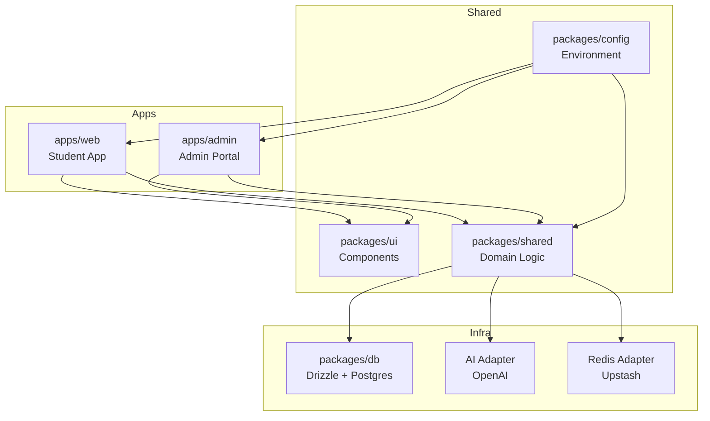
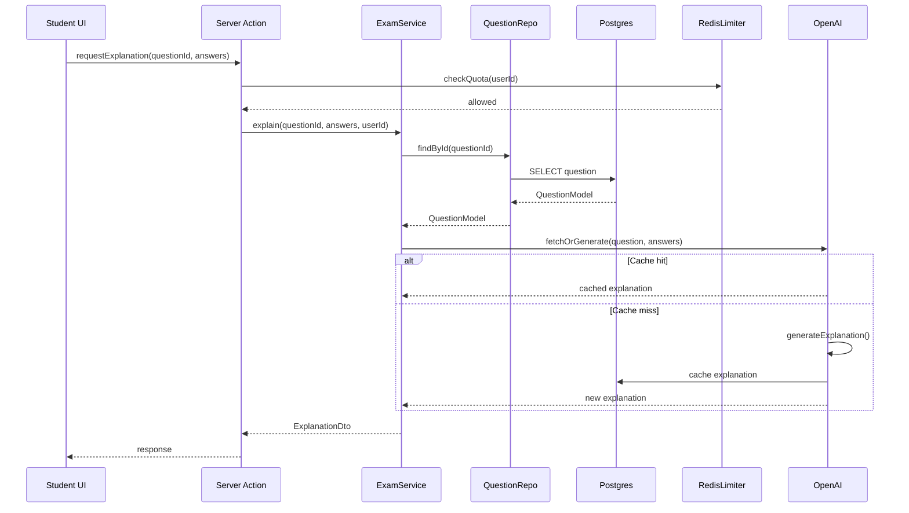

# Complete Build Specification — Brainliest/Brainiest Exam-Prep Platform

**Version:** 2.0.0 AUTHORITATIVE
**Last Updated:** 2025-10-02
**Status:** 🔒 LOCKED — Production-Ready Contract — DO NOT DEVIATE

> **⚠️ MASTER DOCUMENT REFERENCE:**
> This document is governed by **`PROJECT_MANIFEST.md`**
> See `PROJECT_MANIFEST.md` for AI guardrails, cross-references, and modification policies.
> **Any AI must read `PROJECT_MANIFEST.md` FIRST before working with this specification.**

---

## ⚠️ CRITICAL: Read This First

### 🔧 How to Use This Document

**Copy this entire specification into your AI builder (Codex/Claude/Cursor).** Treat it as the **immutable contract**. The AI must adhere to **every requirement verbatim**. **Do not begin coding until this prompt is fully accepted by your generator.**

### Global Contract

- **Mission**: Build a fully modular, SSOT (Single Source of Truth), zero-duplication platform for curated past-exam practice with AI explanations
- **Apps**:
  - **Public**: `apps/web` → served at `SITE_PRIMARY_DOMAIN` (student-facing)
  - **Admin**: `apps/admin` → served at `SITE_ADMIN_DOMAIN` (admin panel subdomain)
- **Domain Parameter** (to end brainiest/brainliest ambiguity):
  ```env
  SITE_PRIMARY_DOMAIN=brainiest.com  # OR brainliest.com — choose ONE
  SITE_ADMIN_DOMAIN=admin.${SITE_PRIMARY_DOMAIN}
  ```
  **All code uses these envs—never hardcode domains**

### Non-Negotiables

1. **Zero TypeScript errors**, no `any`, strict mode everywhere
2. **Schema-first** (Zod) → DTOs → services → repositories → UI; no UI↔DB coupling
3. **One SSOT** for enums/registries/schemas; no duplicated constants/types
4. **Snake_case** in DB, **camelCase** in TS, **kebab-case** for files/paths
5. **Meritocratic CI gates**: lint/type/test/build must pass; Playwright E2E on critical flows

---

## Table of Contents

1. [Technology Guardrails](#1-technology-guardrails)
2. [Monorepo Layout](#2-monorepo-layout)
3. [Naming & Style Conventions](#3-naming--style-conventions)
4. [Separation of Concerns & Dependencies](#4-separation-of-concerns--dependencies)
5. [Environment & Configuration](#5-environment--configuration)
6. [Shared Registries (SSOT)](#6-shared-registries-ssot)
7. [Database Schema](#7-database-schema)
8. [Redis Keyspace](#8-redis-keyspace)
9. [Public Application](#9-public-application)
10. [Admin Application](#10-admin-application)
11. [API & Server Actions](#11-api--server-actions)
12. [AI Explanation Service](#12-ai-explanation-service)
13. [Search & Discovery](#13-search--discovery)
14. [Security & Compliance](#14-security--compliance)
15. [Performance & Caching](#15-performance--caching)
16. [Analytics & Telemetry](#16-analytics--telemetry)
17. [Testing & CI/CD](#17-testing--cicd)
18. [Developer Experience](#18-developer-experience)
19. [Implementation Phases](#19-implementation-phases)
20. [Quality Gates](#20-quality-gates)
21. [Diagrams](#21-diagrams)
22. [Interface Contracts](#22-interface-contracts)
23. [Import Templates](#23-import-templates)
24. [Route Maps](#24-route-maps)
25. [Deployment & Operations](#25-deployment--operations)
26. [Appendices](#26-appendices)

---

## 1) Technology Guardrails

### Core Framework
- **Framework**: Next.js 14 App Router with React Server Components; Route Handlers for `/api`
- **TypeScript**: `"strict": true`, disallow `any`, consistent type imports, Zod for boundary validation
- **UI**: Tailwind CSS + shadcn/ui (Radix primitives). Accessible (WCAG 2.1 AA), responsive, keyboard-first
- **Data**: PostgreSQL 15+ via Drizzle ORM + migrations (`drizzle-kit`)
- **Cache/Coordination**: Redis (Upstash): caching, rate limits, session locks, background jobs
- **Auth**:
  - **Students**: NextAuth v5 (OAuth + email/password + optional magic link)
  - **Admin**: Custom Credentials + WebAuthn + TOTP, separate cookie namespace + CSRF + optional IP allowlist
- **AI**: OpenAI GPT-4/o3 (responses structured via function schema). Guard against prompt injection; cache explanations
- **Deployment**: Vercel for web/admin; Vercel Cron optional; Redis: Upstash. Drizzle migrations via CI hook

### Tooling Stack
- **Package Manager**: pnpm with workspaces
- **Build Tool**: Turborepo for monorepo caching
- **Linting**: ESLint + TypeScript ESLint
- **Formatting**: Prettier
- **Testing**: Vitest (unit), Playwright (E2E), Testing Library (component)
- **Component Preview**: Storybook
- **Code Generation**: Plop generators
- **Dependency Validation**: Dependency Cruiser

---

## 2) Monorepo Layout

```
brainliest/
├── apps/
│   ├── web/              # Student-facing Next.js App Router app
│   ├── admin/            # Admin portal Next.js App Router app
│   └── workers/          # Optional: cron/queue serverless handlers
├── packages/
│   ├── ui/               # Shared component library (shadcn/radix, typed)
│   ├── shared/           # Domain enums, Zod schemas, DTOs, services, adapters
│   ├── db/               # Drizzle schema, migrations, repositories, seeders
│   ├── config/           # Zod env, typed config, Redis key builders, route registries
│   ├── testing/          # Vitest/Playwright utils, factories, E2E helpers
│   └── tooling/          # Codegen, Plop generators, eslint-config, dep-cruiser rules
├── docs/
│   ├── architecture/     # System diagrams, ADRs
│   ├── api/              # API documentation
│   └── ops/              # Runbooks, deployment guides
├── turbo.json
├── pnpm-workspace.yaml
├── .dependency-cruiser.js
├── .editorconfig
├── .vscode/
│   └── settings.json
└── package.json
```

### Package Responsibilities

| Package | Purpose | Allowed Imports |
|---------|---------|-----------------|
| `apps/web` | Student UI, pages, layouts | `packages/ui`, `packages/shared/domain`, `packages/config` |
| `apps/admin` | Admin UI, pages, layouts | `packages/ui`, `packages/shared/domain`, `packages/config` |
| `packages/ui` | Reusable components, design system | `None` (visual only) |
| `packages/shared` | Domain logic, services, DTOs, schemas | Utility libraries only |
| `packages/db` | Repository interfaces, Drizzle impl | `packages/shared/domain` (types only) |
| `packages/config` | Environment, constants, registries | `None` |

---

## 3) Naming & Style Conventions

### File & Directory Naming
- **Files**: `kebab-case` (e.g., `question-service.ts`, `exam-card.tsx`)
- **Directories**: `kebab-case` (e.g., `exam-sessions/`, `user-profiles/`)
- **Test files**: `*.test.ts` or `*.spec.ts`
- **Storybook**: `*.stories.tsx`

### Code Naming
- **Components**: `PascalCase` (e.g., `QuestionCard`, `ExamSessionPanel`)
- **Functions & Variables**: `camelCase` (e.g., `startExamSession`, `questionRepository`)
- **Types & Interfaces**: `PascalCase` (e.g., `QuestionModel`, `ExamRepository`)
- **Constants**: `UPPER_SNAKE_CASE` (e.g., `MAX_QUESTIONS_PER_SESSION`, `AI_EXPLANATION_TTL`)
- **Enums**: `PascalCase` for name, `UPPER_SNAKE_CASE` for values

```typescript
export enum ExamDifficulty {
  EASY = 'EASY',
  MEDIUM = 'MEDIUM',
  HARD = 'HARD',
  EXPERT = 'EXPERT',
}
```

### Database Naming
- **Tables**: `snake_case` (e.g., `exam_sessions`, `question_ai_explanations`)
- **Columns**: `snake_case` (e.g., `created_at`, `user_id`, `exam_slug`)
- **Indexes**: `idx_{table}_{column(s)}` (e.g., `idx_questions_exam_slug`)
- **Foreign Keys**: `fk_{table}_{ref_table}` (e.g., `fk_questions_exams`)

**Note**: Drizzle schema exports use `camelCase`; mapper functions handle conversion.

### Route Naming
- **Public routes**: `kebab-case` (e.g., `/exam-sessions`, `/practice/aws-certified-developer`)
- **API routes**: `/api/v1/` prefix, versioned (e.g., `/api/v1/exam-sessions`)

### Schema Type Suffixes
- **Zod schemas**: `XxxSchema` (e.g., `createQuestionSchema`, `updateExamSchema`)
- **DTOs**: `XxxDto` (e.g., `QuestionDto`, `ExamResultDto`)
- **Domain models**: `XxxModel` (e.g., `QuestionModel`, `ExamSessionModel`)
- **Drizzle entities**: `XxxEntity` (internal to `packages/db`)

### Export Strategy
- **No default exports** except for Next.js page/layout/route components
- **Named exports** for all other modules to improve refactoring and IDE support

---

## 4) Separation of Concerns & Dependencies

### Layered Architecture

```
┌─────────────────────────────────────┐
│   Presentation Layer                │  ← apps/web, apps/admin
│   (UI Components, Pages, Layouts)   │
└──────────────┬──────────────────────┘
               │
┌──────────────▼──────────────────────┐
│   Application Layer                 │  ← Server Actions, Route Handlers
│   (Orchestration, Use Cases)        │
└──────────────┬──────────────────────┘
               │
┌──────────────▼──────────────────────┐
│   Domain Layer                      │  ← packages/shared
│   (Business Logic, Models, Schemas) │
└──────────────┬──────────────────────┘
               │
┌──────────────▼──────────────────────┐
│   Infrastructure Layer              │  ← packages/db, adapters
│   (DB, Cache, External APIs)        │
└─────────────────────────────────────┘
```

### Dependency Rules (ENFORCED)

1. **`apps/*`** → may import **ONLY** from `packages/ui`, `packages/shared/domain`, `packages/config`
2. **`apps/*/server-actions`** → use service interfaces from `packages/shared/services`, **NOT** raw repos
3. **`packages/shared`** → pure domain + service contracts + adapter interfaces. **NO DB code**
4. **`packages/db`** → repository interfaces + Drizzle implementations, migration & seeding tools
5. **`packages/ui`** → **no data access**, visual only + hooks (no infra)

### Enforcement via Dependency Cruiser

```javascript
// .dependency-cruiser.js
module.exports = {
  forbidden: [
    {
      name: 'apps-no-direct-db',
      severity: 'error',
      comment: 'Apps should use repositories via services',
      from: { path: '^apps/(web|admin)' },
      to: { path: '^packages/db' },
    },
    {
      name: 'ui-no-infra',
      severity: 'error',
      comment: 'UI components should not import infrastructure',
      from: { path: '^packages/ui' },
      to: { path: '^packages/(db|shared/(ai|redis))' },
    },
    {
      name: 'no-admin-to-web',
      severity: 'error',
      from: { path: '^apps/admin' },
      to: { path: '^apps/web' },
    },
    {
      name: 'no-web-to-admin',
      severity: 'error',
      from: { path: '^apps/web' },
      to: { path: '^apps/admin' },
    },
  ],
  options: {
    tsPreCompilationDeps: true,
    enhancedResolveOptions: {
      extensions: ['.ts', '.tsx'],
      exportsFields: ['exports'],
    },
  },
};
```

---

## 5) Environment & Configuration

### Server Environment Variables (Zod-validated)

```typescript
// packages/config/env.server.ts
import { z } from 'zod';

const serverEnvSchema = z.object({
  // Database
  DATABASE_URL: z.string().url(),

  // Redis
  REDIS_URL: z.string().url(),

  // Auth
  NEXTAUTH_SECRET: z.string().min(32),
  NEXTAUTH_URL: z.string().url(),

  // AI
  OPENAI_API_KEY: z.string().startsWith('sk-'),

  // Site Config
  SITE_PRIMARY_DOMAIN: z.string().min(1),
  SITE_ADMIN_DOMAIN: z.string().min(1),

  // Security
  SITE_KMS_MASTER_KEY: z.string().length(64),

  // Integrations (optional)
  CAPTCHA_SECRET: z.string().optional(),
  STRIPE_SECRET_KEY: z.string().optional(),
  RESEND_API_KEY: z.string().optional(),
});

export const env = serverEnvSchema.parse(process.env);
```

### Client Environment Variables

```typescript
// packages/config/env.client.ts
import { z } from 'zod';

const clientEnvSchema = z.object({
  NEXT_PUBLIC_SITE_NAME: z.string().default('Brainliest'),
  NEXT_PUBLIC_SITE_URL: z.string().url(),
});

export const clientEnv = clientEnvSchema.parse({
  NEXT_PUBLIC_SITE_NAME: process.env.NEXT_PUBLIC_SITE_NAME,
  NEXT_PUBLIC_SITE_URL: process.env.NEXT_PUBLIC_SITE_URL,
});
```

### Configuration Exports

```typescript
// packages/config/index.ts
export { env } from './env.server';
export { clientEnv } from './env.client';
export { redisKeys } from './redis-keys';
export { routes } from './routes';
export { featureFlags } from './feature-flags';
```

---

## 6) Shared Registries (SSOT)

### Enums & Types

```typescript
// packages/shared/src/domain/enums.ts
export enum UserRole {
  STUDENT = 'STUDENT',
  EDITOR = 'EDITOR',
  ADMIN = 'ADMIN',
  SUPERADMIN = 'SUPERADMIN',
}

export enum AdminRole {
  VIEWER = 'VIEWER',
  EDITOR = 'EDITOR',
  ADMIN = 'ADMIN',
  SUPERADMIN = 'SUPERADMIN',
}

export enum ExamDifficulty {
  EASY = 'EASY',
  MEDIUM = 'MEDIUM',
  HARD = 'HARD',
  EXPERT = 'EXPERT',
}

export enum QuestionType {
  SINGLE = 'SINGLE',
  MULTI = 'MULTI',
}

export enum CategoryKind {
  PROFESSIONAL = 'PROFESSIONAL',
  ACADEMIC = 'ACADEMIC',
  STANDARDIZED = 'STANDARDIZED',
}

export enum IntegrationKeyType {
  OPENAI = 'OPENAI',
  STRIPE = 'STRIPE',
  RESEND = 'RESEND',
  CAPTCHA = 'CAPTCHA',
}

export enum AuditAction {
  CREATE = 'CREATE',
  UPDATE = 'UPDATE',
  DELETE = 'DELETE',
  PUBLISH = 'PUBLISH',
  UNPUBLISH = 'UNPUBLISH',
  BLOCK_USER = 'BLOCK_USER',
  UNBLOCK_USER = 'UNBLOCK_USER',
}
```

### Feature Flag Registry

```typescript
// packages/config/feature-flags.ts
export const FEATURE_FLAGS = {
  AI_EXPLANATIONS_ENABLED: {
    key: 'ai_explanations_enabled',
    description: 'Enable AI-powered answer explanations',
    defaultValue: true,
    rolloutType: 'boolean' as const,
  },
  BULK_QUESTION_IMPORT: {
    key: 'bulk_question_import',
    description: 'Allow CSV/JSON question imports',
    defaultValue: false,
    rolloutType: 'boolean' as const,
  },
  FREEMIUM_DAILY_LIMIT: {
    key: 'freemium_daily_limit',
    description: 'Max questions per day for free users',
    defaultValue: 20,
    rolloutType: 'number' as const,
  },
  ADMIN_IP_ALLOWLIST: {
    key: 'admin_ip_allowlist',
    description: 'Restrict admin login to specific IPs',
    defaultValue: false,
    rolloutType: 'boolean' as const,
  },
} as const;

export type FeatureFlagKey = keyof typeof FEATURE_FLAGS;
```

### Redis Key Registry

```typescript
// packages/config/redis-keys.ts
export const redisKeys = {
  // Caches
  categoryTree: () => 'cache:category-tree:v1',
  examMeta: (slug: string) => `cache:exam:meta:${slug}`,
  question: (id: string, version: number) => `cache:question:${id}:v${version}`,
  searchSuggest: (prefix: string) => `cache:search:suggest:${prefix}`,

  // AI Explanations
  aiExplanation: (questionId: string, answerHash: string, model: string, lang: string) =>
    `ai:explanation:${questionId}:${answerHash}:${model}:${lang}`,

  // Rate Limits
  rateLimitAi: (identifier: string) => `ratelimit:ai:${identifier}`,
  rateLimitAuth: (ip: string) => `ratelimit:auth:${ip}`,
  rateLimitSearch: (ip: string) => `ratelimit:search:${ip}`,

  // Sessions
  adminSession: (sessionId: string) => `session:admin:${sessionId}`,

  // Locks
  lockImport: (importId: string) => `lock:import:${importId}`,

  // Queues
  queue: (name: string) => `queue:${name}`,
} as const;

export const REDIS_TTL = {
  AI_EXPLANATION: 60 * 60 * 24 * 7, // 7 days
  EXAM_META: 60 * 60 * 6, // 6 hours
  QUESTION: 60 * 60 * 6, // 6 hours
  CATEGORY_TREE: 60 * 60 * 12, // 12 hours
  SEARCH_SUGGEST: 60 * 60 * 24, // 24 hours
  ADMIN_SESSION: 60 * 60 * 8, // 8 hours
  RATE_LIMIT_WINDOW: 60 * 60, // 1 hour
  IMPORT_LOCK: 60 * 5, // 5 minutes
} as const;
```

### Route Registry

```typescript
// packages/config/routes.ts
export const routes = {
  // Public
  home: () => '/',
  categories: () => '/categories',
  category: (slug: string) => `/categories/${slug}`,
  subjects: () => '/subjects',
  subject: (slug: string) => `/subjects/${slug}`,
  exam: (slug: string) => `/exams/${slug}`,
  practice: (slug: string) => `/practice/${slug}`,
  results: (sessionId: string) => `/results/${sessionId}`,
  search: (query?: string) => query ? `/search?q=${encodeURIComponent(query)}` : '/search',

  // Auth
  signIn: () => '/auth/sign-in',
  signUp: () => '/auth/sign-up',
  resetPassword: () => '/auth/reset-password',

  // Account
  account: () => '/account',
  accountSettings: () => '/account/settings',
  accountHistory: () => '/account/history',
  accountBookmarks: () => '/account/bookmarks',

  // Admin
  adminLogin: () => '/login',
  adminDashboard: () => '/dashboard',
  adminQuestions: () => '/questions',
  adminExams: () => '/exams',
  adminUsers: () => '/users',
  adminIntegrations: () => '/integrations',
  adminAuditLog: () => '/audit-logs',
} as const;
```

### Analytics Event Registry

```typescript
// packages/shared/src/analytics/events.ts
export const ANALYTICS_EVENTS = {
  PAGE_VIEW: 'page_view',
  EXAM_STARTED: 'exam_started',
  QUESTION_ANSWERED: 'question_answered',
  EXPLANATION_REQUESTED: 'explanation_requested',
  EXAM_COMPLETED: 'exam_completed',
  USER_REGISTERED: 'user_registered',
  SUBJECT_VIEWED: 'subject_viewed',
  SEARCH_PERFORMED: 'search_performed',
  ADMIN_ACTION: 'admin_action',
} as const;

export interface BaseEvent {
  eventName: string;
  userId?: string;
  sessionId?: string;
  timestamp: number;
  properties: Record<string, unknown>;
}

export interface ExamStartedEvent extends BaseEvent {
  eventName: typeof ANALYTICS_EVENTS.EXAM_STARTED;
  properties: {
    examSlug: string;
    subjectSlug: string;
    mode: 'practice' | 'timed';
  };
}

export interface QuestionAnsweredEvent extends BaseEvent {
  eventName: typeof ANALYTICS_EVENTS.QUESTION_ANSWERED;
  properties: {
    questionId: string;
    examSlug: string;
    domain: string;
    isCorrect: boolean;
    timeSpentMs: number;
  };
}
```

---

## 7) Database Schema

### Core Principles

- All tables use `snake_case` naming
- Every table includes: `id` (uuid or composite PK), `created_at`, `updated_at`
- Soft deletes via `deleted_at` where needed
- Foreign keys with ON DELETE CASCADE or SET NULL as appropriate
- JSONB for flexible metadata
- Drizzle exports map to `camelCase` via mapper functions

### Taxonomy Tables

```sql
-- Categories (root level)
CREATE TABLE categories (
  slug VARCHAR(255) PRIMARY KEY,
  name VARCHAR(255) NOT NULL,
  description TEXT,
  icon VARCHAR(100),
  sort_order INTEGER NOT NULL DEFAULT 0,
  kind VARCHAR(50) NOT NULL, -- professional|academic|standardized
  active BOOLEAN NOT NULL DEFAULT TRUE,
  created_at TIMESTAMPTZ NOT NULL DEFAULT CURRENT_TIMESTAMP,
  updated_at TIMESTAMPTZ NOT NULL DEFAULT CURRENT_TIMESTAMP
);

-- Subcategories
CREATE TABLE subcategories (
  slug VARCHAR(255) PRIMARY KEY,
  category_slug VARCHAR(255) NOT NULL REFERENCES categories(slug) ON DELETE CASCADE,
  name VARCHAR(255) NOT NULL,
  description TEXT,
  icon VARCHAR(100),
  sort_order INTEGER NOT NULL DEFAULT 0,
  active BOOLEAN NOT NULL DEFAULT TRUE,
  created_at TIMESTAMPTZ NOT NULL DEFAULT CURRENT_TIMESTAMP,
  updated_at TIMESTAMPTZ NOT NULL DEFAULT CURRENT_TIMESTAMP
);

-- Subjects
CREATE TABLE subjects (
  slug VARCHAR(255) PRIMARY KEY,
  category_slug VARCHAR(255) NOT NULL REFERENCES categories(slug) ON DELETE CASCADE,
  subcategory_slug VARCHAR(255) REFERENCES subcategories(slug) ON DELETE SET NULL,
  name VARCHAR(255) NOT NULL,
  description TEXT,
  icon VARCHAR(100),
  difficulty VARCHAR(50), -- EASY|MEDIUM|HARD|EXPERT
  tags TEXT[],
  active BOOLEAN NOT NULL DEFAULT TRUE,
  metadata JSONB DEFAULT '{}',
  created_at TIMESTAMPTZ NOT NULL DEFAULT CURRENT_TIMESTAMP,
  updated_at TIMESTAMPTZ NOT NULL DEFAULT CURRENT_TIMESTAMP
);

CREATE INDEX idx_subjects_category ON subjects(category_slug);
CREATE INDEX idx_subjects_subcategory ON subjects(subcategory_slug);
```

### Exam & Question Tables

```sql
-- Exams
CREATE TABLE exams (
  slug VARCHAR(255) PRIMARY KEY,
  subject_slug VARCHAR(255) NOT NULL REFERENCES subjects(slug) ON DELETE CASCADE,
  title VARCHAR(500) NOT NULL,
  description TEXT,
  duration_minutes INTEGER,
  question_target INTEGER,
  difficulty VARCHAR(50), -- EASY|MEDIUM|HARD|EXPERT
  status VARCHAR(50) NOT NULL DEFAULT 'draft', -- draft|published|archived
  metadata JSONB DEFAULT '{}',
  created_at TIMESTAMPTZ NOT NULL DEFAULT CURRENT_TIMESTAMP,
  updated_at TIMESTAMPTZ NOT NULL DEFAULT CURRENT_TIMESTAMP
);

CREATE INDEX idx_exams_subject ON exams(subject_slug);
CREATE INDEX idx_exams_status ON exams(status);

-- Questions
CREATE TABLE questions (
  id UUID PRIMARY KEY DEFAULT gen_random_uuid(),
  exam_slug VARCHAR(255) REFERENCES exams(slug) ON DELETE SET NULL,
  subject_slug VARCHAR(255) NOT NULL REFERENCES subjects(slug) ON DELETE CASCADE,
  current_version_id UUID, -- FK to question_versions (set after insert)
  type VARCHAR(50) NOT NULL, -- single|multi
  difficulty VARCHAR(50) NOT NULL,
  source VARCHAR(255),
  copyright TEXT,
  year INTEGER,
  published BOOLEAN NOT NULL DEFAULT FALSE,
  created_at TIMESTAMPTZ NOT NULL DEFAULT CURRENT_TIMESTAMP,
  updated_at TIMESTAMPTZ NOT NULL DEFAULT CURRENT_TIMESTAMP
);

-- Question Versions (versioned content)
CREATE TABLE question_versions (
  id UUID PRIMARY KEY DEFAULT gen_random_uuid(),
  question_id UUID NOT NULL REFERENCES questions(id) ON DELETE CASCADE,
  stem_markdown TEXT NOT NULL,
  has_katex BOOLEAN NOT NULL DEFAULT FALSE,
  explanation_markdown TEXT,
  is_current BOOLEAN NOT NULL DEFAULT FALSE,
  created_at TIMESTAMPTZ NOT NULL DEFAULT CURRENT_TIMESTAMP
);

-- Choices (tied to version)
CREATE TABLE choices (
  id UUID PRIMARY KEY DEFAULT gen_random_uuid(),
  question_version_id UUID NOT NULL REFERENCES question_versions(id) ON DELETE CASCADE,
  label VARCHAR(10) NOT NULL, -- A, B, C, D, etc.
  content_markdown TEXT NOT NULL,
  is_correct BOOLEAN NOT NULL DEFAULT FALSE,
  sort_order INTEGER NOT NULL DEFAULT 0
);

-- Question Assets
CREATE TABLE question_assets (
  id UUID PRIMARY KEY DEFAULT gen_random_uuid(),
  question_id UUID NOT NULL REFERENCES questions(id) ON DELETE CASCADE,
  type VARCHAR(50) NOT NULL, -- image|audio|file
  url TEXT NOT NULL,
  metadata JSONB DEFAULT '{}',
  created_at TIMESTAMPTZ NOT NULL DEFAULT CURRENT_TIMESTAMP
);

-- Tags
CREATE TABLE tags (
  id UUID PRIMARY KEY DEFAULT gen_random_uuid(),
  slug VARCHAR(255) UNIQUE NOT NULL,
  label VARCHAR(255) NOT NULL,
  created_at TIMESTAMPTZ NOT NULL DEFAULT CURRENT_TIMESTAMP
);

-- Question-Tag Junction
CREATE TABLE question_tags (
  question_id UUID NOT NULL REFERENCES questions(id) ON DELETE CASCADE,
  tag_id UUID NOT NULL REFERENCES tags(id) ON DELETE CASCADE,
  PRIMARY KEY (question_id, tag_id)
);

CREATE INDEX idx_questions_exam ON questions(exam_slug);
CREATE INDEX idx_questions_subject ON questions(subject_slug);
CREATE INDEX idx_question_versions_question ON question_versions(question_id);
CREATE INDEX idx_choices_version ON choices(question_version_id);
```

### AI Explanation Tables

```sql
-- AI-generated explanations (cached)
CREATE TABLE question_ai_explanations (
  id UUID PRIMARY KEY DEFAULT gen_random_uuid(),
  question_version_id UUID NOT NULL REFERENCES question_versions(id) ON DELETE CASCADE,
  answer_hash VARCHAR(255) NOT NULL, -- hash of selected choice IDs
  model VARCHAR(100) NOT NULL,
  language VARCHAR(10) NOT NULL DEFAULT 'en',
  content_markdown TEXT NOT NULL,
  tokens_total INTEGER NOT NULL,
  cost_cents INTEGER NOT NULL,
  created_at TIMESTAMPTZ NOT NULL DEFAULT CURRENT_TIMESTAMP,
  UNIQUE(question_version_id, answer_hash, model, language)
);

CREATE INDEX idx_ai_explanations_version ON question_ai_explanations(question_version_id);
```

### User Tables

```sql
-- Users (students)
CREATE TABLE users (
  id UUID PRIMARY KEY DEFAULT gen_random_uuid(),
  email VARCHAR(255) UNIQUE NOT NULL,
  password_hash TEXT,
  name VARCHAR(255),
  image_url TEXT,
  role VARCHAR(50) NOT NULL DEFAULT 'STUDENT', -- STUDENT|EDITOR|ADMIN|SUPERADMIN
  status VARCHAR(50) NOT NULL DEFAULT 'ACTIVE', -- ACTIVE|BLOCKED|SUSPENDED
  email_verified_at TIMESTAMPTZ,
  created_at TIMESTAMPTZ NOT NULL DEFAULT CURRENT_TIMESTAMP,
  updated_at TIMESTAMPTZ NOT NULL DEFAULT CURRENT_TIMESTAMP
);

-- User Profiles
CREATE TABLE user_profiles (
  user_id UUID PRIMARY KEY REFERENCES users(id) ON DELETE CASCADE,
  first_name VARCHAR(255),
  last_name VARCHAR(255),
  avatar_url TEXT,
  preferences JSONB DEFAULT '{}',
  created_at TIMESTAMPTZ NOT NULL DEFAULT CURRENT_TIMESTAMP,
  updated_at TIMESTAMPTZ NOT NULL DEFAULT CURRENT_TIMESTAMP
);

-- NextAuth tables (standard schema)
CREATE TABLE accounts (
  id UUID PRIMARY KEY DEFAULT gen_random_uuid(),
  user_id UUID NOT NULL REFERENCES users(id) ON DELETE CASCADE,
  type VARCHAR(255) NOT NULL,
  provider VARCHAR(255) NOT NULL,
  provider_account_id VARCHAR(255) NOT NULL,
  refresh_token TEXT,
  access_token TEXT,
  expires_at BIGINT,
  token_type VARCHAR(255),
  scope VARCHAR(255),
  id_token TEXT,
  session_state VARCHAR(255),
  created_at TIMESTAMPTZ NOT NULL DEFAULT CURRENT_TIMESTAMP,
  updated_at TIMESTAMPTZ NOT NULL DEFAULT CURRENT_TIMESTAMP,
  UNIQUE(provider, provider_account_id)
);

CREATE TABLE sessions (
  id UUID PRIMARY KEY DEFAULT gen_random_uuid(),
  user_id UUID NOT NULL REFERENCES users(id) ON DELETE CASCADE,
  session_token VARCHAR(255) UNIQUE NOT NULL,
  expires TIMESTAMPTZ NOT NULL,
  created_at TIMESTAMPTZ NOT NULL DEFAULT CURRENT_TIMESTAMP,
  updated_at TIMESTAMPTZ NOT NULL DEFAULT CURRENT_TIMESTAMP
);

CREATE TABLE verification_tokens (
  identifier VARCHAR(255) NOT NULL,
  token VARCHAR(255) NOT NULL,
  expires TIMESTAMPTZ NOT NULL,
  PRIMARY KEY (identifier, token)
);

-- Admin Users (separate from students)
CREATE TABLE admin_users (
  id UUID PRIMARY KEY DEFAULT gen_random_uuid(),
  email VARCHAR(255) UNIQUE NOT NULL,
  password_hash TEXT NOT NULL,
  role VARCHAR(50) NOT NULL DEFAULT 'VIEWER', -- VIEWER|EDITOR|ADMIN|SUPERADMIN
  totp_secret TEXT,
  webauthn JSONB,
  status VARCHAR(50) NOT NULL DEFAULT 'ACTIVE',
  last_login_at TIMESTAMPTZ,
  created_at TIMESTAMPTZ NOT NULL DEFAULT CURRENT_TIMESTAMP,
  updated_at TIMESTAMPTZ NOT NULL DEFAULT CURRENT_TIMESTAMP
);
```

### Session & Attempt Tables

```sql
-- Exam Sessions
CREATE TABLE exam_sessions (
  id UUID PRIMARY KEY DEFAULT gen_random_uuid(),
  user_id UUID NOT NULL REFERENCES users(id) ON DELETE CASCADE,
  exam_slug VARCHAR(255) NOT NULL REFERENCES exams(slug) ON DELETE CASCADE,
  mode VARCHAR(50) NOT NULL, -- practice|timed
  status VARCHAR(50) NOT NULL DEFAULT 'in_progress', -- in_progress|completed|abandoned
  score_percent NUMERIC(5,2),
  time_spent_seconds INTEGER,
  started_at TIMESTAMPTZ NOT NULL DEFAULT CURRENT_TIMESTAMP,
  completed_at TIMESTAMPTZ,
  metadata JSONB DEFAULT '{}'
);

-- Session Questions (tracks user answers per question)
CREATE TABLE exam_session_questions (
  id UUID PRIMARY KEY DEFAULT gen_random_uuid(),
  session_id UUID NOT NULL REFERENCES exam_sessions(id) ON DELETE CASCADE,
  question_id UUID NOT NULL REFERENCES questions(id) ON DELETE CASCADE,
  question_version_id UUID NOT NULL REFERENCES question_versions(id) ON DELETE CASCADE,
  order_index INTEGER NOT NULL,
  selected_choice_ids UUID[],
  is_correct BOOLEAN,
  time_spent_ms INTEGER,
  ai_explanation_id UUID REFERENCES question_ai_explanations(id),
  created_at TIMESTAMPTZ NOT NULL DEFAULT CURRENT_TIMESTAMP,
  UNIQUE(session_id, question_id)
);

-- Bookmarks
CREATE TABLE bookmarks (
  id UUID PRIMARY KEY DEFAULT gen_random_uuid(),
  user_id UUID NOT NULL REFERENCES users(id) ON DELETE CASCADE,
  question_id UUID NOT NULL REFERENCES questions(id) ON DELETE CASCADE,
  notes TEXT,
  created_at TIMESTAMPTZ NOT NULL DEFAULT CURRENT_TIMESTAMP,
  UNIQUE(user_id, question_id)
);

CREATE INDEX idx_exam_sessions_user ON exam_sessions(user_id);
CREATE INDEX idx_session_questions_session ON exam_session_questions(session_id);
```

### Admin & Operations Tables

```sql
-- Integration Keys (encrypted)
CREATE TABLE integration_keys (
  id UUID PRIMARY KEY DEFAULT gen_random_uuid(),
  name VARCHAR(255) NOT NULL,
  type VARCHAR(100) NOT NULL, -- OPENAI|STRIPE|RESEND|CAPTCHA
  encrypted_value BYTEA NOT NULL,
  description TEXT,
  environment VARCHAR(50) NOT NULL DEFAULT 'production', -- dev|preview|production
  last_rotated_at TIMESTAMPTZ,
  created_by_admin UUID REFERENCES admin_users(id),
  disabled BOOLEAN NOT NULL DEFAULT FALSE,
  created_at TIMESTAMPTZ NOT NULL DEFAULT CURRENT_TIMESTAMP,
  updated_at TIMESTAMPTZ NOT NULL DEFAULT CURRENT_TIMESTAMP
);

-- Feature Flags
CREATE TABLE feature_flags (
  key VARCHAR(255) PRIMARY KEY,
  description TEXT,
  enabled BOOLEAN NOT NULL DEFAULT FALSE,
  rollout_percentage INTEGER DEFAULT 100,
  metadata JSONB DEFAULT '{}',
  created_at TIMESTAMPTZ NOT NULL DEFAULT CURRENT_TIMESTAMP,
  updated_at TIMESTAMPTZ NOT NULL DEFAULT CURRENT_TIMESTAMP
);

-- Audit Logs
CREATE TABLE audit_logs (
  id UUID PRIMARY KEY DEFAULT gen_random_uuid(),
  actor_type VARCHAR(50) NOT NULL, -- admin|user|system
  actor_id UUID,
  action VARCHAR(255) NOT NULL,
  entity_type VARCHAR(100),
  entity_id VARCHAR(255),
  diff JSONB,
  ip_address VARCHAR(45),
  user_agent TEXT,
  created_at TIMESTAMPTZ NOT NULL DEFAULT CURRENT_TIMESTAMP
);

-- Bans
CREATE TABLE bans (
  id UUID PRIMARY KEY DEFAULT gen_random_uuid(),
  user_id UUID NOT NULL REFERENCES users(id) ON DELETE CASCADE,
  admin_id UUID NOT NULL REFERENCES admin_users(id),
  reason TEXT NOT NULL,
  expires_at TIMESTAMPTZ,
  created_at TIMESTAMPTZ NOT NULL DEFAULT CURRENT_TIMESTAMP
);

-- Announcements
CREATE TABLE announcements (
  id UUID PRIMARY KEY DEFAULT gen_random_uuid(),
  title VARCHAR(500) NOT NULL,
  body TEXT NOT NULL,
  starts_at TIMESTAMPTZ NOT NULL,
  ends_at TIMESTAMPTZ,
  audience VARCHAR(50) NOT NULL DEFAULT 'all', -- all|students|admins
  active BOOLEAN NOT NULL DEFAULT TRUE,
  created_at TIMESTAMPTZ NOT NULL DEFAULT CURRENT_TIMESTAMP,
  updated_at TIMESTAMPTZ NOT NULL DEFAULT CURRENT_TIMESTAMP
);

CREATE INDEX idx_audit_logs_actor ON audit_logs(actor_id);
CREATE INDEX idx_audit_logs_entity ON audit_logs(entity_type, entity_id);
```

### Full-Text Search

```sql
-- Materialized view for search
CREATE MATERIALIZED VIEW search_documents AS
SELECT
  'question'::text AS doc_type,
  q.id AS doc_id,
  qv.stem_markdown AS title,
  qv.explanation_markdown AS description,
  s.name AS subject_name,
  e.title AS exam_title,
  setweight(to_tsvector('english', COALESCE(qv.stem_markdown, '')), 'A') ||
  setweight(to_tsvector('english', COALESCE(qv.explanation_markdown, '')), 'B') ||
  setweight(to_tsvector('english', COALESCE(s.name, '')), 'C') ||
  setweight(to_tsvector('english', COALESCE(e.title, '')), 'D') AS search_vector
FROM questions q
JOIN question_versions qv ON q.current_version_id = qv.id
JOIN subjects s ON q.subject_slug = s.slug
LEFT JOIN exams e ON q.exam_slug = e.slug
WHERE q.published = true;

CREATE INDEX idx_search_documents_vector ON search_documents USING GIN(search_vector);

-- Refresh function
CREATE OR REPLACE FUNCTION refresh_search_documents()
RETURNS void AS $$
BEGIN
  REFRESH MATERIALIZED VIEW CONCURRENTLY search_documents;
END;
$$ LANGUAGE plpgsql;
```

---

## 8) Redis Keyspace

All Redis keys **MUST** use the typed builders from `packages/config/redis-keys.ts`. Never use string literals.

### Key Patterns

```typescript
// Cache keys
cache:category-tree:v1
cache:exam:meta:{examSlug}
cache:question:{questionId}:v{version}
cache:search:suggest:{prefix}

// AI explanation keys
ai:explanation:{questionId}:{answerHash}:{model}:{lang}

// Rate limit keys
ratelimit:ai:{userId|ip}
ratelimit:auth:{ip}
ratelimit:search:{ip}

// Session keys
session:admin:{sessionId}

// Lock keys
lock:import:{importId}

// Queue keys
queue:{queueName}
```

### TTL Strategy

| Key Pattern | TTL | Invalidation |
|-------------|-----|--------------|
| `cache:category-tree:v1` | 12 hours | On category/subject CRUD |
| `cache:exam:meta:{slug}` | 6 hours | On exam update |
| `cache:question:{id}:v{v}` | 6 hours | On question version change |
| `ai:explanation:*` | 7 days | Manual or on question update |
| `ratelimit:*` | 1 hour | Automatic expiry |
| `session:admin:*` | 8 hours | On logout or timeout |
| `lock:import:*` | 5 minutes | On completion or timeout |

---

## 9) Public Application

### Route Structure

```
apps/web/src/app/
├── (marketing)/
│   ├── page.tsx                    # Homepage (SSR/ISR)
│   ├── about/
│   ├── contact/
│   ├── privacy/
│   └── terms/
├── (catalog)/
│   ├── categories/
│   │   ├── page.tsx                # Category index
│   │   └── [categorySlug]/
│   │       ├── page.tsx            # Category detail
│   │       └── [subCategorySlug]/
│   │           └── page.tsx        # Subcategory detail
│   ├── subjects/
│   │   ├── page.tsx                # Subject list
│   │   └── [subjectSlug]/
│   │       └── page.tsx            # Subject detail with exams
├── (exam)/
│   ├── exams/
│   │   └── [examSlug]/
│   │       └── page.tsx            # Exam overview (ISR)
│   ├── practice/
│   │   └── [examSlug]/
│   │       ├── page.tsx            # Practice session (CSR + server actions)
│   │       └── actions.ts          # Server actions
│   └── results/
│       └── [sessionId]/
│           └── page.tsx            # Results summary (SSR)
├── (auth)/
│   ├── sign-in/
│   ├── sign-up/
│   └── reset-password/
├── (account)/
│   ├── account/
│   │   ├── page.tsx                # Profile
│   │   ├── settings/
│   │   ├── history/
│   │   └── bookmarks/
├── search/
│   └── page.tsx                    # Full-text search
└── api/
    └── v1/
        ├── categories/
        ├── exams/
        ├── questions/
        ├── exam-sessions/
        └── ai/
            └── explain/
```

### Key Features

#### Homepage
- Hero section with CTA
- Live stats (subjects, exams, questions)
- Category navigation grid
- Trending certifications
- SEO-optimized with Next.js metadata API

#### Practice Session Flow

**Requirements:**
1. Server action `startExamSession` creates `exam_sessions` record
2. Session token stored in httpOnly cookie
3. Question panel features:
   - Single/multi-select MCQ
   - Mark for review
   - Timer (persists across refresh)
   - Progress indicator
   - "Reveal Answer" button (no AI call, just shows correct answer)
   - "Explain with AI" button:
     - Triggers `requestExplanation` server action
     - Checks Redis cache first
     - If miss, calls OpenAI and caches result
     - Rate limited: 5 per minute, 50 per day per user
4. Accessibility:
   - Keyboard navigation (1-6 for answers, ←/→ for prev/next)
   - ARIA labels on all interactive elements
   - Focus management
   - Screen reader announcements

#### Results Page
- Score summary with gauge chart
- Per-domain accuracy breakdown
- Time distribution
- List of questions with ability to:
  - View question + user's answer
  - Request AI explanation (if not already requested)
- Retry exam CTA

---

## 10) Admin Application

### Route Structure

```
apps/admin/src/app/
├── (auth)/
│   └── login/
│       └── page.tsx
├── (dashboard)/
│   └── page.tsx
├── (content)/
│   ├── questions/
│   │   ├── page.tsx
│   │   ├── new/
│   │   ├── import/
│   │   └── [questionId]/
│   │       └── edit/
│   ├── exams/
│   │   ├── page.tsx
│   │   ├── new/
│   │   └── [examSlug]/
│   │       └── edit/
├── (taxonomy)/
│   ├── categories/
│   ├── subcategories/
│   └── subjects/
├── (users)/
│   ├── students/
│   └── admins/
├── (integrations)/
│   └── keys/
├── (settings)/
│   ├── feature-flags/
│   └── announcements/
├── (ai)/
│   └── explanations/
└── (audit)/
    └── logs/
```

### Key Features

#### Authentication
- Email + password + TOTP (Google Authenticator)
- Optional WebAuthn (hardware keys) for SUPERADMIN
- IP allowlist toggle via feature flag
- Separate cookie namespace: `__Host-admin_session`
- Session stored in Redis with revocation support

#### Dashboard
- KPI cards (DAU, total questions, AI usage, new registrations)
- Quick actions (add question, review AI logs)
- Recent activity feed
- Usage graphs (7-day, 30-day trends)

#### Question Management
- **List View**:
  - Filters: subject, exam, domain, difficulty, year, status
  - Inline preview of content
  - Bulk actions (assign to exam, publish, delete)
- **Create/Edit Form**:
  - Markdown editor with KaTeX preview
  - Options builder (min 2, max 10)
  - Mark correct answer(s)
  - Attach explanation
  - Domain tags, source, year
  - Asset upload
  - JSON preview
- **Bulk Import**:
  - Upload CSV/JSON/QTI
  - Mapping wizard
  - Dry-run preview
  - Detailed error reporting
  - Conflict detection (duplicate slugs)
- **Versioning**:
  - View diff across `question_versions`
  - Rollback to previous version

#### AI Console
- Token usage tracking
- Cost breakdown by question/subject
- View cached explanations
- Regenerate with different prompt
- Adjust prompt templates (versioned)
- Cache hit rate metrics

---

## 11) API & Server Actions

### API Structure

All endpoints under `/api/v1/` return typed responses:

```typescript
// Success response
{
  "success": true,
  "data": { ... },
  "meta": {
    "page": 1,
    "pageSize": 20,
    "totalCount": 150
  }
}

// Error response
{
  "success": false,
  "error": {
    "code": "VALIDATION_ERROR",
    "message": "Invalid input",
    "details": { ... }
  }
}
```

### Public Endpoints

```typescript
// Categories
GET /api/v1/categories → CategoryTree[]
GET /api/v1/categories/:slug → CategoryDetail

// Subjects
GET /api/v1/subjects → SubjectMeta[]
GET /api/v1/subjects/:slug → SubjectDetail

// Exams
GET /api/v1/exams?subject=:slug → ExamMeta[]
GET /api/v1/exams/:slug → ExamDetail

// Questions
GET /api/v1/questions/:id → QuestionView

// Sessions
POST /api/v1/exams/:slug/start → { sessionId, questions }
POST /api/v1/exam-sessions/:id/answer → { correct, revealed }

// AI
POST /api/v1/ai/explain → SSE stream { chunk } then final ExplanationDto

// Search
GET /api/v1/search?q=...&filters=... → { results, facets }
```

### Admin Endpoints (Protected)

All admin endpoints require:
- Valid admin session cookie
- CSRF token on POST/PATCH/DELETE
- Role-based permission check
- Rate limiting

```typescript
// Questions
POST /api/v1/admin/questions → QuestionModel
PATCH /api/v1/admin/questions/:id → QuestionModel
DELETE /api/v1/admin/questions/:id → void
POST /api/v1/admin/questions/import → { created, errors[] }

// Exams
POST /api/v1/admin/exams → ExamModel
PATCH /api/v1/admin/exams/:slug → ExamModel
DELETE /api/v1/admin/exams/:slug → void

// Users
GET /api/v1/admin/users → PaginatedResult<UserModel>
PATCH /api/v1/admin/users/:id → UserModel
POST /api/v1/admin/users/:id/block → void
POST /api/v1/admin/users/:id/unblock → void

// Integration Keys
GET /api/v1/admin/integration-keys → IntegrationKey[]
POST /api/v1/admin/integration-keys → IntegrationKey
PATCH /api/v1/admin/integration-keys/:id → IntegrationKey
DELETE /api/v1/admin/integration-keys/:id → void

// Audit Logs
GET /api/v1/admin/audit-logs → PaginatedResult<AuditLog>
```

### Server Actions Pattern

```typescript
// apps/web/app/practice/[examSlug]/actions.ts
'use server';

import { z } from 'zod';
import { authAction } from '@/lib/auth-action';
import { requestExplanationSchema } from '@brainliest/shared/schemas';

export const requestExplanation = authAction(
  requestExplanationSchema,
  async ({ questionId, selectedChoiceIds }, ctx) => {
    // Check rate limit
    const allowed = await rateLimiter.check(ctx.user.id);
    if (!allowed) {
      throw new RateLimitError('Too many explanation requests');
    }

    // Get or create explanation
    const explanation = await aiExplanationService.getOrCreate({
      questionId,
      selectedChoiceIds,
      userId: ctx.user.id,
    });

    return { success: true, data: explanation };
  }
);
```

---

## 12) AI Explanation Service

### Service Implementation

```typescript
// packages/shared/src/adapters/ai/explain-question.ts
import { OpenAI } from 'openai';
import type { QuestionModel } from '../../domain';
import { redis } from '../redis';
import { redisKeys, REDIS_TTL } from '@brainliest/config';

export interface ExplanationRequest {
  question: QuestionModel;
  selectedChoiceIds: string[];
  userId: string;
  locale?: string;
}

export interface ExplanationDto {
  summary: string;
  keyPoints: string[];
  steps: string[];
  relatedConcepts?: string[];
  confidence: 'low' | 'medium' | 'high';
}

const openai = new OpenAI({ apiKey: env.OPENAI_API_KEY });

const SYSTEM_PROMPT = `You are a concise, rigorous exam tutor. Explain answers step by step using only the provided question, choices, and correct answer.
Prefer formulas, definitions, and contrasts. Keep under 180 words. Use KaTeX-compatible LaTeX for math.
If the user-selected answer is wrong, briefly contrast with the correct one. If context is insufficient, say so and stop.`;

export async function generateExplanation(
  request: ExplanationRequest
): Promise<ExplanationDto> {
  const { question, selectedChoiceIds, locale = 'en' } = request;

  // Build answer hash for caching
  const answerHash = hashAnswers(selectedChoiceIds);
  const cacheKey = redisKeys.aiExplanation(
    question.id,
    answerHash,
    'gpt-4-turbo',
    locale
  );

  // Check cache
  const cached = await redis.get(cacheKey);
  if (cached) {
    return JSON.parse(cached);
  }

  // Generate via OpenAI
  const prompt = buildPrompt(question, selectedChoiceIds);

  const response = await openai.chat.completions.create({
    model: 'gpt-4-turbo-preview',
    messages: [
      { role: 'system', content: SYSTEM_PROMPT },
      { role: 'user', content: prompt },
    ],
    functions: [EXPLANATION_FUNCTION_SCHEMA],
    function_call: { name: 'provide_explanation' },
    temperature: 0.3,
  });

  const functionCall = response.choices[0]?.message?.function_call;
  if (!functionCall) {
    throw new Error('No function call in OpenAI response');
  }

  const explanation = JSON.parse(functionCall.arguments) as ExplanationDto;

  // Cache result
  await redis.setex(
    cacheKey,
    REDIS_TTL.AI_EXPLANATION,
    JSON.stringify(explanation)
  );

  // Persist to database for admin review
  await questionRepository.saveExplanation({
    questionVersionId: question.currentVersionId,
    answerHash,
    model: 'gpt-4-turbo',
    language: locale,
    contentMarkdown: JSON.stringify(explanation),
    tokensTotal: response.usage?.total_tokens ?? 0,
    costCents: calculateCost(response.usage),
  });

  return explanation;
}

function hashAnswers(choiceIds: string[]): string {
  const sorted = [...choiceIds].sort();
  return createHash('sha256')
    .update(sorted.join(','))
    .digest('hex')
    .slice(0, 16);
}

function buildPrompt(question: QuestionModel, selectedIds: string[]): string {
  const selectedLabels = question.options
    .filter(opt => selectedIds.includes(opt.id))
    .map(opt => opt.label);

  const correctLabels = question.options
    .filter(opt => question.correctChoiceIds.includes(opt.id))
    .map(opt => opt.label);

  return `
Context:
- Question: ${question.stemMarkdown}
- Choices: ${question.options.map(o => `${o.label}. ${o.contentMarkdown}`).join('\n')}
- User selected: ${selectedLabels.join(', ')}
- Correct answer(s): ${correctLabels.join(', ')}
- Subject: ${question.subjectSlug}
- Difficulty: ${question.difficulty}

Task:
Explain the correct answer and reasoning. If user is wrong, contrast succinctly.
  `.trim();
}
```

### Rate Limiting

```typescript
// packages/shared/src/adapters/redis/rate-limiter.ts
export async function checkAiRateLimit(
  identifier: string
): Promise<{ allowed: boolean; remaining: number }> {
  const key = redisKeys.rateLimitAi(identifier);

  // Token bucket: 5 per minute, 50 per day
  const minuteKey = `${key}:minute`;
  const dayKey = `${key}:day`;

  const [minuteCount, dayCount] = await Promise.all([
    redis.incr(minuteKey),
    redis.incr(dayKey),
  ]);

  if (minuteCount === 1) {
    await redis.expire(minuteKey, 60);
  }
  if (dayCount === 1) {
    await redis.expire(dayKey, 86400);
  }

  return {
    allowed: minuteCount <= 5 && dayCount <= 50,
    remaining: Math.min(5 - minuteCount, 50 - dayCount),
  };
}
```

---

## 13) Search & Discovery

### Full-Text Search Implementation

```typescript
// packages/db/src/repositories/search-repository.ts
export interface SearchFilters {
  categorySlug?: string;
  subjectSlug?: string;
  difficulty?: ExamDifficulty[];
  yearFrom?: number;
  yearTo?: number;
  type?: QuestionType[];
}

export interface SearchResult {
  docType: 'question' | 'exam' | 'subject';
  docId: string;
  title: string;
  description: string;
  relevance: number;
  metadata: Record<string, unknown>;
}

export async function search(
  query: string,
  filters: SearchFilters,
  page: number = 1,
  pageSize: number = 20
): Promise<PaginatedResult<SearchResult>> {
  const tsQuery = query
    .split(/\s+/)
    .map(term => `${term}:*`)
    .join(' & ');

  const results = await db.execute(sql`
    SELECT
      doc_type,
      doc_id,
      title,
      description,
      subject_name,
      exam_title,
      ts_rank(search_vector, to_tsquery('english', ${tsQuery})) as relevance
    FROM search_documents
    WHERE search_vector @@ to_tsquery('english', ${tsQuery})
      ${filters.categorySlug ? sql`AND category_slug = ${filters.categorySlug}` : sql``}
      ${filters.difficulty?.length ? sql`AND difficulty = ANY(${filters.difficulty})` : sql``}
    ORDER BY relevance DESC
    LIMIT ${pageSize}
    OFFSET ${(page - 1) * pageSize}
  `);

  return {
    data: results.rows as SearchResult[],
    pagination: {
      page,
      pageSize,
      totalCount: 0, // TODO: separate COUNT query
      totalPages: 0,
    },
  };
}
```

### Autocomplete

```typescript
// packages/shared/src/services/autocomplete-service.ts
export async function getAutocompleteSuggestions(
  prefix: string,
  limit: number = 10
): Promise<string[]> {
  const cacheKey = redisKeys.searchSuggest(prefix);

  // Check cache
  const cached = await redis.get(cacheKey);
  if (cached) {
    return JSON.parse(cached);
  }

  // Query database for matching subjects/exams
  const suggestions = await db.execute(sql`
    SELECT DISTINCT name
    FROM (
      SELECT name FROM subjects WHERE name ILIKE ${prefix + '%'}
      UNION
      SELECT title AS name FROM exams WHERE title ILIKE ${prefix + '%'}
    ) combined
    ORDER BY name
    LIMIT ${limit}
  `);

  const results = suggestions.rows.map(r => r.name);

  // Cache for 24 hours
  await redis.setex(cacheKey, REDIS_TTL.SEARCH_SUGGEST, JSON.stringify(results));

  return results;
}
```

---

## 14) Security & Compliance

### Content Security Policy

```typescript
// apps/web/middleware.ts
import { NextResponse } from 'next/server';
import type { NextRequest } from 'next/server';

export function middleware(request: NextRequest) {
  const nonce = Buffer.from(crypto.randomUUID()).toString('base64');

  const cspHeader = `
    default-src 'self';
    script-src 'self' 'nonce-${nonce}' 'strict-dynamic' https://vercel.live;
    style-src 'self' 'nonce-${nonce}' 'unsafe-inline';
    img-src 'self' blob: data: https:;
    font-src 'self';
    object-src 'none';
    base-uri 'self';
    form-action 'self';
    frame-ancestors 'none';
    upgrade-insecure-requests;
  `.replace(/\s{2,}/g, ' ').trim();

  const response = NextResponse.next();

  response.headers.set('Content-Security-Policy', cspHeader);
  response.headers.set('X-Frame-Options', 'DENY');
  response.headers.set('X-Content-Type-Options', 'nosniff');
  response.headers.set('Referrer-Policy', 'strict-origin-when-cross-origin');
  response.headers.set('Strict-Transport-Security', 'max-age=63072000; includeSubDomains; preload');

  return response;
}
```

### Input Sanitization

```typescript
// packages/shared/src/utils/sanitize.ts
import DOMPurify from 'isomorphic-dompurify';

export function sanitizeHtml(input: string): string {
  return DOMPurify.sanitize(input, {
    ALLOWED_TAGS: ['b', 'i', 'em', 'strong', 'a', 'p', 'br', 'ul', 'ol', 'li', 'code', 'pre', 'span'],
    ALLOWED_ATTR: ['href', 'title', 'target', 'class'],
  });
}

export function sanitizeMarkdown(input: string): string {
  // Remove potential script injections from markdown
  return input
    .replace(/<script\b[^<]*(?:(?!<\/script>)<[^<]*)*<\/script>/gi, '')
    .replace(/javascript:/gi, '')
    .replace(/on\w+\s*=/gi, '');
}
```

### Encryption (Integration Keys)

```typescript
// packages/shared/src/crypto/encryption.ts
import { webcrypto } from 'crypto';

const algorithm = 'AES-GCM';
const keyLength = 256;

async function getKey(): Promise<CryptoKey> {
  const keyMaterial = Buffer.from(env.SITE_KMS_MASTER_KEY, 'hex');
  return webcrypto.subtle.importKey(
    'raw',
    keyMaterial,
    { name: algorithm },
    false,
    ['encrypt', 'decrypt']
  );
}

export async function encrypt(plaintext: string): Promise<string> {
  const key = await getKey();
  const iv = webcrypto.getRandomValues(new Uint8Array(12));
  const encoded = new TextEncoder().encode(plaintext);

  const ciphertext = await webcrypto.subtle.encrypt(
    { name: algorithm, iv },
    key,
    encoded
  );

  // Combine IV + ciphertext
  const combined = new Uint8Array(iv.length + ciphertext.byteLength);
  combined.set(iv, 0);
  combined.set(new Uint8Array(ciphertext), iv.length);

  return Buffer.from(combined).toString('base64');
}

export async function decrypt(encrypted: string): Promise<string> {
  const key = await getKey();
  const combined = Buffer.from(encrypted, 'base64');

  const iv = combined.slice(0, 12);
  const ciphertext = combined.slice(12);

  const decrypted = await webcrypto.subtle.decrypt(
    { name: algorithm, iv },
    key,
    ciphertext
  );

  return new TextDecoder().decode(decrypted);
}
```

### Audit Logging

```typescript
// packages/db/src/repositories/audit-log-repository.ts
export async function logAdminAction(params: {
  adminId: string;
  action: AuditAction;
  entityType: string;
  entityId: string;
  diff?: object;
  ip?: string;
  userAgent?: string;
}): Promise<void> {
  await db.insert(auditLogs).values({
    actorType: 'admin',
    actorId: params.adminId,
    action: params.action,
    entityType: params.entityType,
    entityId: params.entityId,
    diff: params.diff,
    ipAddress: params.ip,
    userAgent: params.userAgent,
    createdAt: new Date(),
  });
}
```

---

## 15) Performance & Caching

### ISR Strategy

```typescript
// apps/web/app/exams/[examSlug]/page.tsx
export const revalidate = 3600; // 1 hour

export async function generateStaticParams() {
  const exams = await db.select({ slug: exams.slug }).from(exams);
  return exams.map(exam => ({ examSlug: exam.slug }));
}

export default async function ExamPage({
  params
}: {
  params: { examSlug: string }
}) {
  const exam = await getExamWithCache(params.examSlug);
  return <ExamDetail exam={exam} />;
}
```

### Cache Invalidation

```typescript
// packages/shared/src/services/cache-invalidation.ts
import { revalidateTag } from 'next/cache';
import { redis } from '../adapters/redis';
import { redisKeys } from '@brainliest/config';

export async function invalidateExam(examSlug: string): Promise<void> {
  // Clear Redis cache
  await redis.del(redisKeys.examMeta(examSlug));

  // Revalidate Next.js ISR
  revalidateTag(`exam:${examSlug}`);
}

export async function invalidateCategory(categorySlug: string): Promise<void> {
  await redis.del(redisKeys.categoryTree());
  revalidateTag('categories');
}
```

### Image Optimization

```typescript
// apps/web/next.config.js
module.exports = {
  images: {
    domains: [
      process.env.SITE_PRIMARY_DOMAIN,
      `cdn.${process.env.SITE_PRIMARY_DOMAIN}`,
    ],
    formats: ['image/avif', 'image/webp'],
    deviceSizes: [640, 750, 828, 1080, 1200, 1920],
  },
};
```

---

## 16) Analytics & Telemetry

### Event Tracking

```typescript
// packages/shared/src/analytics/tracker.ts
export async function track(event: BaseEvent): Promise<void> {
  // Send to Vercel Analytics
  if (typeof window !== 'undefined' && window.va) {
    window.va('event', {
      name: event.eventName,
      data: event.properties,
    });
  }

  // Persist to database for offline analysis
  await db.insert(analyticsEvents).values({
    eventName: event.eventName,
    userId: event.userId,
    sessionId: event.sessionId,
    properties: event.properties,
    createdAt: new Date(event.timestamp),
  });
}
```

### Usage Example

```typescript
// apps/web/app/practice/[examSlug]/actions.ts
import { track, ANALYTICS_EVENTS } from '@brainliest/shared/analytics';

export const requestExplanation = authAction(
  requestExplanationSchema,
  async ({ questionId, selectedChoiceIds }, ctx) => {
    const explanation = await aiExplanationService.getOrCreate({
      questionId,
      selectedChoiceIds,
      userId: ctx.user.id,
    });

    // Track event
    await track({
      eventName: ANALYTICS_EVENTS.EXPLANATION_REQUESTED,
      userId: ctx.user.id,
      timestamp: Date.now(),
      properties: {
        questionId,
        examSlug: ctx.examSlug,
        model: 'gpt-4-turbo',
      },
    });

    return { success: true, data: explanation };
  }
);
```

---

## 17) Testing & CI/CD

### Unit Tests

```typescript
// packages/shared/src/services/exam-service.test.ts
import { describe, it, expect } from 'vitest';
import { calculateScore } from './exam-service';

describe('calculateScore', () => {
  it('calculates percentage correctly', () => {
    const result = calculateScore({ correct: 8, total: 10 });
    expect(result).toBe(80);
  });

  it('handles zero total', () => {
    const result = calculateScore({ correct: 0, total: 0 });
    expect(result).toBe(0);
  });

  it('rounds to 2 decimal places', () => {
    const result = calculateScore({ correct: 1, total: 3 });
    expect(result).toBe(33.33);
  });
});
```

### E2E Tests

```typescript
// packages/testing/src/playwright/flows/practice-exam.spec.ts
import { test, expect } from '@playwright/test';

test('student can complete practice exam', async ({ page }) => {
  // Login
  await page.goto('/auth/sign-in');
  await page.fill('[name=email]', 'student@test.com');
  await page.fill('[name=password]', 'password123');
  await page.click('button[type=submit]');
  await expect(page).toHaveURL('/account');

  // Navigate to exam
  await page.goto('/exams/aws-certified-developer');
  await expect(page.locator('h1')).toContainText('AWS Certified Developer');
  await page.click('text=Start Practice');

  // Answer first question
  await expect(page.locator('[data-testid=question-stem]')).toBeVisible();
  await page.click('[data-choice-label="A"]');
  await page.click('text=Next');

  // ... answer remaining questions

  // Submit exam
  await page.click('text=Submit Exam');
  await page.click('text=Confirm');

  // Verify results
  await expect(page).toHaveURL(/\/results\/.+/);
  await expect(page.locator('[data-testid=score-percentage]')).toBeVisible();
});
```

### CI Pipeline

```yaml
# .github/workflows/ci.yml
name: CI

on:
  push:
    branches: [main, develop]
  pull_request:

jobs:
  lint:
    runs-on: ubuntu-latest
    steps:
      - uses: actions/checkout@v4
      - uses: pnpm/action-setup@v4
        with:
          version: 9
      - uses: actions/setup-node@v4
        with:
          node-version: 20
          cache: 'pnpm'
      - run: pnpm install --frozen-lockfile
      - run: pnpm turbo run lint

  typecheck:
    runs-on: ubuntu-latest
    steps:
      - uses: actions/checkout@v4
      - uses: pnpm/action-setup@v4
        with:
          version: 9
      - uses: actions/setup-node@v4
        with:
          node-version: 20
          cache: 'pnpm'
      - run: pnpm install --frozen-lockfile
      - run: pnpm turbo run typecheck

  test:
    runs-on: ubuntu-latest
    services:
      postgres:
        image: postgres:15
        env:
          POSTGRES_PASSWORD: postgres
        options: >-
          --health-cmd pg_isready
          --health-interval 10s
          --health-timeout 5s
          --health-retries 5
    steps:
      - uses: actions/checkout@v4
      - uses: pnpm/action-setup@v4
        with:
          version: 9
      - uses: actions/setup-node@v4
        with:
          node-version: 20
          cache: 'pnpm'
      - run: pnpm install --frozen-lockfile
      - run: pnpm turbo run test

  e2e:
    runs-on: ubuntu-latest
    steps:
      - uses: actions/checkout@v4
      - uses: pnpm/action-setup@v4
        with:
          version: 9
      - uses: actions/setup-node@v4
        with:
          node-version: 20
          cache: 'pnpm'
      - run: pnpm install --frozen-lockfile
      - run: pnpm exec playwright install --with-deps
      - run: pnpm turbo run e2e

  build:
    runs-on: ubuntu-latest
    steps:
      - uses: actions/checkout@v4
      - uses: pnpm/action-setup@v4
        with:
          version: 9
      - uses: actions/setup-node@v4
        with:
          node-version: 20
          cache: 'pnpm'
      - run: pnpm install --frozen-lockfile
      - run: pnpm turbo run build
```

---

## 18) Developer Experience

### Plop Generators

```javascript
// packages/tooling/src/generators/plopfile.js
module.exports = function (plop) {
  // Component generator
  plop.setGenerator('component', {
    description: 'Create a new component',
    prompts: [
      {
        type: 'input',
        name: 'name',
        message: 'Component name (PascalCase):',
      },
      {
        type: 'list',
        name: 'package',
        message: 'Package:',
        choices: ['ui', 'web', 'admin'],
      },
    ],
    actions: [
      {
        type: 'add',
        path: 'packages/{{package}}/src/components/{{kebabCase name}}.tsx',
        templateFile: 'templates/component.tsx.hbs',
      },
      {
        type: 'add',
        path: 'packages/{{package}}/src/components/{{kebabCase name}}.test.tsx',
        templateFile: 'templates/component.test.tsx.hbs',
      },
      {
        type: 'add',
        path: 'packages/{{package}}/src/components/{{kebabCase name}}.stories.tsx',
        templateFile: 'templates/component.stories.tsx.hbs',
      },
    ],
  });

  // Repository generator
  plop.setGenerator('repository', {
    description: 'Create a new repository',
    prompts: [
      {
        type: 'input',
        name: 'entity',
        message: 'Entity name (PascalCase):',
      },
    ],
    actions: [
      {
        type: 'add',
        path: 'packages/db/src/repositories/{{kebabCase entity}}-repository.ts',
        templateFile: 'templates/repository.ts.hbs',
      },
      {
        type: 'add',
        path: 'packages/db/src/repositories/{{kebabCase entity}}-repository.test.ts',
        templateFile: 'templates/repository.test.ts.hbs',
      },
    ],
  });
};
```

### VSCode Workspace Settings

```json
// .vscode/settings.json
{
  "editor.formatOnSave": true,
  "editor.codeActionsOnSave": {
    "source.fixAll.eslint": "explicit"
  },
  "typescript.tsdk": "node_modules/typescript/lib",
  "typescript.enablePromptUseWorkspaceTsdk": true,
  "files.associations": {
    "*.css": "tailwindcss"
  },
  "tailwindCSS.experimental.classRegex": [
    ["cva\\(([^)]*)\\)", "[\"'`]([^\"'`]*).*?[\"'`]"],
    ["cn\\(([^)]*)\\)", "[\"'`]([^\"'`]*).*?[\"'`]"]
  ],
  "eslint.workingDirectories": [
    { "pattern": "apps/*" },
    { "pattern": "packages/*" }
  ]
}
```

---

## 19) Implementation Phases

### Phase 0: Foundation (Week 1)
- [ ] Setup monorepo (pnpm, Turborepo, tsconfig)
- [ ] Configure ESLint, Prettier, TypeScript strict mode
- [ ] Setup CI/CD (GitHub Actions)
- [ ] Initialize `packages/config` with Zod env schemas
- [ ] Setup Dependency Cruiser with rules
- [ ] Create ADR template

### Phase 1: Shared Infrastructure (Week 2-3)
- [ ] Build `packages/ui` core primitives
- [ ] Define domain models in `packages/shared/domain`
- [ ] Create Zod schemas in `packages/shared/schemas`
- [ ] Setup Drizzle schema in `packages/db`
- [ ] Write migrations (taxonomy, exams, questions, users)
- [ ] Create seed scripts
- [ ] Implement repository pattern
- [ ] Setup Redis adapter with typed keys

### Phase 2: Web App Core (Week 4-6)
- [ ] Homepage with SSR
- [ ] Category/subject/exam explorers
- [ ] Exam overview pages (ISR)
- [ ] Practice session flow
- [ ] Results page
- [ ] NextAuth integration
- [ ] Profile & settings
- [ ] Global search

### Phase 3: Admin Portal (Week 7-9)
- [ ] Admin auth (TOTP, WebAuthn)
- [ ] Dashboard with KPIs
- [ ] Taxonomy management
- [ ] Exam management
- [ ] Question management (CRUD, bulk import, versioning)
- [ ] Media manager
- [ ] User management
- [ ] Integration key vault

### Phase 4: AI Integration (Week 10-11)
- [ ] OpenAI adapter
- [ ] Explanation caching (Redis)
- [ ] Rate limiting
- [ ] Admin AI console
- [ ] Cost tracking

### Phase 5: Polish & QA (Week 12-14)
- [ ] Analytics implementation
- [ ] Feature flags
- [ ] Announcement system
- [ ] Audit log viewer
- [ ] Accessibility audit
- [ ] Performance optimization
- [ ] E2E test coverage
- [ ] Security review

### Phase 6: Launch (Week 15-16)
- [ ] Production deploy
- [ ] Monitoring setup
- [ ] Runbooks
- [ ] Documentation
- [ ] User acceptance testing

---

## 20) Quality Gates

**All gates must pass before production:**

### Code Quality
- [ ] Zero TypeScript errors
- [ ] Zero ESLint warnings
- [ ] Prettier formatting consistent
- [ ] Dependency Cruiser rules passing

### Testing
- [ ] Unit tests ≥80% coverage
- [ ] Integration tests passing
- [ ] E2E critical flows passing
- [ ] Contract tests validating API

### Database
- [ ] All migrations applied
- [ ] No schema drift
- [ ] Seed scripts working
- [ ] Backup/restore tested

### Security
- [ ] CSP configured
- [ ] CSRF protection
- [ ] Rate limiting
- [ ] Keys encrypted
- [ ] Audit logging active
- [ ] No secrets in code

### Performance
- [ ] Lighthouse ≥90
- [ ] LCP <2.5s
- [ ] CLS <0.1
- [ ] Bundle size under budget

### Accessibility
- [ ] Axe scan 0 violations
- [ ] Keyboard navigation works
- [ ] Screen reader tested
- [ ] WCAG 2.1 AA compliant

---

## 21) Diagrams

### System Architecture



### Request Lifecycle



---

## 22) Interface Contracts

### Domain Models

```typescript
// packages/shared/src/domain/models.ts
export type Brand<T, U extends string> = T & { readonly __brand: U };

export type UserId = Brand<string, 'UserId'>;
export type QuestionId = Brand<string, 'QuestionId'>;
export type ExamSlug = Brand<string, 'ExamSlug'>;
export type SubjectSlug = Brand<string, 'SubjectSlug'>;

export interface QuestionOption {
  readonly id: string;
  readonly label: string; // "A" | "B" | "C" | ...
  readonly contentMarkdown: string;
}

export interface QuestionModel {
  readonly id: QuestionId;
  readonly examSlug: ExamSlug;
  readonly subjectSlug: SubjectSlug;
  readonly type: 'single' | 'multi';
  readonly difficulty: 'EASY' | 'MEDIUM' | 'HARD' | 'EXPERT';
  readonly stemMarkdown: string;
  readonly hasKatex: boolean;
  readonly options: ReadonlyArray<QuestionOption>;
  readonly correctChoiceIds: ReadonlyArray<string>;
  readonly explanationMarkdown?: string;
  readonly source?: string;
  readonly year?: number;
  readonly currentVersionId: string;
  readonly createdAt: Date;
  readonly updatedAt: Date;
}
```

### Repository Interfaces

```typescript
// packages/db/src/repositories/question-repository.ts
export interface QuestionRepository {
  findById(id: QuestionId): Promise<QuestionModel | null>;
  findByExam(
    examSlug: ExamSlug,
    filters: {
      difficulty?: ExamDifficulty[];
      limit?: number;
      offset?: number;
    }
  ): Promise<PaginatedResult<QuestionModel>>;
  create(
    input: {
      examSlug: ExamSlug;
      subjectSlug: SubjectSlug;
      type: QuestionType;
      difficulty: ExamDifficulty;
      stemMarkdown: string;
      hasKatex: boolean;
      options: QuestionOption[];
      correctChoiceIds: string[];
      explanationMarkdown?: string;
      source?: string;
      year?: number;
    },
    actorAdminId: string
  ): Promise<QuestionId>;
  update(
    id: QuestionId,
    input: Partial<CreateQuestionInput>,
    actorAdminId: string
  ): Promise<void>;
  delete(id: QuestionId, actorAdminId: string): Promise<void>;
}
```

### Service Interfaces

```typescript
// packages/shared/src/services/exam-service.ts
export interface StartSessionDto {
  userId: UserId;
  examSlug: ExamSlug;
  mode: 'practice' | 'timed';
}

export interface ExamService {
  startSession(input: StartSessionDto): Promise<{ sessionId: string }>;
  recordAnswer(input: {
    sessionId: string;
    questionId: QuestionId;
    selectedChoiceIds: string[];
  }): Promise<{ correct: boolean }>;
  finalizeSession(sessionId: string): Promise<{ scorePercent: number }>;
}
```

---

## 23) Import Templates

### CSV Format

```csv
exam_slug,subject_slug,question_type,difficulty,stem_markdown,choice_a,choice_b,choice_c,choice_d,correct_labels,tags,source,year
cisco-ccna,networking/cisco,single,MEDIUM,"What is the default administrative distance of OSPF?","90","100","110","120","C","routing;ospf","Cisco Official",2023
```

### JSON Format

```json
{
  "exam_slug": "aws-saa",
  "subject_slug": "it-cloud/aws",
  "question_type": "multi",
  "difficulty": "HARD",
  "stem_markdown": "Which services provide high availability for a web application? (Select TWO)",
  "choices": [
    { "label": "A", "content_markdown": "Application Load Balancer", "is_correct": true },
    { "label": "B", "content_markdown": "Auto Scaling", "is_correct": true },
    { "label": "C", "content_markdown": "Single EC2 instance", "is_correct": false },
    { "label": "D", "content_markdown": "S3 Bucket", "is_correct": false }
  ],
  "tags": ["vpc", "ha", "elb"],
  "source": "AWS Official",
  "year": 2024
}
```

---

## 24) Route Maps

### Public App Routes

| Route | Type | Description |
|-------|------|-------------|
| `/` | SSR/ISR | Homepage with hero, stats, categories |
| `/categories` | SSR | Category index |
| `/categories/:slug` | SSR | Category detail |
| `/subjects` | SSR | Subject list |
| `/subjects/:slug` | ISR | Subject detail with exams |
| `/exams/:slug` | ISR | Exam overview |
| `/practice/:slug` | CSR | Practice session |
| `/results/:sessionId` | SSR | Results summary |
| `/search` | SSR | Search results |
| `/auth/sign-in` | SSR | Student login |
| `/account` | SSR | Profile |

### Admin App Routes

| Route | Type | Description |
|-------|------|-------------|
| `/login` | SSR | Admin login (TOTP) |
| `/dashboard` | SSR | KPI dashboard |
| `/questions` | SSR | Question list |
| `/questions/new` | SSR | Create question |
| `/questions/import` | SSR | Bulk import |
| `/exams` | SSR | Exam list |
| `/users` | SSR | User management |
| `/integrations/keys` | SSR | Integration keys |
| `/audit-logs` | SSR | Audit log viewer |

---

## 25) Deployment & Operations

### Vercel Configuration

```json
// apps/web/vercel.json
{
  "buildCommand": "pnpm turbo run build --filter=web",
  "devCommand": "pnpm dev --filter=web",
  "installCommand": "pnpm install",
  "framework": "nextjs",
  "regions": ["iad1"],
  "env": {
    "DATABASE_URL": "@database-url",
    "REDIS_URL": "@redis-url",
    "NEXTAUTH_SECRET": "@nextauth-secret",
    "OPENAI_API_KEY": "@openai-api-key",
    "SITE_PRIMARY_DOMAIN": "@site-primary-domain",
    "SITE_KMS_MASTER_KEY": "@kms-master-key"
  }
}
```

### Migration Script

```bash
#!/bin/bash
# scripts/migrate.sh

set -e

echo "Running database migrations..."
pnpm --filter @brainliest/db migrate:apply

echo "Refreshing search index..."
psql $DATABASE_URL -c "SELECT refresh_search_documents();"

echo "Migrations complete!"
```

### Health Check

```typescript
// apps/web/app/api/health/route.ts
import { NextResponse } from 'next/server';
import { db } from '@brainliest/db';
import { redis } from '@brainliest/shared/adapters/redis';

export async function GET() {
  const checks = {
    database: false,
    redis: false,
    timestamp: new Date().toISOString(),
  };

  try {
    await db.execute(sql`SELECT 1`);
    checks.database = true;
  } catch (error) {
    console.error('Database health check failed:', error);
  }

  try {
    await redis.ping();
    checks.redis = true;
  } catch (error) {
    console.error('Redis health check failed:', error);
  }

  const allHealthy = checks.database && checks.redis;

  return NextResponse.json(
    { healthy: allHealthy, checks },
    { status: allHealthy ? 200 : 503 }
  );
}
```

---

## 26) Appendices

### Appendix A: TypeScript Config

```json
// tsconfig.base.json
{
  "compilerOptions": {
    "target": "ES2022",
    "lib": ["ES2022", "DOM", "DOM.Iterable"],
    "module": "ESNext",
    "moduleResolution": "Bundler",
    "strict": true,
    "noImplicitAny": true,
    "noUncheckedIndexedAccess": true,
    "exactOptionalPropertyTypes": true,
    "useUnknownInCatchVariables": true,
    "forceConsistentCasingInFileNames": true,
    "skipLibCheck": false,
    "resolveJsonModule": true,
    "baseUrl": ".",
    "paths": {
      "@ui/*": ["packages/ui/src/*"],
      "@shared/*": ["packages/shared/src/*"],
      "@db/*": ["packages/db/src/*"],
      "@config/*": ["packages/config/src/*"],
      "@testing/*": ["packages/testing/src/*"]
    }
  }
}
```

### Appendix B: ESLint Config

```javascript
// packages/tooling/eslint-config/index.js
module.exports = {
  root: true,
  parser: '@typescript-eslint/parser',
  plugins: ['@typescript-eslint', 'unused-imports', 'react-hooks'],
  extends: [
    'eslint:recommended',
    'plugin:@typescript-eslint/recommended',
    'plugin:@typescript-eslint/recommended-requiring-type-checking',
    'next',
    'prettier',
  ],
  rules: {
    '@typescript-eslint/no-explicit-any': 'error',
    '@typescript-eslint/consistent-type-imports': 'error',
    '@typescript-eslint/no-floating-promises': 'error',
    '@typescript-eslint/no-misused-promises': 'error',
    'unused-imports/no-unused-imports': 'error',
    'react-hooks/rules-of-hooks': 'error',
    'react-hooks/exhaustive-deps': 'warn',
  },
};
```

### Appendix C: Package Scripts

```json
// package.json (root)
{
  "scripts": {
    "dev": "turbo run dev --parallel",
    "dev:web": "turbo run dev --filter=apps/web",
    "dev:admin": "turbo run dev --filter=apps/admin",
    "build": "turbo run build",
    "lint": "turbo run lint",
    "typecheck": "turbo run typecheck",
    "test": "turbo run test",
    "test:e2e": "turbo run test:e2e",
    "migrate:generate": "turbo run migrate:generate --filter=@brainliest/db",
    "migrate:apply": "turbo run migrate:apply --filter=@brainliest/db",
    "seed": "turbo run seed --filter=@brainliest/db",
    "depgraph": "depcruise --config .dependency-cruiser.js src | dot -Tsvg -o docs/dependencies.svg",
    "storybook": "turbo run storybook --filter=@brainliest/ui"
  }
}
```

---

## Final Reminders to Code Generator

1. **Do NOT invent** additional tables/types beyond this spec
2. **Do NOT place** DB code in `apps` or `packages/ui`
3. **Do NOT use** `any`. If 3rd-party types are loose, narrow with Zod at boundary
4. **ENFORCE** dependency rules via Dependency Cruiser
5. **USE** Edge runtime where possible for read-heavy endpoints
6. **NEVER leak** secrets in error messages or logs
7. **FOLLOW** naming conventions exactly as specified
8. **VALIDATE** all inputs with Zod schemas
9. **CACHE** aggressively, invalidate precisely
10. **TEST** at every layer

---

**End of Complete Build Specification**

This document is the **authoritative contract** for building Brainliest. All implementation must reference this specification to ensure zero drift, zero duplication, and production-grade quality.
