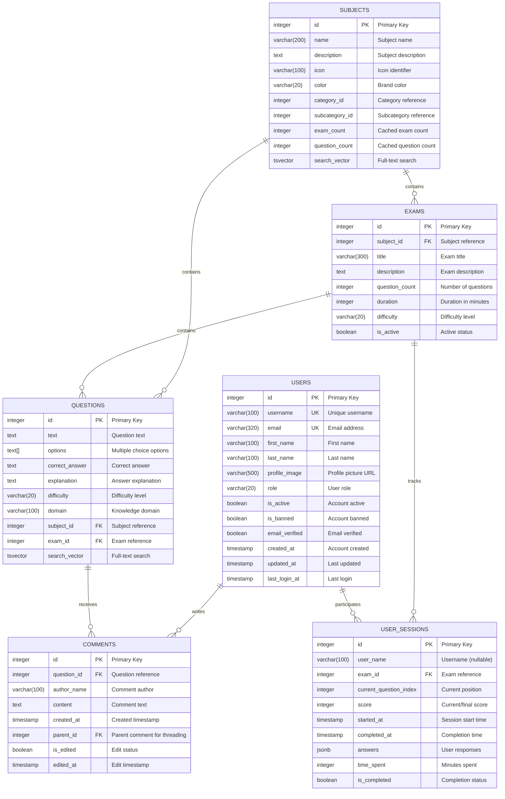
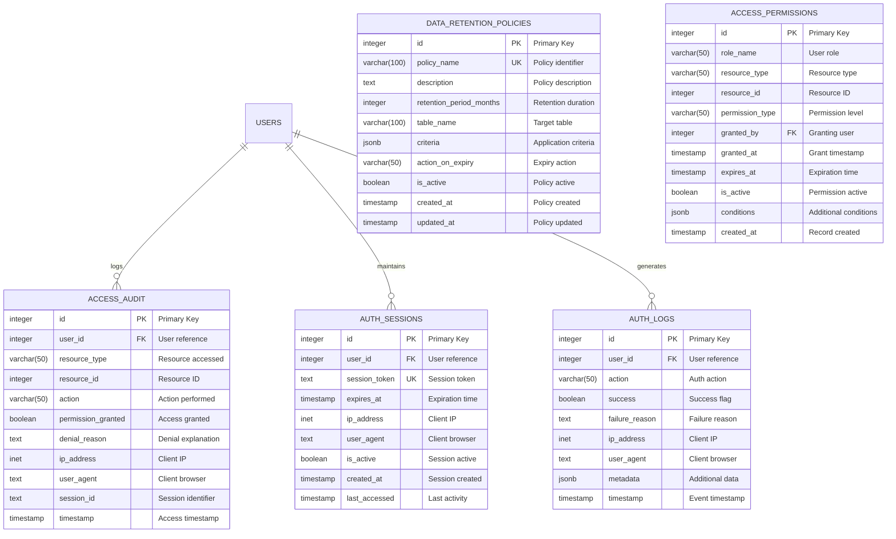

# Database Entity-Relationship Diagram

## Current Schema Structure (Updated: July 07, 2025)

### Core Entity Relationships



### Advanced Analytics Tables

```mermaid
erDiagram
    USERS ||--o{ USER_PROFILES : has
    USERS ||--o{ DETAILED_ANSWERS : provides
    USERS ||--o{ EXAM_ANALYTICS : generates
    SUBJECTS ||--o{ PERFORMANCE_TRENDS : tracks
    USERS ||--o{ STUDY_RECOMMENDATIONS : receives
    
    USER_PROFILES {
        integer id PK "Primary Key"
        varchar(100) user_name UK "Username reference"
        integer total_exams_taken "Exam count"
        varchar(10) average_score "Performance metric"
        integer total_questions_answered "Question count"
        integer total_study_time_minutes "Study time"
        varchar(50) preferred_subjects "Subject preferences"
        varchar(50) learning_pace "Learning speed"
        timestamp last_activity_date "Last activity"
        jsonb performance_by_subject "Subject performance"
        timestamp created_at "Profile created"
        timestamp updated_at "Profile updated"
    }
    
    DETAILED_ANSWERS {
        integer id PK "Primary Key"
        varchar(100) user_name "Username reference"
        integer question_id FK "Question reference"
        text user_answer "User's answer"
        boolean is_correct "Correctness flag"
        integer time_taken_seconds "Response time"
        integer attempts_count "Number of attempts"
        boolean used_hint "Hint usage flag"
        varchar(50) confidence_level "User confidence"
        jsonb metadata "Additional data"
        timestamp answered_at "Answer timestamp"
    }
    
    EXAM_ANALYTICS {
        integer id PK "Primary Key"
        varchar(100) user_name "Username reference"
        integer exam_id FK "Exam reference"
        integer score "Final score"
        integer total_questions "Question count"
        integer time_taken_minutes "Completion time"
        numeric(5,2) accuracy_percentage "Accuracy rate"
        varchar(50) completion_status "Status"
        jsonb performance_by_domain "Domain analysis"
        jsonb question_timing "Timing analysis"
        timestamp started_at "Start time"
        timestamp completed_at "Completion time"
    }
    
    PERFORMANCE_TRENDS {
        integer id PK "Primary Key"
        varchar(100) user_name "Username reference"
        integer subject_id FK "Subject reference"
        varchar(20) week_start_date "Week identifier"
        integer questions_attempted "Weekly questions"
        numeric(5,2) average_accuracy "Weekly accuracy"
        integer study_time_minutes "Weekly study time"
        integer improvement_score "Performance trend"
        jsonb weekly_performance_data "Detailed metrics"
        timestamp created_at "Record created"
        timestamp updated_at "Last updated"
    }
    
    STUDY_RECOMMENDATIONS {
        integer id PK "Primary Key"
        varchar(100) user_name "Username reference"
        integer subject_id FK "Subject reference"
        varchar(50) recommendation_type "Recommendation category"
        text recommendation_text "Recommendation content"
        varchar(20) priority_level "Priority level"
        boolean is_completed "Completion status"
        timestamp created_at "Created timestamp"
        timestamp completed_at "Completion timestamp"
    }
```

### Security and Audit Tables



### Partitioned Analytics Tables

```mermaid
erDiagram
    SYSTEM_EVENTS {
        integer id PK "Primary Key"
        varchar(50) event_type "Event category"
        varchar(50) event_category "Event subcategory"
        varchar(20) severity_level "Severity rating"
        integer user_id FK "User reference"
        text session_id "Session identifier"
        varchar(50) resource_type "Resource involved"
        integer resource_id "Resource ID"
        jsonb event_data "Event details"
        text message "Event message"
        inet ip_address "Client IP"
        text user_agent "Client browser"
        timestamp timestamp "Event timestamp"
        boolean processed "Processing status"
    }
    
    PERFORMANCE_METRICS {
        integer id PK "Primary Key"
        varchar(100) metric_name "Metric identifier"
        numeric(10,2) metric_value "Metric value"
        varchar(20) metric_unit "Value unit"
        varchar(50) component "System component"
        varchar(20) environment "Environment name"
        timestamp timestamp "Metric timestamp"
        jsonb metadata "Additional data"
    }
    
    API_USAGE_LOGS {
        integer id PK "Primary Key"
        varchar(200) endpoint "API endpoint"
        varchar(10) method "HTTP method"
        integer status_code "Response status"
        integer response_time_ms "Response time"
        integer user_id FK "User reference"
        inet ip_address "Client IP"
        text user_agent "Client browser"
        integer request_size_bytes "Request size"
        integer response_size_bytes "Response size"
        timestamp timestamp "Request timestamp"
    }
```

## Business Logic Documentation

### Core Business Rules

**Subject Management**:
- Each subject must have a unique name within its category
- Subject question_count and exam_count are automatically maintained by triggers
- Subjects cannot be deleted if they have associated exams or questions
- Subject search vectors are automatically updated on name/description changes

**Exam Structure**:
- Exams must belong to exactly one subject
- Exam question_count should match actual questions in the exam
- Only active exams are available to users for taking
- Exam difficulty must be one of: 'Beginner', 'Intermediate', 'Advanced'

**Question Management**:
- Questions must belong to both a subject and an exam
- Question options array must contain 2-6 choices
- Correct answer must match exactly one of the options
- Question search vectors include text, explanation, and domain content

**User Session Logic**:
- Anonymous users can take exams (user_name can be null)
- Session progress is tracked with current_question_index
- Answers are stored as JSONB for flexible question response formats
- Sessions can be resumed until marked as completed

**Security and Access Control**:
- User roles determine access permissions (admin, moderator, user)
- All data access is logged in access_audit table
- Authentication sessions have expiration times
- Failed authentication attempts are tracked and can trigger account locks

### Data Integrity Constraints

**Referential Integrity**:
- Foreign key constraints ensure data consistency across all relationships
- Cascade deletes are configured where appropriate (e.g., user -> user_sessions)
- Orphaned records are prevented through proper constraint definitions

**Data Validation**:
- Email addresses are validated with regex patterns
- Enumerated values (difficulty, role) are enforced with CHECK constraints
- Numeric ranges are validated (scores, percentages, counts)
- JSON data structures are validated where business logic requires it

**Performance Optimization**:
- Cached counts (exam_count, question_count) are maintained via triggers
- Search vectors are automatically updated for full-text search efficiency
- Composite indexes are created for common query patterns
- Partitioned tables handle high-volume audit and analytics data

---

**Schema Documentation Status**: ✅ Complete ER diagram with all relationships documented  
**Coverage**: Core entities, analytics tables, security structures, partitioned data  
**Maintenance**: Automatically updated database comments and visual documentation  
**Business Logic**: Comprehensive documentation of all constraints and rules

**Database Architect**: Claude 4.0 Sonnet  
**Documentation Updated**: July 07, 2025 at 1:25 PM UTC