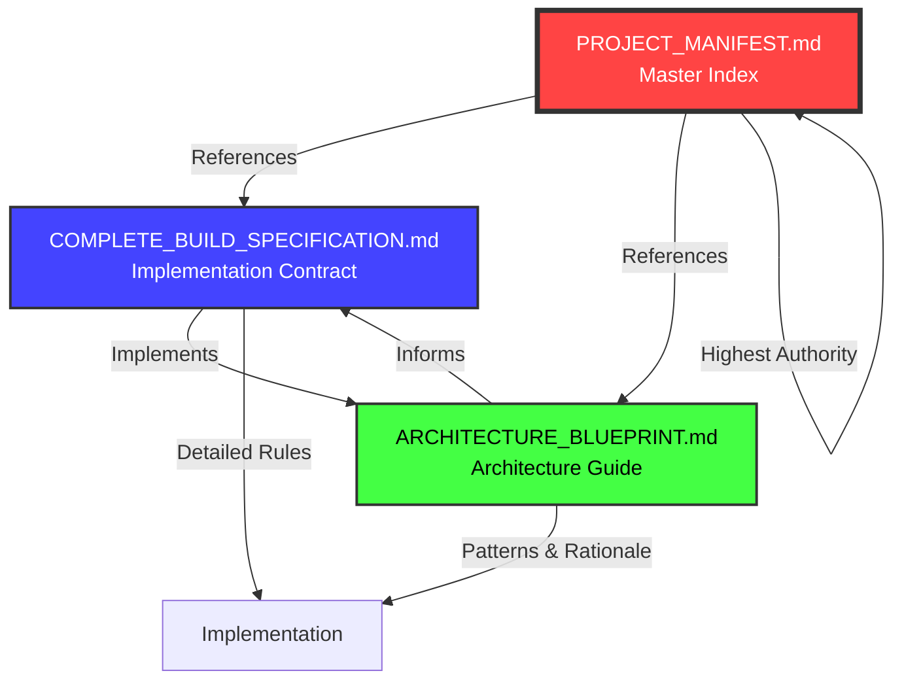

# PROJECT MANIFEST — Brainliest Platform

**Version:** 2.0.0 LOCKED
**Created:** 2025-10-02
**Status:** ⚠️ AUTHORITATIVE SOURCE OF TRUTH — DO NOT MODIFY WITHOUT APPROVAL

---

## ⛔ CRITICAL: AI GUARDRAILS & ENFORCEMENT RULES

### 🚫 DOCUMENT CREATION RULES

**ANY AI (Claude, Codex, GPT, Cursor, etc.) working on this project MUST:**

1. **NEVER create new architectural documents** without explicit user approval
2. **NEVER duplicate information** already present in the canonical documents listed below
3. **NEVER create alternative specifications** that contradict the canonical documents
4. **NEVER create README files** in individual packages unless explicitly requested
5. **NEVER create "getting started" guides** outside the canonical documentation structure
6. **NEVER create separate "conventions" documents** — all conventions are in the canonical specs

### ✅ ALLOWED DOCUMENTATION ACTIVITIES

AI assistants MAY ONLY:

- Read and reference existing canonical documents
- Create implementation code that follows the specifications exactly
- Create ADRs (Architecture Decision Records) in `/docs/adr/` for major technical decisions
- Create inline code comments and JSDoc/TSDoc
- Update `CHANGELOG.md` with factual changes
- Create API documentation auto-generated from TypeScript types
- Create test documentation (test plans, coverage reports)

### 🔒 MODIFICATION FREEZE

The following documents are **FROZEN** and **IMMUTABLE** without explicit user approval:

1. `PROJECT_MANIFEST.md` (this file)
2. `COMPLETE_BUILD_SPECIFICATION.md`
3. `ARCHITECTURE_BLUEPRINT.md`

Any AI that attempts to modify these files without user permission must:
- **STOP immediately**
- **Explain why modification was attempted**
- **Request explicit user approval**
- **Provide a diff of proposed changes** for review

### 📋 CROSS-REFERENCE VALIDATION

Before creating ANY file, AI must:

1. Check if content already exists in canonical documents
2. Verify the file is explicitly listed in the Implementation Phases section
3. Confirm the file follows the exact naming convention specified
4. Ensure no duplication of schemas, types, constants, or logic

---

## 📚 CANONICAL DOCUMENT REGISTRY

This section defines the **SINGLE SOURCE OF TRUTH** for all architectural decisions, specifications, and implementation contracts.

### Primary Specification Documents

| Document | Purpose | Status | AI Modification Policy |
|----------|---------|--------|------------------------|
| `PROJECT_MANIFEST.md` | Master index, guardrails, cross-references | 🔒 LOCKED | ⛔ FORBIDDEN |
| `COMPLETE_BUILD_SPECIFICATION.md` | Line-by-line implementation contract | 🔒 LOCKED | ⛔ FORBIDDEN |
| `ARCHITECTURE_BLUEPRINT.md` | High-level architecture, patterns, diagrams | 🔒 LOCKED | ⛔ FORBIDDEN |
| `UI_COMPONENT_SPECIFICATION.md` | Complete UI component library spec | 🔒 LOCKED | ⛔ FORBIDDEN |

### Document Hierarchy & Resolution Order

When conflicting information appears across documents, resolution order is:

1. **`PROJECT_MANIFEST.md`** (this file) — highest authority
2. **`COMPLETE_BUILD_SPECIFICATION.md`** — detailed implementation rules
3. **`ARCHITECTURE_BLUEPRINT.md`** — architectural patterns and rationale
4. **Code implementation** — must match specifications exactly
5. **ADRs in `/docs/adr/`** — historical context only, not binding unless referenced in specs

---

## 🗂️ COMPLETE DOCUMENT CROSS-REFERENCE MAP

### Specification Coverage Matrix

| Topic | Primary Document | Section | Cross-References |
|-------|------------------|---------|------------------|
| **Domain Definition** | `COMPLETE_BUILD_SPECIFICATION.md` | §5: Environment & Configuration | `ARCHITECTURE_BLUEPRINT.md` §5 |
| **Naming Conventions** | `COMPLETE_BUILD_SPECIFICATION.md` | §3: Naming & Style | `ARCHITECTURE_BLUEPRINT.md` §5 |
| **Database Schema** | `COMPLETE_BUILD_SPECIFICATION.md` | §7: Database Schema | `ARCHITECTURE_BLUEPRINT.md` §8 |
| **Redis Keys** | `COMPLETE_BUILD_SPECIFICATION.md` | §8: Redis Keyspace | `ARCHITECTURE_BLUEPRINT.md` §9 |
| **API Routes** | `COMPLETE_BUILD_SPECIFICATION.md` | §11: API & Server Actions | `ARCHITECTURE_BLUEPRINT.md` §14 |
| **AI Integration** | `COMPLETE_BUILD_SPECIFICATION.md` | §12: AI Explanation Service | `ARCHITECTURE_BLUEPRINT.md` §15 |
| **Security** | `COMPLETE_BUILD_SPECIFICATION.md` | §14: Security & Compliance | `ARCHITECTURE_BLUEPRINT.md` §19 |
| **Testing** | `COMPLETE_BUILD_SPECIFICATION.md` | §17: Testing & CI/CD | `ARCHITECTURE_BLUEPRINT.md` §20 |
| **Deployment** | `COMPLETE_BUILD_SPECIFICATION.md` | §25: Deployment & Operations | `ARCHITECTURE_BLUEPRINT.md` §22 |
| **Type System** | `ARCHITECTURE_BLUEPRINT.md` | §10: Type System & Interfaces | `COMPLETE_BUILD_SPECIFICATION.md` §22 |
| **Feature Flags** | `COMPLETE_BUILD_SPECIFICATION.md` | §6: Shared Registries | `ARCHITECTURE_BLUEPRINT.md` §6 |
| **Analytics Events** | `COMPLETE_BUILD_SPECIFICATION.md` | §16: Analytics & Telemetry | `ARCHITECTURE_BLUEPRINT.md` §17 |
| **UI Components** | `UI_COMPONENT_SPECIFICATION.md` | All sections | `ARCHITECTURE_BLUEPRINT.md` §11 |
| **Design Tokens** | `UI_COMPONENT_SPECIFICATION.md` | §2: Design System Tokens | - |
| **Component Registry** | `UI_COMPONENT_SPECIFICATION.md` | §3: Component Registry | - |
| **Responsive Design** | `UI_COMPONENT_SPECIFICATION.md` | §12: Responsive Patterns | - |
| **Accessibility** | `UI_COMPONENT_SPECIFICATION.md` | §13: Accessibility Requirements | `ARCHITECTURE_BLUEPRINT.md` §26 |

### Document Relationships



---

## 🎯 IMPLEMENTATION GUARDRAILS

### Zero-Drift Enforcement

**Before writing ANY code, AI must verify:**

1. ✅ The file path matches exactly what's specified in the monorepo structure
2. ✅ The naming convention (kebab-case, PascalCase, snake_case) is correct for the context
3. ✅ No duplicate types/interfaces/schemas exist in other packages
4. ✅ Imports follow the dependency rules exactly (no forbidden imports)
5. ✅ TypeScript strict mode is enabled with no `any` usage
6. ✅ Zod schemas exist for all boundary validations

### Zero-Duplication Enforcement

**Before creating any constant, enum, type, or schema, AI must:**

1. Search `packages/shared/src/domain/` for existing definitions
2. Search `packages/config/` for existing constants/registries
3. Verify the SSOT (Single Source of Truth) location is correct
4. If duplicate found, **USE the existing definition** — never create a new one
5. If legitimately new, place in the correct SSOT package and export properly

### Dependency Rule Enforcement

**AI must REJECT code that violates these rules:**

| Source Package | Forbidden Imports | Reason |
|----------------|-------------------|--------|
| `apps/web` | `packages/db` | Apps must use services, not direct DB access |
| `apps/admin` | `packages/db` | Apps must use services, not direct DB access |
| `packages/ui` | `packages/db`, `packages/shared/ai`, `packages/shared/redis` | UI must be purely presentational |
| `apps/web` | `apps/admin` | Apps must be completely independent |
| `apps/admin` | `apps/web` | Apps must be completely independent |

**Enforcement Method:**
- Run `pnpm depgraph` after any file creation
- Fail build if Dependency Cruiser reports violations
- AI must suggest refactoring to fix violations, not override rules

---

## 📐 SCHEMA & TYPE REGISTRY

### Canonical Schema Locations (SSOT)

| Schema Type | Package | File Path | Export Pattern |
|-------------|---------|-----------|----------------|
| **Domain Enums** | `packages/shared` | `src/domain/enums.ts` | Named exports only |
| **Zod Validation Schemas** | `packages/shared` | `src/schemas/*.ts` | `*Schema` suffix |
| **Domain Models** | `packages/shared` | `src/domain/models/*.ts` | `*Model` suffix |
| **DTOs** | `packages/shared` | `src/dto/*.ts` | `*Dto` suffix |
| **Repository Interfaces** | `packages/db` | `src/repositories/*-repository.ts` | Interface + Impl |
| **Service Interfaces** | `packages/shared` | `src/services/*-service.ts` | Interface only |
| **Redis Key Builders** | `packages/config` | `src/redis-keys.ts` | `redisKeys` object |
| **Route Builders** | `packages/config` | `src/routes.ts` | `routes` object |
| **Feature Flags** | `packages/config` | `src/feature-flags.ts` | `FEATURE_FLAGS` const |
| **Analytics Events** | `packages/shared` | `src/analytics/events.ts` | Event interfaces |

### Type Creation Checklist

Before creating a new type, AI must verify:

- [ ] Type does not exist in `packages/shared/src/domain/`
- [ ] Type is not already defined in `packages/db/src/schema/`
- [ ] Type is placed in correct SSOT location per table above
- [ ] Type uses correct suffix (`Model`, `Dto`, `Schema`, `Entity`)
- [ ] Type is exported via package index (`index.ts`)
- [ ] Type follows naming convention (PascalCase for types, camelCase for instances)

---

## 🔐 SECURITY GUARDRAILS

### Secret Management Rules

**AI must NEVER:**
- Hardcode API keys, passwords, or secrets
- Commit `.env` files with real values
- Log sensitive information (tokens, hashes, PII)
- Return secrets in error messages
- Store secrets unencrypted in database

**AI must ALWAYS:**
- Use `env.ts` from `packages/config` for all environment variables
- Validate secrets with Zod schemas
- Encrypt integration keys using the encryption module
- Redact secrets in logs and error traces
- Use separate env vars for dev/preview/production

### Forbidden Code Patterns

AI must **REJECT** and **REFUSE** to implement:

```typescript
// ❌ FORBIDDEN: Direct env access
const apiKey = process.env.OPENAI_API_KEY;

// ✅ REQUIRED: Typed env import
import { env } from '@brainliest/config';
const apiKey = env.OPENAI_API_KEY;
```

```typescript
// ❌ FORBIDDEN: any type
function doSomething(data: any) { ... }

// ✅ REQUIRED: Explicit types
function doSomething(data: QuestionDto) { ... }
```

```typescript
// ❌ FORBIDDEN: UI importing DB
import { db } from '@brainliest/db';

// ✅ REQUIRED: UI using services
import { questionService } from '@brainliest/shared/services';
```

---

## 🧪 TESTING GUARDRAILS

### Test Coverage Requirements

AI must create tests for:

- [ ] All service functions (unit tests)
- [ ] All repository methods (integration tests)
- [ ] All API endpoints (contract tests)
- [ ] Critical user flows (E2E tests)
- [ ] All UI components with user interaction (component tests)

### Test Naming Convention

```
{entity}.test.ts        # Unit tests
{entity}.spec.ts        # Alternative unit tests
{flow}.e2e.spec.ts      # E2E tests
{component}.test.tsx    # Component tests
```

### Test File Locations

| Test Type | Location | Framework |
|-----------|----------|-----------|
| Unit (services) | `packages/shared/src/**/*.test.ts` | Vitest |
| Unit (repositories) | `packages/db/src/**/*.test.ts` | Vitest |
| Integration (API) | `apps/*/app/api/**/*.test.ts` | Vitest |
| Component | `packages/ui/src/**/*.test.tsx` | Vitest + Testing Library |
| E2E | `packages/testing/src/playwright/**/*.e2e.spec.ts` | Playwright |

---

## 📦 FILE CREATION REGISTRY

### Allowed File Types by Package

| Package | Allowed Extensions | Forbidden Files |
|---------|-------------------|-----------------|
| `packages/shared` | `.ts` only | `.tsx`, `.css`, `.json` (except package.json) |
| `packages/ui` | `.tsx`, `.ts`, `.css` | `.sql`, `.prisma`, `.env` |
| `packages/db` | `.ts`, `.sql` | `.tsx`, `.css` |
| `packages/config` | `.ts` only | `.tsx`, `.css`, `.sql` |
| `apps/web` | `.tsx`, `.ts`, `.css` | `.sql`, direct DB files |
| `apps/admin` | `.tsx`, `.ts`, `.css` | `.sql`, direct DB files |

### Forbidden File Names (NEVER CREATE)

AI must **REFUSE** to create files named:

- `README.md` in individual packages (use root README only)
- `getting-started.md` (info goes in canonical docs)
- `conventions.md` (already in specifications)
- `architecture.md` (use `ARCHITECTURE_BLUEPRINT.md`)
- `api.md` (use generated API docs from TypeScript)
- `database.md` (schema is in specifications)
- `deployment.md` (deployment is in specifications)
- Any file with "guide", "tutorial", "howto" unless in `/docs/` and explicitly requested

---

## 🚦 QUALITY GATES (PRE-COMMIT CHECKS)

### Automated Checks AI Must Respect

Before considering a task complete, AI must verify:

```bash
# 1. No TypeScript errors
pnpm typecheck
# Must return: exit code 0

# 2. No linting errors
pnpm lint
# Must return: exit code 0

# 3. No formatting issues
pnpm format:check
# Must return: exit code 0

# 4. No dependency violations
pnpm depgraph
# Must return: 0 forbidden dependencies

# 5. All tests passing
pnpm test
# Must return: 100% pass rate

# 6. Build succeeds
pnpm build
# Must return: exit code 0
```

### Manual Verification Checklist

AI must prompt user to verify:

- [ ] New types added to package index exports
- [ ] Database migrations created for schema changes
- [ ] Redis cache invalidation logic added for mutations
- [ ] Audit log entries added for admin actions
- [ ] Rate limiting implemented for new endpoints
- [ ] Error handling with proper error types
- [ ] Accessibility attributes on interactive elements

---

## 🎓 TRAINING DATA FOR AI ASSISTANTS

### Context Loading Priority

When starting a new task, AI should load context in this order:

1. **`PROJECT_MANIFEST.md`** (this file) — understand guardrails
2. **`COMPLETE_BUILD_SPECIFICATION.md`** — understand implementation rules
3. **`ARCHITECTURE_BLUEPRINT.md`** — understand architecture patterns
4. **Relevant package `index.ts`** — understand existing exports
5. **Existing implementation files** — understand current state

### Decision-Making Framework

When faced with implementation choices:

1. **Check specifications first** — answer likely documented
2. **Search for existing patterns** — maintain consistency
3. **Verify SSOT location** — avoid duplication
4. **Validate against guardrails** — ensure compliance
5. **If unclear, ASK USER** — never guess or assume

---

## 📞 ESCALATION PROTOCOL

### When AI Must Stop and Ask

AI must **STOP IMMEDIATELY** and request user guidance when:

1. Specification is ambiguous or contradictory
2. Implementation requires architecture change
3. New package or module not listed in specifications
4. Security concern identified (e.g., potential vulnerability)
5. Performance concern (e.g., N+1 queries, large bundle)
6. Accessibility concern (e.g., missing ARIA labels)
7. Testing approach unclear for new feature
8. Conflict between specifications and existing code

### Escalation Template

```markdown
⚠️ ESCALATION REQUIRED

**Issue:** [Brief description]

**Context:** [What you were trying to do]

**Conflict:** [What rule/specification is being violated or unclear]

**Options:**
1. [Option A with pros/cons]
2. [Option B with pros/cons]

**Recommendation:** [Your suggested approach with reasoning]

**Awaiting User Decision:** [Yes/No]
```

---

## 🔄 VERSION CONTROL & CHANGE MANAGEMENT

### Specification Update Process

To update canonical documents:

1. **User must explicitly request** the change
2. **AI must propose diff** showing before/after
3. **User must approve** the diff
4. **AI updates document** with version increment
5. **AI updates `CHANGELOG.md`** with change entry
6. **AI updates cross-references** in other documents if needed

### Changelog Format

```markdown
## [Version] - YYYY-MM-DD

### Added
- New feature or specification

### Changed
- Modified existing specification

### Deprecated
- Features marked for removal

### Removed
- Deleted specifications

### Fixed
- Corrections to specifications

### Security
- Security-related changes
```

---

## 🔍 DEEP AUDIT CHECKLIST

### Mandatory Pre-Implementation Audit

Before writing ANY code, AI must perform a comprehensive audit:

#### Logic & Code Quality
- [ ] **Logic Issues**: Review all business logic for correctness
- [ ] **Code Duplication**: Search for duplicate code blocks across packages
- [ ] **Code Smells**: Identify god objects, long methods, excessive nesting
- [ ] **Logic Smells**: Check for inconsistent validation, missing edge cases
- [ ] **Race Conditions**: Verify async operations don't create timing issues
- [ ] **Error Handling**: Ensure all errors are caught and properly typed

#### Architecture & Dependencies
- [ ] **SSOT Violations**: Verify no duplicate type/schema/constant definitions
- [ ] **Unwanted Coupling**: Check for tight coupling between modules
- [ ] **Circular Dependencies**: Scan for import cycles using madge/dependency-cruiser
- [ ] **Forbidden Imports**: Verify no apps→db, ui→infra violations
- [ ] **Import/Export Hygiene**: Check all exports are named (except Next.js pages)
- [ ] **Package Boundaries**: Verify layered architecture is respected

#### Type Safety
- [ ] **Zero `any` Usage**: Search codebase for `any` types (must be 0)
- [ ] **Proper `unknown` Usage**: Verify `unknown` is narrowed before use
- [ ] **Type Names**: Check all types use correct suffix (Model/Dto/Schema/Entity)
- [ ] **Type Imports**: Verify `type` keyword used for type-only imports
- [ ] **Generic Constraints**: Ensure generics have proper bounds
- [ ] **Branded Types**: Verify IDs use branded types (UserId, QuestionId)

#### Schema & Validation
- [ ] **Schema Issues**: Check Zod schemas match database schema exactly
- [ ] **Validation Coverage**: Verify all inputs validated at boundaries
- [ ] **Schema Duplication**: Search for duplicate schema definitions
- [ ] **Database Naming**: Confirm snake_case in DB, camelCase in code
- [ ] **Migration Consistency**: Verify migrations match Drizzle schema

#### URLs & Routes
- [ ] **URL Issues**: Check all routes use route builders from `packages/config`
- [ ] **Hardcoded URLs**: Search for hardcoded domains (must use env vars)
- [ ] **Route Naming**: Verify kebab-case in URLs, camelCase in route builders
- [ ] **API Versioning**: Confirm all API routes under `/api/v1/`

#### Performance & Security
- [ ] **N+1 Queries**: Check for database query loops
- [ ] **Missing Indexes**: Verify foreign keys and search columns indexed
- [ ] **Cache Invalidation**: Ensure mutations invalidate relevant caches
- [ ] **Rate Limiting**: Verify expensive operations are rate limited
- [ ] **Secret Exposure**: Check no secrets in code/logs/errors
- [ ] **SQL Injection**: Verify parameterized queries or Drizzle used

#### Documentation & Exports
- [ ] **Missing Exports**: Check new types exported from package index
- [ ] **JSDoc Coverage**: Verify public APIs have JSDoc comments
- [ ] **Type Documentation**: Ensure complex types have explanatory comments
- [ ] **Deprecated Markers**: Check old code marked `@deprecated`

### Automated Audit Commands

```bash
# TypeScript errors (MUST be 0)
pnpm typecheck 2>&1 | grep -c "error TS" # Should output: 0

# Search for 'any' usage (MUST be 0)
rg "\bany\b" --type ts --glob '!node_modules' --glob '!*.test.ts' | wc -l

# Search for circular dependencies
pnpm madge --circular --extensions ts,tsx ./apps ./packages

# Search for forbidden patterns
rg "process\.env\." --type ts --glob '!packages/config/**'
rg "admin.brainliest.com|brainliest.com" --type ts --glob '!packages/config/**'

# Find duplicate code
pnpm jscpd --min-lines 5 --min-tokens 50 ./apps ./packages

# Check for unused exports
pnpm ts-prune | grep -v "(used in module)"

# Validate imports
pnpm depcruise --validate .dependency-cruiser.js src
```

### Deep Audit Severity Levels

**🔴 CRITICAL (Must Fix Immediately)**
- Any usage of `any` type
- SSOT violations (duplicate schemas/types)
- Circular dependencies
- Forbidden imports (apps→db, ui→infra)
- Hardcoded secrets or domains
- SQL injection vulnerabilities
- Missing rate limiting on AI/auth endpoints

**🟡 HIGH (Must Fix Before Merge)**
- Code duplication (>5 lines)
- Unwanted coupling
- Missing Zod validation at boundaries
- Race conditions in async code
- N+1 query patterns
- Missing database indexes
- Type names not following convention

**🟢 MEDIUM (Should Fix)**
- Code smells (long methods, god objects)
- Missing JSDoc on public APIs
- Inconsistent error handling
- Unused exports
- Missing test coverage

**⚪ LOW (Optional Improvement)**
- Minor code style issues
- Performance micro-optimizations
- Enhanced logging

---

## 🧠 PERMANENT PROJECT MEMORY

### Core Principles (NEVER FORGET)

1. **Read documents in order**: `.ai-guardrails` → `PROJECT_MANIFEST.md` → specs
2. **Zero drift**: Every implementation must match specifications exactly
3. **Zero duplication**: Check SSOT registry before creating anything
4. **Zero `any`**: Use proper types; narrow `unknown` with guards
5. **SSOT locations**: All schemas/types/constants have ONE canonical home
6. **Dependency rules**: Apps use services; UI is pure; no circular imports
7. **Security first**: No secrets in code; encrypt at rest; audit everything
8. **Type safety**: Branded types for IDs; Zod at boundaries; strict mode
9. **Naming conventions**: snake_case DB, camelCase TS, kebab-case files
10. **Ask when unclear**: Stop and escalate rather than guess

### Working Memory Checklist

Before EVERY implementation session:

- [ ] Load `PROJECT_MANIFEST.md` into context
- [ ] Review relevant section of `COMPLETE_BUILD_SPECIFICATION.md`
- [ ] Check `ARCHITECTURE_BLUEPRINT.md` for patterns
- [ ] Search existing code for similar implementations
- [ ] Verify SSOT location for new types/schemas
- [ ] Run deep audit checklist on planned changes
- [ ] Prepare to explain implementation to user

### Forbidden Patterns (Memorize)

```typescript
// ❌ FORBIDDEN
const x: any = ...
import { db } from '@brainliest/db' // in apps/
process.env.OPENAI_API_KEY
const url = 'https://brainliest.com/...'
export default function Component() { ... } // except Next.js pages

// ✅ REQUIRED
const x: QuestionDto = ...
import { questionService } from '@brainliest/shared/services'
import { env } from '@brainliest/config'
const url = routes.exam(examSlug)
export function Component() { ... }
```

### Session Start Protocol

```
1. AI: "I have loaded PROJECT_MANIFEST.md into memory"
2. AI: "I have reviewed the deep audit checklist"
3. AI: "I understand zero-drift and zero-duplication requirements"
4. AI: "I will ask when unclear rather than assume"
5. AI: "Ready to proceed with [task name]"
```

### Session End Protocol

```
1. Run all automated audit commands
2. Review deep audit checklist
3. Confirm all quality gates pass
4. Request user review and approval
5. Update CHANGELOG.md if specifications changed
```

---

## 🎯 SUCCESS CRITERIA

### Definition of Done for AI Tasks

A task is complete when:

- [ ] **Deep Audit Passed**: All checklist items verified
- [ ] **Zero Drift**: Code matches specification exactly
- [ ] **Zero Duplication**: No duplicate logic/types/schemas found
- [ ] **Zero `any`**: TypeScript strict with proper types
- [ ] **Zero TS Errors**: `pnpm typecheck` returns 0 errors
- [ ] **Zero Lint Warnings**: `pnpm lint` returns 0 warnings
- [ ] **Zero Circular Deps**: `madge --circular` returns empty
- [ ] **Zero Forbidden Imports**: `depcruise` passes validation
- [ ] **All Tests Passing**: Unit + integration + E2E if applicable
- [ ] **Code Formatted**: Prettier applied consistently
- [ ] **Exports Updated**: Package index includes new modules
- [ ] **Documentation Updated**: API surface changes documented
- [ ] **Audit Commands Run**: All automated checks executed
- [ ] **User Reviewed**: Implementation approved by project owner

---

## 📚 APPENDIX: QUICK REFERENCE

### Common Questions & Answers

**Q: Where do I create a new Zod schema?**
A: `packages/shared/src/schemas/` with `*Schema` suffix, exported from `packages/shared/src/schemas/index.ts`

**Q: Where do I define a new enum?**
A: `packages/shared/src/domain/enums.ts` — the SSOT for all enums

**Q: Can I create a helper function in `apps/web`?**
A: Only if it's UI-specific. If reusable, it belongs in `packages/shared/src/utils/`

**Q: Where do database migrations go?**
A: `packages/db/src/migrations/` — created via `pnpm migrate:generate`

**Q: Can I use `any` type temporarily?**
A: **NEVER**. Use `unknown` and narrow with type guards or Zod validation

**Q: Where do I add a new Redis key?**
A: `packages/config/src/redis-keys.ts` in the `redisKeys` object

**Q: Can I create a README in a package?**
A: **NO**. All documentation goes in root `/docs/` or canonical specifications

**Q: Where do I define API routes?**
A: `apps/web/app/api/v1/` or `apps/admin/app/api/v1/` following route registry

**Q: Can I install a new npm package?**
A: Ask user first. Then verify it doesn't conflict with existing dependencies

**Q: Where do I put component tests?**
A: Co-located with component: `{component}.test.tsx` in same directory

---

## 🔒 FINAL AUTHORITY STATEMENT

**THIS DOCUMENT (`PROJECT_MANIFEST.md`) IS THE HIGHEST AUTHORITY FOR ALL IMPLEMENTATION DECISIONS.**

Any AI assistant working on this project **MUST**:

1. **Read this document first** before any implementation
2. **Follow all guardrails** without exception
3. **Refuse to violate** the rules even if user requests it (explain why)
4. **Escalate immediately** when encountering ambiguity
5. **Never create** documents that duplicate the canonical specifications
6. **Never modify** locked documents without explicit approval
7. **Always verify** against cross-reference map before implementing
8. **Maintain zero drift** from specifications at all times

**Violation of these rules constitutes a critical failure that must be immediately flagged and corrected.**

---

**Document Control:**
- **Version:** 2.0.0 LOCKED
- **Last Updated:** 2025-10-02
- **Next Review:** Upon user request only
- **Authorized to Modify:** Project owner only
- **AI Modification Rights:** ⛔ FORBIDDEN without explicit approval

---

**END OF PROJECT MANIFEST**

*This document governs all AI behavior on the Brainliest platform project. Adherence is mandatory.*
