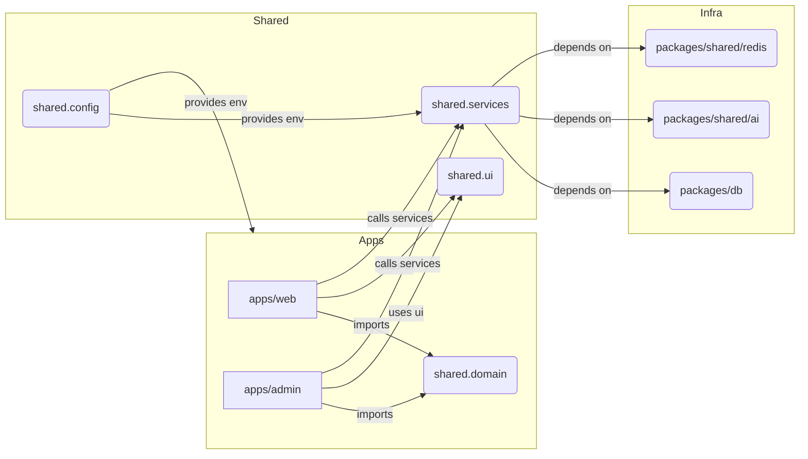

> **Guardrail Notice**  
> This document is part of the Brainliest single source of truth. AI assistants must first review [../../.ai-guardrails](../../.ai-guardrails) and [../../PROJECT_MANIFEST.md](../../PROJECT_MANIFEST.md). All work must comply with [../../COMPLETE_BUILD_SPECIFICATION.md](../../COMPLETE_BUILD_SPECIFICATION.md), [../../ARCHITECTURE_BLUEPRINT.md](../../ARCHITECTURE_BLUEPRINT.md), and [Architecture & Delivery Guardrails](guardrails.md). AI assistants must not deviate from these constraints.

## Related Documents
- [PROJECT_MANIFEST.md](../../PROJECT_MANIFEST.md)
- [COMPLETE_BUILD_SPECIFICATION.md](../../COMPLETE_BUILD_SPECIFICATION.md)
- [ARCHITECTURE_BLUEPRINT.md](../../ARCHITECTURE_BLUEPRINT.md)
- [Architecture & Delivery Guardrails](guardrails.md)

# Architecture Overview

## Purpose

This document summarizes the target system architecture for the Brainliest platform rebuild. It should be read alongside `ARCHITECTURE_BLUEPRINT.md` and kept in sync with any approved Architecture Decision Records (ADRs).

## System Context

- **User-facing app (`brainliest.com`)**: Next.js 14 App Router, serves student workflows (discovery, practice, results, profiles).
- **Admin portal (`admin.brainliest.com`)**: Next.js 14 App Router, manages taxonomy, questions, users, integrations, feature flags, analytics.
- **Shared packages**: Provide domain models, validation schemas, UI primitives, configuration, database repositories, service interfaces.
- **Infrastructure services**: PostgreSQL (content + auth), Upstash Redis (caching, rate limiting, queue coordination), OpenAI (answer explanations), optional background workers.

## High-Level Architecture

## Layered Model

1. **Presentation Layer**: Next.js layouts, server components, client components, leveraging `packages/ui` primitives.
2. **Application Layer**: Server actions and route handlers invoking shared service interfaces. Handles orchestration, authorization, input/output mapping.
3. **Domain Layer**: Pure business logic in `packages/shared` (immutable models, zod schemas, computations, domain events).
4. **Infrastructure Layer**: Drizzle repositories, Redis adapters, OpenAI integration, email/payments, all accessed via typed interfaces.

## Deployment Topology

- Deployed on Vercel with two projects (web + admin). Environment variables managed via secure secret store.
- PostgreSQL managed service (e.g., Neon, Supabase, RDS). Migrations executed via CI.
- Upstash Redis for caching + rate limits.
- Optional Vercel/Upstash queue workers for scheduled tasks.
- CDN (Vercel Edge) for static assets and ISR.

## Communication Paths

- UI → Server actions (within same Next.js app) via RPC-style function calls, falling back to REST/Route Handlers when necessary.
- Admin operations use dedicated auth/session cookies and hit admin-specific server actions.
- AI explainer requests go through domain service `AIExplanationService`, which wraps caching + OpenAI calls.
- Analytics events posted to server-side collectors before persistence.

## Monitoring & Observability

- Sentry (or equivalent) for error tracking in both apps.
- Structured logging (e.g., pino) aggregated via Logtail/Grafana Loki.
- Metrics from Redis/Postgres monitored via provider dashboards.
- Alerts defined in `docs/ops/monitoring.md`.

## Reference Documents

- `docs/architecture/glossary.md`
- `docs/database/schema.md`
- `docs/api/reference.md`
- `docs/ops/deployment.md`
- ADRs under `docs/adr/`

## Maintenance

- Update this overview whenever architecture changes are approved.
- Include links to new diagrams or ADRs.
- Keep the Mermaid diagram consistent with the current package layout.